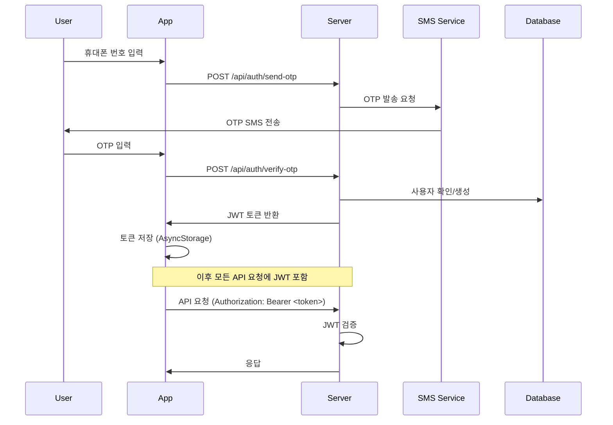

# 인증 시스템

## 🔐 인증 개요

kgency는 **휴대폰 번호 기반 OTP 인증**과 **JWT 토큰**을 사용하는 하이브리드 인증 시스템을 구현합니다.

### 인증 플로우



## 📱 모바일 앱 인증 구현

### AuthContext 구조

```typescript
interface AuthContextType {
  user: User | null;
  token: string | null;
  isLoading: boolean;
  isAuthenticated: boolean;
  login: (phoneNumber: string, userType: UserType) => Promise<void>;
  verifyOTP: (otp: string) => Promise<void>;
  logout: () => Promise<void>;
  authenticatedRequest: (url: string, options?: RequestInit) => Promise<Response>;
}
```

### 인증 상태 관리

```typescript
// contexts/AuthContext.tsx
const AuthProvider: React.FC<{ children: React.ReactNode }> = ({ children }) => {
  const [user, setUser] = useState<User | null>(null);
  const [token, setToken] = useState<string | null>(null);
  const [isLoading, setIsLoading] = useState(true);

  // 앱 시작시 저장된 토큰 복원
  useEffect(() => {
    restoreAuthState();
  }, []);

  const restoreAuthState = async () => {
    try {
      const savedToken = await AsyncStorage.getItem('auth_token');
      const savedUser = await AsyncStorage.getItem('user_data');
      
      if (savedToken && savedUser) {
        setToken(savedToken);
        setUser(JSON.parse(savedUser));
      }
    } catch (error) {
      console.error('Failed to restore auth state:', error);
    } finally {
      setIsLoading(false);
    }
  };

  const authenticatedRequest = async (url: string, options: RequestInit = {}) => {
    if (!token) {
      throw new Error('No authentication token');
    }

    const response = await fetch(url, {
      ...options,
      headers: {
        ...options.headers,
        'Authorization': `Bearer ${token}`,
        'Content-Type': 'application/json',
      },
    });

    // 401 에러시 자동 로그아웃
    if (response.status === 401) {
      await logout();
      throw new Error('Authentication expired');
    }

    return response;
  };
};
```

### OTP 인증 구현

#### 1. OTP 발송
```typescript
const sendOTP = async (phoneNumber: string, userType: UserType) => {
  try {
    const response = await fetch(`${API_BASE_URL}/api/auth/send-otp`, {
      method: 'POST',
      headers: {
        'Content-Type': 'application/json',
      },
      body: JSON.stringify({
        phoneNumber,
        userType,
      }),
    });

    const data = await response.json();
    
    if (!data.success) {
      throw new Error(data.error?.message || 'Failed to send OTP');
    }

    return data;
  } catch (error) {
    console.error('Send OTP error:', error);
    throw error;
  }
};
```

#### 2. OTP 검증
```typescript
const verifyOTP = async (phoneNumber: string, otp: string, userType: UserType) => {
  try {
    const response = await fetch(`${API_BASE_URL}/api/auth/verify-otp`, {
      method: 'POST',
      headers: {
        'Content-Type': 'application/json',
      },
      body: JSON.stringify({
        phoneNumber,
        otp,
        userType,
      }),
    });

    const data = await response.json();
    
    if (!data.success) {
      throw new Error(data.error?.message || 'Invalid OTP');
    }

    // 토큰 및 사용자 정보 저장
    await AsyncStorage.setItem('auth_token', data.token);
    await AsyncStorage.setItem('user_data', JSON.stringify(data.user));
    
    setToken(data.token);
    setUser(data.user);

    return data;
  } catch (error) {
    console.error('Verify OTP error:', error);
    throw error;
  }
};
```

## 🖥 서버 인증 구현

### JWT 토큰 생성

```javascript
// services/auth.service.js
const jwt = require('jsonwebtoken');

const generateToken = (user) => {
  const payload = {
    user_id: user.id,
    phone_number: user.phone_number,
    user_type: user.user_type,
  };

  return jwt.sign(payload, process.env.JWT_SECRET, {
    expiresIn: '7d', // 7일 만료
    issuer: 'kgency',
    audience: 'kgency-app',
  });
};

const verifyToken = (token) => {
  try {
    return jwt.verify(token, process.env.JWT_SECRET, {
      issuer: 'kgency',
      audience: 'kgency-app',
    });
  } catch (error) {
    throw new Error('Invalid token');
  }
};
```

### 인증 미들웨어

```javascript
// middlewares/auth.js
const authMiddleware = async (req, res, next) => {
  try {
    const authHeader = req.headers.authorization;
    
    if (!authHeader || !authHeader.startsWith('Bearer ')) {
      return res.status(401).json({
        success: false,
        error: {
          code: 'MISSING_TOKEN',
          message: 'Authentication token required'
        }
      });
    }

    const token = authHeader.substring(7); // 'Bearer ' 제거
    const decoded = verifyToken(token);
    
    // 사용자 정보 조회
    const { data: user } = await supabase
      .from('profiles')
      .select('*')
      .eq('id', decoded.user_id)
      .single();

    if (!user) {
      return res.status(401).json({
        success: false,
        error: {
          code: 'USER_NOT_FOUND',
          message: 'User not found'
        }
      });
    }

    req.user = user;
    req.token = decoded;
    next();
  } catch (error) {
    console.error('Auth middleware error:', error);
    
    return res.status(401).json({
      success: false,
      error: {
        code: 'INVALID_TOKEN',
        message: 'Invalid authentication token'
      }
    });
  }
};

module.exports = authMiddleware;
```

### OTP 서비스 (Solapi)

```javascript
// services/sms.service.js
const axios = require('axios');

class SMSService {
  constructor() {
    this.apiKey = process.env.SOLAPI_API_KEY;
    this.apiSecret = process.env.SOLAPI_API_SECRET;
    this.senderPhone = process.env.SENDER_PHONE;
    this.baseURL = 'https://api.solapi.com';
  }

  async sendOTP(phoneNumber, otp) {
    try {
      const message = `[kgency] 인증번호: ${otp}`;
      
      const response = await axios.post(
        `${this.baseURL}/messages/v4/send`,
        {
          message: {
            to: phoneNumber,
            from: this.senderPhone,
            text: message,
          }
        },
        {
          headers: {
            'Authorization': `HMAC-SHA256 apiKey=${this.apiKey}, date=${new Date().toISOString()}, salt=${Date.now()}, signature=${this.generateSignature()}`,
            'Content-Type': 'application/json',
          }
        }
      );

      return response.data;
    } catch (error) {
      console.error('SMS send error:', error);
      throw new Error('Failed to send SMS');
    }
  }

  generateOTP() {
    return Math.floor(100000 + Math.random() * 900000).toString(); // 6자리 숫자
  }

  generateSignature() {
    // HMAC-SHA256 서명 생성 로직
    // Solapi 문서 참조
  }
}

module.exports = new SMSService();
```

## 🗄 Supabase 인증 통합

### RLS (Row Level Security) 정책

```sql
-- profiles 테이블 RLS 정책
CREATE POLICY "Users can view own profile" ON profiles
  FOR SELECT USING (auth.uid() = id);

CREATE POLICY "Users can update own profile" ON profiles
  FOR UPDATE USING (auth.uid() = id);

-- applications 테이블 RLS 정책
CREATE POLICY "Users can view own applications" ON applications
  FOR SELECT USING (
    auth.uid() = user_id OR 
    auth.uid() = company_id
  );

-- messages 테이블 RLS 정책
CREATE POLICY "Users can view own messages" ON messages
  FOR SELECT USING (
    auth.uid() = sender_id OR 
    auth.uid() = receiver_id
  );
```

### Supabase 클라이언트 설정

```typescript
// lib/supabase.ts
import { createClient } from '@supabase/supabase-js';

const supabaseUrl = process.env.EXPO_PUBLIC_SUPABASE_URL!;
const supabaseAnonKey = process.env.EXPO_PUBLIC_SUPABASE_ANON_KEY!;

export const supabase = createClient(supabaseUrl, supabaseAnonKey, {
  auth: {
    // JWT 토큰을 Supabase 세션으로 설정
    detectSessionInUrl: false,
    persistSession: false, // AsyncStorage로 직접 관리
  },
});

// JWT 토큰을 Supabase 세션으로 변환
export const setSupabaseSession = async (jwtToken: string) => {
  try {
    const { data, error } = await supabase.auth.setSession({
      access_token: jwtToken,
      refresh_token: '', // 사용하지 않음
    });

    if (error) {
      console.error('Set Supabase session error:', error);
    }

    return data;
  } catch (error) {
    console.error('Set Supabase session error:', error);
  }
};
```

## 🔒 보안 고려사항

### JWT 토큰 보안

#### 토큰 구조
```json
{
  "header": {
    "alg": "HS256",
    "typ": "JWT"
  },
  "payload": {
    "user_id": "uuid",
    "phone_number": "01012345678",
    "user_type": "user",
    "iat": 1640995200,
    "exp": 1641600000,
    "iss": "kgency",
    "aud": "kgency-app"
  }
}
```

#### 보안 설정
- **Secret Key**: 복잡한 랜덤 문자열 사용
- **만료 시간**: 7일 (적절한 보안 수준)
- **Issuer/Audience**: 토큰 발급자 및 대상 검증

### OTP 보안

#### OTP 설정
- **길이**: 6자리 숫자
- **만료 시간**: 5분
- **재발송 제한**: 1분 쿨다운
- **시도 제한**: 5회 실패시 계정 잠금

#### Rate Limiting
```javascript
// 분당 OTP 발송 제한
const otpLimiter = rateLimit({
  windowMs: 1 * 60 * 1000, // 1분
  max: 5, // 분당 5회
  message: {
    success: false,
    error: {
      code: 'RATE_LIMIT_EXCEEDED',
      message: 'Too many OTP requests'
    }
  }
});
```

### 클라이언트 보안

#### 토큰 저장
```typescript
// 안전한 토큰 저장
import * as SecureStore from 'expo-secure-store';

const storeToken = async (token: string) => {
  try {
    await SecureStore.setItemAsync('auth_token', token);
  } catch (error) {
    // Fallback to AsyncStorage
    await AsyncStorage.setItem('auth_token', token);
  }
};

const getToken = async (): Promise<string | null> => {
  try {
    return await SecureStore.getItemAsync('auth_token');
  } catch (error) {
    // Fallback to AsyncStorage
    return await AsyncStorage.getItem('auth_token');
  }
};
```

#### 자동 로그아웃
```typescript
// 토큰 만료 감지 및 자동 로그아웃
const checkTokenExpiry = (token: string): boolean => {
  try {
    const decoded = jwt.decode(token) as any;
    const now = Date.now() / 1000;
    
    return decoded.exp > now;
  } catch {
    return false;
  }
};

// 앱 foreground시 토큰 검증
useEffect(() => {
  const handleAppStateChange = async (nextAppState: string) => {
    if (nextAppState === 'active' && token) {
      if (!checkTokenExpiry(token)) {
        await logout();
      }
    }
  };

  const subscription = AppState.addEventListener('change', handleAppStateChange);
  return () => subscription?.remove();
}, [token]);
```

## 🚨 에러 처리

### 인증 에러 코드

```typescript
enum AuthErrorCode {
  INVALID_OTP = 'INVALID_OTP',
  EXPIRED_OTP = 'EXPIRED_OTP',
  INVALID_PHONE = 'INVALID_PHONE',
  INVALID_TOKEN = 'INVALID_TOKEN',
  TOKEN_EXPIRED = 'TOKEN_EXPIRED',
  USER_NOT_FOUND = 'USER_NOT_FOUND',
  RATE_LIMIT_EXCEEDED = 'RATE_LIMIT_EXCEEDED',
  SMS_SEND_FAILED = 'SMS_SEND_FAILED',
}
```

### 에러 처리 예시

```typescript
const handleAuthError = (error: AuthError) => {
  switch (error.code) {
    case AuthErrorCode.INVALID_OTP:
      Alert.alert('오류', '인증번호가 올바르지 않습니다.');
      break;
    case AuthErrorCode.EXPIRED_OTP:
      Alert.alert('오류', '인증번호가 만료되었습니다. 다시 요청해주세요.');
      break;
    case AuthErrorCode.TOKEN_EXPIRED:
      Alert.alert('세션 만료', '다시 로그인해주세요.');
      logout();
      break;
    case AuthErrorCode.RATE_LIMIT_EXCEEDED:
      Alert.alert('요청 제한', '잠시 후 다시 시도해주세요.');
      break;
    default:
      Alert.alert('오류', '알 수 없는 오류가 발생했습니다.');
  }
};
```

## 📊 인증 모니터링

### 로그 수집

```javascript
// 인증 이벤트 로깅
const logAuthEvent = (event, userId, metadata = {}) => {
  console.log({
    event,
    userId,
    timestamp: new Date().toISOString(),
    metadata,
  });
  
  // 프로덕션에서는 외부 로깅 서비스 사용
  // (예: LogRocket, Sentry, CloudWatch)
};

// 사용 예시
logAuthEvent('OTP_SENT', null, { phoneNumber: '010****5678' });
logAuthEvent('LOGIN_SUCCESS', userId, { userType: 'user' });
logAuthEvent('TOKEN_EXPIRED', userId, { lastActivity: timestamp });
```

### 메트릭 수집

- **OTP 발송 성공률**
- **인증 성공률**
- **토큰 만료 빈도**
- **에러 발생 패턴**