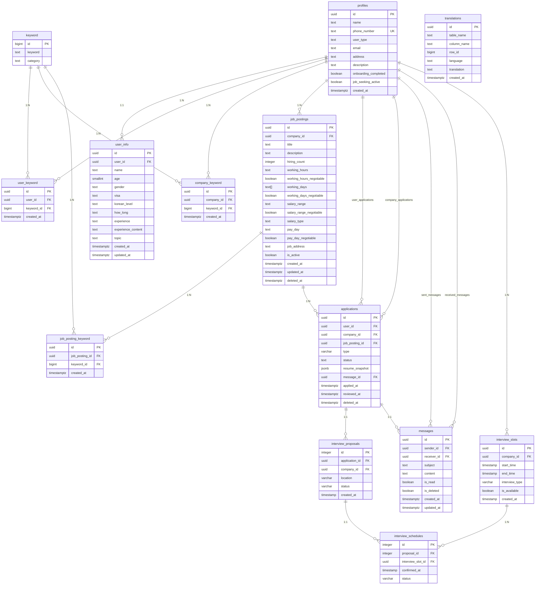

# 데이터베이스 스키마

## 🗄 데이터베이스 개요

### 기술 스택
- **Database**: PostgreSQL 15.x (Supabase 관리)
- **ORM**: Direct SQL queries via Supabase client
- **Authentication**: Supabase Auth + Custom JWT
- **Real-time**: Supabase Realtime subscriptions

### 접근 패턴
- **Direct Supabase**: 대부분의 CRUD 작업
- **Server API**: 인증, 일부 비즈니스 로직
- **Real-time**: 메시지, 알림 등

## 📊 전체 ERD



## 📋 테이블 상세 명세

### 1. profiles (핵심 프로필 테이블)

```sql
CREATE TABLE profiles (
    id uuid PRIMARY KEY REFERENCES auth.users(id),
    name text,
    phone_number text UNIQUE NOT NULL,
    user_type text NOT NULL CHECK (user_type IN ('user', 'company')),
    email text,
    address text,
    description text,
    onboarding_completed boolean DEFAULT false,
    job_seeking_active boolean DEFAULT true,
    created_at timestamptz DEFAULT now()
);
```

#### 사용 패턴
```typescript
// 프로필 조회
const { data: profile } = await supabase
  .from('profiles')
  .select('*, user_info(*)')
  .eq('id', userId)
  .single();

// 기업 프로필 조회
const { data: companies } = await supabase
  .from('profiles')
  .select('*')
  .eq('user_type', 'company');
```

### 2. user_info (사용자 상세 정보)

```sql
CREATE TABLE user_info (
    id uuid PRIMARY KEY DEFAULT gen_random_uuid(),
    user_id uuid UNIQUE REFERENCES profiles(id) ON DELETE CASCADE,
    name text,
    age smallint,
    gender text,
    visa text,
    korean_level text,
    how_long text,
    experience text,
    experience_content text,
    topic text,
    created_at timestamptz DEFAULT now(),
    updated_at timestamptz DEFAULT now()
);
```

#### 트리거 (자동 업데이트)
```sql
CREATE OR REPLACE FUNCTION update_user_info_updated_at()
RETURNS TRIGGER AS $$
BEGIN
    NEW.updated_at = now();
    RETURN NEW;
END;
$$ LANGUAGE plpgsql;

CREATE TRIGGER user_info_updated_at
    BEFORE UPDATE ON user_info
    FOR EACH ROW
    EXECUTE FUNCTION update_user_info_updated_at();
```

### 3. keyword (키워드 마스터)

```sql
CREATE TABLE keyword (
    id bigint PRIMARY KEY GENERATED ALWAYS AS IDENTITY,
    keyword text NOT NULL,
    category text NOT NULL CHECK (category IN (
        'country', 'job', 'condition', 'location', 
        'visa', 'workDay', 'koreanLevel', 'gender', 
        'age', 'moveable'
    ))
);

-- RLS 활성화
ALTER TABLE keyword ENABLE ROW LEVEL SECURITY;

-- 모든 사용자가 읽기 가능
CREATE POLICY "Keywords are viewable by everyone" ON keyword
    FOR SELECT USING (true);
```

#### 카테고리별 키워드 예시
```sql
-- 국가
INSERT INTO keyword (keyword, category) VALUES 
('한국', 'country'), ('중국', 'country'), ('일본', 'country');

-- 직업
INSERT INTO keyword (keyword, category) VALUES 
('프론트엔드', 'job'), ('백엔드', 'job'), ('디자인', 'job');

-- 조건
INSERT INTO keyword (keyword, category) VALUES 
('주5일', 'condition'), ('야근없음', 'condition'), ('재택근무', 'condition');
```

### 4. job_postings (채용공고)

```sql
CREATE TABLE job_postings (
    id uuid PRIMARY KEY DEFAULT gen_random_uuid(),
    company_id uuid REFERENCES profiles(id) ON DELETE CASCADE,
    title text NOT NULL,
    description text,
    hiring_count integer DEFAULT 1,
    working_hours text,
    working_hours_negotiable boolean DEFAULT false,
    working_days text[] DEFAULT '{}',
    working_days_negotiable boolean DEFAULT false,
    salary_range text,
    salary_range_negotiable boolean DEFAULT false,
    salary_type text,
    pay_day text,
    pay_day_negotiable boolean DEFAULT false,
    job_address text,
    is_active boolean DEFAULT true,
    created_at timestamptz DEFAULT now(),
    updated_at timestamptz DEFAULT now(),
    deleted_at timestamptz
);

-- 소프트 삭제를 위한 인덱스
CREATE INDEX idx_job_postings_active ON job_postings 
WHERE deleted_at IS NULL;

-- 업데이트 트리거
CREATE TRIGGER job_postings_updated_at
    BEFORE UPDATE ON job_postings
    FOR EACH ROW
    EXECUTE FUNCTION update_updated_at_column();
```

#### 복잡한 쿼리 예시
```typescript
// 활성 공고 + 키워드 + 회사 정보
const { data: jobPostings } = await supabase
  .from('job_postings')
  .select(`
    *,
    company:profiles!company_id(name, address),
    job_posting_keyword(
      keyword(keyword, category)
    )
  `)
  .eq('is_active', true)
  .is('deleted_at', null)
  .order('created_at', { ascending: false });
```

### 5. applications (지원서)

```sql
CREATE TABLE applications (
    id uuid PRIMARY KEY DEFAULT gen_random_uuid(),
    user_id uuid REFERENCES profiles(id),
    company_id uuid REFERENCES profiles(id),
    job_posting_id uuid REFERENCES job_postings(id),
    type varchar NOT NULL CHECK (type IN (
        'user_initiated', 'company_invited', 'user_instant_interview'
    )),
    status text DEFAULT 'pending' CHECK (status IN (
        'pending', 'accepted', 'rejected', 'withdrawn'
    )),
    resume_snapshot jsonb,
    message_id uuid REFERENCES messages(id),
    applied_at timestamptz DEFAULT now(),
    reviewed_at timestamptz,
    deleted_at timestamptz,
    
    -- 중복 지원 방지
    UNIQUE(user_id, job_posting_id)
);

-- 성능을 위한 인덱스
CREATE INDEX idx_applications_user_id ON applications(user_id);
CREATE INDEX idx_applications_company_id ON applications(company_id);
CREATE INDEX idx_applications_status ON applications(status);
```

#### resume_snapshot JSONB 구조
```json
{
  "user_info": {
    "name": "홍길동",
    "age": 25,
    "experience": "1-3년",
    "korean_level": "고급"
  },
  "keywords": [
    {"keyword": "React", "category": "job"},
    {"keyword": "JavaScript", "category": "job"}
  ],
  "applied_at": "2025-01-01T00:00:00Z"
}
```

### 6. messages (메시지 시스템)

```sql
CREATE TABLE messages (
    id uuid PRIMARY KEY DEFAULT gen_random_uuid(),
    sender_id uuid REFERENCES profiles(id),
    receiver_id uuid REFERENCES profiles(id),
    subject text,
    content text NOT NULL,
    is_read boolean DEFAULT false,
    is_deleted boolean DEFAULT false,
    created_at timestamptz DEFAULT now(),
    updated_at timestamptz DEFAULT now()
);

-- 메시지 조회 성능을 위한 인덱스
CREATE INDEX idx_messages_receiver_id ON messages(receiver_id);
CREATE INDEX idx_messages_sender_id ON messages(sender_id);
CREATE INDEX idx_messages_created_at ON messages(created_at DESC);

-- 실시간 구독을 위한 복합 인덱스
CREATE INDEX idx_messages_participants ON messages(sender_id, receiver_id);
```

#### 실시간 메시지 구독
```typescript
// 새 메시지 실시간 수신
const subscription = supabase
  .channel('messages')
  .on('postgres_changes', {
    event: 'INSERT',
    schema: 'public',
    table: 'messages',
    filter: `receiver_id=eq.${userId}`,
  }, (payload) => {
    console.log('New message:', payload.new);
    // 메시지 처리 로직
  })
  .subscribe();
```

### 7. interview_slots (면접 시간 슬롯)

```sql
CREATE TABLE interview_slots (
    id uuid PRIMARY KEY DEFAULT gen_random_uuid(),
    company_id uuid REFERENCES profiles(id),
    start_time timestamp NOT NULL,
    end_time timestamp NOT NULL,
    interview_type varchar DEFAULT '대면',
    is_available boolean DEFAULT true,
    created_at timestamp DEFAULT now(),
    
    -- 시간 겹침 방지
    CONSTRAINT valid_time_range CHECK (end_time > start_time)
);

-- 시간 검색을 위한 인덱스
CREATE INDEX idx_interview_slots_company_time 
ON interview_slots(company_id, start_time, end_time);

-- 예약 가능한 슬롯 조회를 위한 인덱스
CREATE INDEX idx_interview_slots_available 
ON interview_slots(company_id, is_available) 
WHERE is_available = true;
```

### 8. translations (다국어 지원)

```sql
CREATE TABLE translations (
    id uuid PRIMARY KEY DEFAULT gen_random_uuid(),
    table_name text NOT NULL,
    column_name text NOT NULL,
    row_id bigint NOT NULL,
    language text NOT NULL CHECK (language IN (
        'en', 'ja', 'zh', 'vi', 'hi', 'si', 
        'ar', 'tr', 'my', 'ky', 'ha', 'mn'
    )),
    translation text NOT NULL,
    created_at timestamptz DEFAULT now(),
    
    -- 번역 중복 방지
    UNIQUE(table_name, column_name, row_id, language)
);

-- 번역 조회 성능을 위한 인덱스
CREATE INDEX idx_translations_lookup 
ON translations(table_name, column_name, row_id, language);
```

#### 번역 사용 예시
```typescript
// 채용공고 번역 조회
const { data: translations } = await supabase
  .from('translations')
  .select('*')
  .eq('table_name', 'job_postings')
  .eq('column_name', 'title')
  .eq('row_id', jobPostingId)
  .eq('language', 'en');
```

## 🔒 Row Level Security (RLS)

### 기본 정책 패턴

#### 1. 자신의 데이터만 접근
```sql
-- 프로필: 본인만 조회/수정 가능
CREATE POLICY "Users can view own profile" ON profiles
    FOR SELECT USING (auth.uid() = id);

CREATE POLICY "Users can update own profile" ON profiles
    FOR UPDATE USING (auth.uid() = id);
```

#### 2. 관련 당사자만 접근
```sql
-- 지원서: 지원자와 회사만 조회 가능
CREATE POLICY "View own applications" ON applications
    FOR SELECT USING (
        auth.uid() = user_id OR 
        auth.uid() = company_id
    );

-- 메시지: 발신자와 수신자만 조회 가능
CREATE POLICY "View own messages" ON messages
    FOR SELECT USING (
        auth.uid() = sender_id OR 
        auth.uid() = receiver_id
    );
```

#### 3. 공개 데이터
```sql
-- 키워드: 모든 사용자가 조회 가능
CREATE POLICY "Keywords are public" ON keyword
    FOR SELECT USING (true);

-- 활성 채용공고: 모든 사용자가 조회 가능
CREATE POLICY "Active job postings are public" ON job_postings
    FOR SELECT USING (is_active = true AND deleted_at IS NULL);
```

### 고급 RLS 정책

#### 동적 권한 체크
```sql
-- 사용자 타입별 권한
CREATE POLICY "Users can apply to jobs" ON applications
    FOR INSERT WITH CHECK (
        auth.uid() = user_id AND
        EXISTS (
            SELECT 1 FROM profiles 
            WHERE id = auth.uid() AND user_type = 'user'
        )
    );

-- 기업은 자신의 공고에만 지원서 상태 변경 가능
CREATE POLICY "Companies can update applications" ON applications
    FOR UPDATE USING (
        EXISTS (
            SELECT 1 FROM job_postings 
            WHERE id = job_posting_id 
            AND company_id = auth.uid()
        )
    );
```

## 📈 성능 최적화

### 인덱스 전략

#### 1. 복합 인덱스
```sql
-- 지원서 조회 최적화
CREATE INDEX idx_applications_user_status 
ON applications(user_id, status) 
WHERE deleted_at IS NULL;

-- 채용공고 검색 최적화
CREATE INDEX idx_job_postings_active_created 
ON job_postings(is_active, created_at DESC) 
WHERE deleted_at IS NULL;
```

#### 2. 부분 인덱스
```sql
-- 활성 사용자만 인덱싱
CREATE INDEX idx_profiles_active_job_seekers 
ON profiles(user_type, job_seeking_active) 
WHERE user_type = 'user' AND job_seeking_active = true;

-- 읽지 않은 메시지만 인덱싱
CREATE INDEX idx_messages_unread 
ON messages(receiver_id, created_at) 
WHERE is_read = false AND is_deleted = false;
```

### 쿼리 최적화

#### 1. JSONB 인덱스
```sql
-- resume_snapshot JSONB 검색
CREATE INDEX idx_applications_resume_name 
ON applications USING gin ((resume_snapshot->'user_info'->>'name'));

-- JSONB 키워드 검색
CREATE INDEX idx_applications_resume_keywords 
ON applications USING gin ((resume_snapshot->'keywords'));
```

#### 2. 전문 검색
```sql
-- 채용공고 전문 검색
ALTER TABLE job_postings 
ADD COLUMN search_vector tsvector 
GENERATED ALWAYS AS (
    to_tsvector('korean', coalesce(title, '') || ' ' || coalesce(description, ''))
) STORED;

CREATE INDEX idx_job_postings_search 
ON job_postings USING gin(search_vector);

-- 사용 예시
SELECT * FROM job_postings 
WHERE search_vector @@ to_tsquery('korean', 'React & 개발자');
```

## 🔄 마이그레이션 관리

### Supabase 마이그레이션

#### 1. 마이그레이션 파일 생성
```bash
supabase migration new add_job_postings_search
```

#### 2. 마이그레이션 작성
```sql
-- 20250101000000_add_job_postings_search.sql
BEGIN;

-- 검색 컬럼 추가
ALTER TABLE job_postings 
ADD COLUMN search_vector tsvector;

-- 트리거 함수 생성
CREATE OR REPLACE FUNCTION update_job_postings_search()
RETURNS TRIGGER AS $$
BEGIN
    NEW.search_vector := to_tsvector('korean', 
        coalesce(NEW.title, '') || ' ' || 
        coalesce(NEW.description, '')
    );
    RETURN NEW;
END;
$$ LANGUAGE plpgsql;

-- 트리거 생성
CREATE TRIGGER job_postings_search_update
    BEFORE INSERT OR UPDATE ON job_postings
    FOR EACH ROW
    EXECUTE FUNCTION update_job_postings_search();

-- 기존 데이터 업데이트
UPDATE job_postings SET updated_at = updated_at;

-- 인덱스 생성
CREATE INDEX idx_job_postings_search 
ON job_postings USING gin(search_vector);

COMMIT;
```

#### 3. 마이그레이션 적용
```bash
supabase db push
```

### 데이터 시딩

#### 1. 기본 키워드 데이터
```sql
-- seed_keywords.sql
INSERT INTO keyword (keyword, category) VALUES
    -- 국가
    ('한국', 'country'),
    ('중국', 'country'),
    ('일본', 'country'),
    ('베트남', 'country'),
    
    -- 직업
    ('프론트엔드', 'job'),
    ('백엔드', 'job'),
    ('풀스택', 'job'),
    ('모바일', 'job'),
    
    -- 기술
    ('React', 'job'),
    ('Vue', 'job'),
    ('Node.js', 'job'),
    ('Python', 'job')
ON CONFLICT (keyword, category) DO NOTHING;
```

## 📊 모니터링 및 분석

### 성능 모니터링

#### 1. 슬로우 쿼리 감지
```sql
-- 실행 시간이 긴 쿼리 조회
SELECT query, calls, total_time, mean_time
FROM pg_stat_statements
WHERE mean_time > 100  -- 100ms 이상
ORDER BY mean_time DESC;
```

#### 2. 인덱스 사용률 확인
```sql
-- 사용되지 않는 인덱스 찾기
SELECT schemaname, tablename, indexname, idx_scan
FROM pg_stat_user_indexes
WHERE idx_scan = 0;
```

### 비즈니스 메트릭

#### 1. 매칭 성공률
```sql
-- 지원서 상태별 통계
SELECT status, COUNT(*) as count,
       ROUND(COUNT(*) * 100.0 / SUM(COUNT(*)) OVER(), 2) as percentage
FROM applications
WHERE deleted_at IS NULL
GROUP BY status;
```

#### 2. 활성 사용자 통계
```sql
-- 최근 30일 활성 사용자
SELECT user_type, COUNT(*) as active_users
FROM profiles p
WHERE EXISTS (
    SELECT 1 FROM applications a
    WHERE (a.user_id = p.id OR a.company_id = p.id)
    AND a.applied_at > now() - interval '30 days'
)
GROUP BY user_type;
```