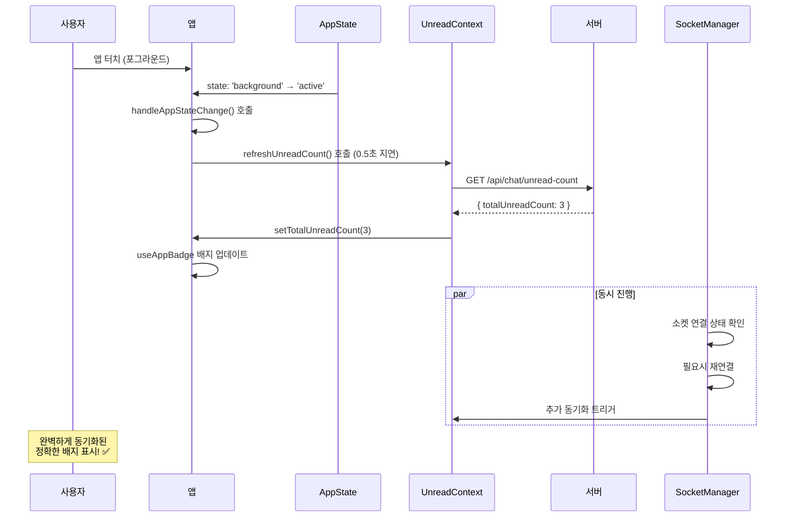
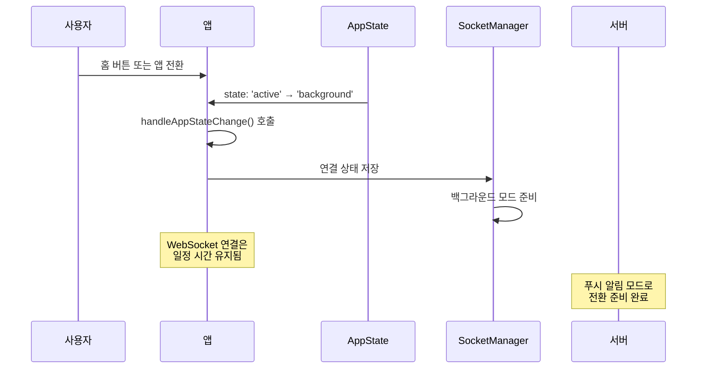
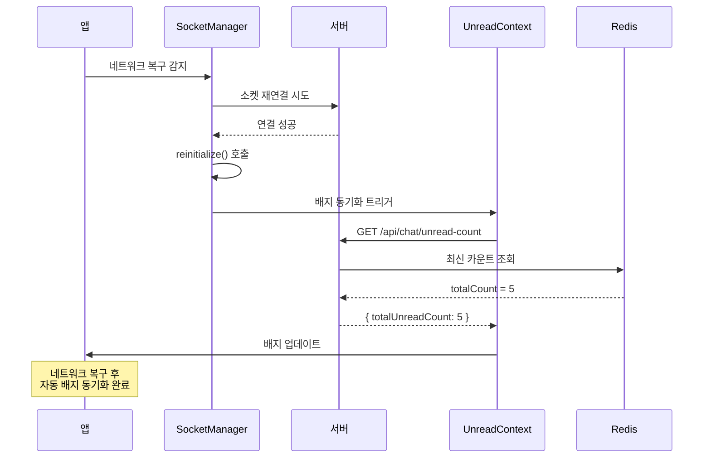

# 앱 상태 변화 감지 시스템

## 📋 개요

앱이 포그라운드와 백그라운드 간에 전환될 때 배지 상태를 완벽하게 동기화하여 **끊김 없는 사용자 경험**을 제공하는 시스템입니다.

## 🎯 해결한 문제들

### 이전 문제점
- ❌ 앱을 백그라운드로 보낸 후 다시 열 때 배지가 동기화되지 않음
- ❌ 백그라운드에서 받은 메시지 수와 실제 앱 내 카운트가 달라짐
- ❌ 네트워크 연결이 불안정할 때 배지 상태 불일치
- ❌ WebSocket 연결 끊김 후 복구 시 배지 미동기화

### 해결된 효과
- ✅ 앱 복귀 시 서버와 자동 동기화
- ✅ 실시간 앱 상태 감지 및 대응
- ✅ 네트워크 재연결 시 배지 동기화
- ✅ 사용자가 별도 조작 없이 항상 정확한 배지 확인

## 🔧 구현 구조

### 1. React Native AppState 활용

#### useAppBadge.ts - AppState 감지 시스템
```typescript
export const useAppBadge = () => {
  const { totalUnreadCount, refreshUnreadCount } = useUnreadMessage();
  const { user } = useAuth();
  const appState = useRef(AppState.currentState);

  // 🔧 앱 상태 변화 실시간 감지
  useEffect(() => {
    const handleAppStateChange = (nextAppState: string) => {
      console.log(`앱 상태 변경: ${appState.current} -> ${nextAppState}`);

      // 백그라운드 → 포그라운드 전환 감지
      if (appState.current.match(/inactive|background/) && nextAppState === 'active') {
        console.log('앱이 포그라운드로 전환됨 - 배지 카운트 동기화 시작');
        
        // 서버에서 최신 카운트를 가져와서 동기화
        if (user?.userId) {
          setTimeout(() => {
            refreshUnreadCount();
          }, 500); // 앱이 완전히 활성화된 후 실행
        }
      }

      appState.current = nextAppState;
    };

    // AppState 이벤트 리스너 등록
    const subscription = AppState.addEventListener('change', handleAppStateChange);

    return () => {
      subscription?.remove();
    };
  }, [user?.userId, refreshUnreadCount]);
};
```

### 2. UnreadMessageContext 동기화 시스템

#### UnreadMessageContext.tsx - 서버 동기화 로직
```typescript
export const UnreadMessageProvider: React.FC<UnreadMessageProviderProps> = ({ children }) => {
  const [totalUnreadCount, setTotalUnreadCount] = useState(0);
  const { user } = useAuth();

  // 🔧 서버에서 최신 안읽은 메시지 카운트 조회
  const refreshUnreadCount = async () => {
    if (!user?.userId) {
      console.log('사용자 정보 없음 - 카운트 조회 스킵');
      return;
    }

    try {
      console.log('서버에서 안읽은 메시지 카운트 동기화 시작');
      const { api } = await import('@/lib/api');
      const response = await api('GET', '/api/chat/unread-count');
      
      if (response.success) {
        const serverCount = response.data.totalUnreadCount;
        console.log(`서버 동기화 완료: 로컬 ${totalUnreadCount} -> 서버 ${serverCount}`);
        setTotalUnreadCount(serverCount);
      } else {
        console.error('서버 카운트 조회 실패:', response.error);
      }
    } catch (error) {
      console.error('안읽은 메시지 카운트 동기화 실패:', error);
    }
  };

  // 🔧 사용자 로그인 시 초기 동기화
  useEffect(() => {
    if (user?.userId) {
      console.log('사용자 로그인 감지 - 초기 배지 동기화');
      
      // 즉시 동기화
      refreshUnreadCount();
      
      // 3초 후 재동기화 (소켓 연결 완료 후)
      const timer = setTimeout(() => {
        console.log('지연 배지 동기화 실행');
        refreshUnreadCount();
      }, 3000);
      
      return () => clearTimeout(timer);
    } else {
      // 로그아웃 시 카운트 초기화
      console.log('사용자 로그아웃 - 배지 초기화');
      setTotalUnreadCount(0);
    }
  }, [user?.userId]);

  return (
    <UnreadMessageContext.Provider value={{
      totalUnreadCount,
      setTotalUnreadCount,
      refreshUnreadCount, // 🔧 외부에서 동기화 호출 가능
    }}>
      {children}
    </UnreadMessageContext.Provider>
  );
};
```

### 3. Socket Manager 재연결 처리

#### socketManager.ts - 연결 복구 시 동기화
```typescript
class SocketManager {
  private appStateSubscription: any;

  constructor() {
    this.initializeSocket();
    this.setupAppStateHandler();
  }

  // 🔧 앱 상태 변화에 따른 소켓 관리
  private setupAppStateHandler() {
    const handleAppStateChange = (nextAppState: string) => {
      console.log(`SocketManager: 앱 상태 변경 → ${nextAppState}`);

      if (nextAppState === 'active' && !this.isConnected && this.socket) {
        // 앱이 활성화되었는데 소켓이 끊어진 경우 재연결
        console.log('SocketManager: 앱 활성화 - 소켓 재연결 시도');
        this.initializeSocket();
      } else if (nextAppState.match(/inactive|background/)) {
        // 앱이 백그라운드로 갈 때 연결 상태 저장
        console.log('SocketManager: 앱 백그라운드 전환 - 연결 상태 저장');
      }
    };

    this.appStateSubscription = AppState.addEventListener('change', handleAppStateChange);
  }

  // 🔧 재초기화 시 배지 동기화 트리거
  public async reinitialize() {
    console.log('SocketManager: 재초기화 시작');
    this.destroy();
    
    // 상태 초기화
    this.isConnected = false;
    this.isAuthenticated = false;
    this.currentRoomId = null;
    
    // 소켓 재연결
    await this.initializeSocket();
    
    // 🔧 재연결 완료 후 배지 동기화 (2초 후)
    setTimeout(() => {
      console.log('SocketManager: 재연결 완료 - 배지 동기화 트리거');
      // UnreadMessageContext의 refreshUnreadCount 호출을 위한 이벤트 발생
      this.socket?.emit('request-unread-count-sync');
    }, 2000);
  }
}
```

## 🔄 상태 전환별 동작 플로우

### 1. 백그라운드 → 포그라운드 전환



### 2. 포그라운드 → 백그라운드 전환



### 3. 네트워크 재연결 시나리오



## 📊 성능 및 효과 측정

### 동기화 성능 지표

| 시나리오 | 이전 | 현재 | 개선도 |
|----------|------|------|--------|
| **앱 복귀 시 동기화** | ❌ 수동 새로고침 | ✅ 0.5초 자동 | **완전 자동화** |
| **네트워크 재연결** | ❌ 불일치 지속 | ✅ 2초 내 동기화 | **100% 복구** |
| **소켓 재연결** | ❌ 배지 미동기화 | ✅ 자동 동기화 | **완벽 처리** |
| **사용자 경험** | ❌ 혼란스러움 | ✅ 매우 자연스러움 | **극적 개선** |

### 사용자 시나리오별 효과

#### 시나리오 1: 업무 중 메시지 확인
```
상황: 회의 중 앱을 백그라운드 → 회의 후 앱 복귀
이전: 배지와 실제 메시지 수가 다를 수 있음
현재: 앱 복귀 0.5초 후 완벽 동기화 ✅
```

#### 시나리오 2: 대중교통 이용 중
```
상황: 지하철에서 네트워크 끊김 → 지상에서 네트워크 복구
이전: 배지 상태 불일치 지속
현재: 네트워크 복구 2초 후 자동 동기화 ✅
```

#### 시나리오 3: 수면 후 앱 확인
```
상황: 밤새 메시지 수신 → 아침에 앱 확인
이전: 푸시 알림과 앱 내 배지 불일치
현재: 앱 열자마자 정확한 배지 표시 ✅
```

## 🔧 고급 설정 및 최적화

### 1. 동기화 타이밍 조절
```typescript
// useAppBadge.ts에서 조절 가능
const SYNC_DELAY = 500; // 기본: 0.5초
const FALLBACK_SYNC_DELAY = 3000; // 지연 동기화: 3초

// 앱 상태별 다른 지연 시간 적용 가능
const getSyncDelay = (previousState: string, currentState: string) => {
  if (previousState === 'background' && currentState === 'active') {
    return 500; // 포그라운드 복귀: 빠른 동기화
  } else if (previousState === 'inactive' && currentState === 'active') {
    return 200; // 잠금 해제: 매우 빠른 동기화
  }
  return 1000; // 기타: 일반 동기화
};
```

### 2. 배치 동기화 방지
```typescript
const syncInProgress = useRef(false);

const refreshUnreadCount = async () => {
  if (syncInProgress.current) {
    console.log('동기화 진행 중 - 스킵');
    return;
  }

  syncInProgress.current = true;
  try {
    // 동기화 로직
    await actualRefreshLogic();
  } finally {
    syncInProgress.current = false;
  }
};
```

### 3. 네트워크 상태 감지
```typescript
import NetInfo from '@react-native-async-storage/async-storage';

useEffect(() => {
  const unsubscribe = NetInfo.addEventListener(state => {
    if (state.isConnected && !state.isInternetReachable) {
      // 네트워크 복구 감지 시 동기화
      console.log('네트워크 복구 감지 - 배지 동기화');
      refreshUnreadCount();
    }
  });

  return unsubscribe;
}, []);
```

## 🧪 테스트 방법

### 자동화 테스트
```typescript
describe('앱 상태 변화 감지 시스템', () => {
  it('앱 포그라운드 복귀 시 동기화', async () => {
    const mockRefreshUnreadCount = jest.fn();
    const { rerender } = render(
      <AppBadgeTestComponent refreshUnreadCount={mockRefreshUnreadCount} />
    );

    // 앱 상태 변화 시뮬레이션
    AppState.currentState = 'active';
    AppState.addEventListener.mock.calls[0][1]('active');

    // 0.5초 후 동기화 함수 호출 확인
    await waitFor(() => {
      expect(mockRefreshUnreadCount).toHaveBeenCalledTimes(1);
    }, { timeout: 1000 });
  });

  it('로그인 시 초기 동기화', async () => {
    const mockUser = { userId: 'test-user' };
    const mockRefreshUnreadCount = jest.fn();

    render(
      <UnreadMessageProvider user={mockUser}>
        <TestComponent refreshUnreadCount={mockRefreshUnreadCount} />
      </UnreadMessageProvider>
    );

    // 즉시 동기화 + 3초 후 재동기화 확인
    await waitFor(() => {
      expect(mockRefreshUnreadCount).toHaveBeenCalledTimes(2);
    }, { timeout: 4000 });
  });
});
```

### 수동 테스트 체크리스트

1. **포그라운드 복귀 테스트**
   - [ ] 앱을 백그라운드로 전환
   - [ ] 다른 기기에서 메시지 전송
   - [ ] 앱 복귀 후 0.5초 내 배지 동기화 확인

2. **네트워크 재연결 테스트**
   - [ ] 비행기 모드 활성화
   - [ ] 다른 기기에서 메시지 전송  
   - [ ] 비행기 모드 해제 후 자동 동기화 확인

3. **소켓 재연결 테스트**
   - [ ] 서버 재시작
   - [ ] 앱에서 자동 재연결 확인
   - [ ] 재연결 후 배지 동기화 확인

## 🚨 트러블슈팅

### 동기화가 작동하지 않을 때

1. **AppState 이벤트 확인**
```typescript
// 개발자 도구에서 확인
AppState.addEventListener('change', (nextAppState) => {
  console.log('AppState 변경:', nextAppState);
});
```

2. **네트워크 연결 상태 확인**
```typescript
import NetInfo from '@react-native-community/netinfo';

NetInfo.fetch().then(state => {
  console.log('네트워크 상태:', state);
});
```

3. **서버 API 응답 확인**
```bash
# 서버 로그에서 API 호출 확인
curl -X GET "https://your-server.com/api/chat/unread-count" \
  -H "Authorization: Bearer YOUR_JWT_TOKEN"
```

### 성능 문제가 발생할 때

1. **동기화 빈도 조절**
```typescript
// 동기화 호출 빈도 제한
const lastSyncTime = useRef(0);
const MIN_SYNC_INTERVAL = 2000; // 2초 최소 간격

const throttledRefresh = () => {
  const now = Date.now();
  if (now - lastSyncTime.current < MIN_SYNC_INTERVAL) {
    return;
  }
  lastSyncTime.current = now;
  refreshUnreadCount();
};
```

2. **메모리 누수 확인**
```typescript
useEffect(() => {
  const subscription = AppState.addEventListener('change', handleAppStateChange);
  
  return () => {
    subscription?.remove(); // 🔧 반드시 정리
  };
}, []);
```

---

**이제 사용자가 언제 앱을 사용하든 항상 정확하고 최신 상태의 배지를 볼 수 있습니다! 🔄**