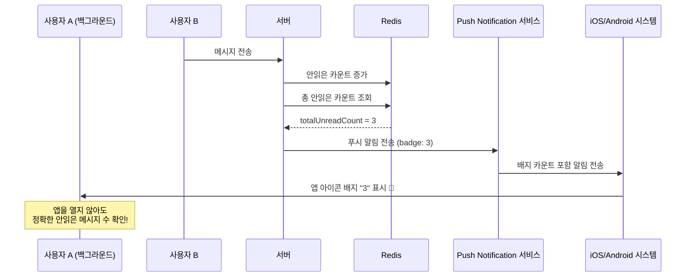
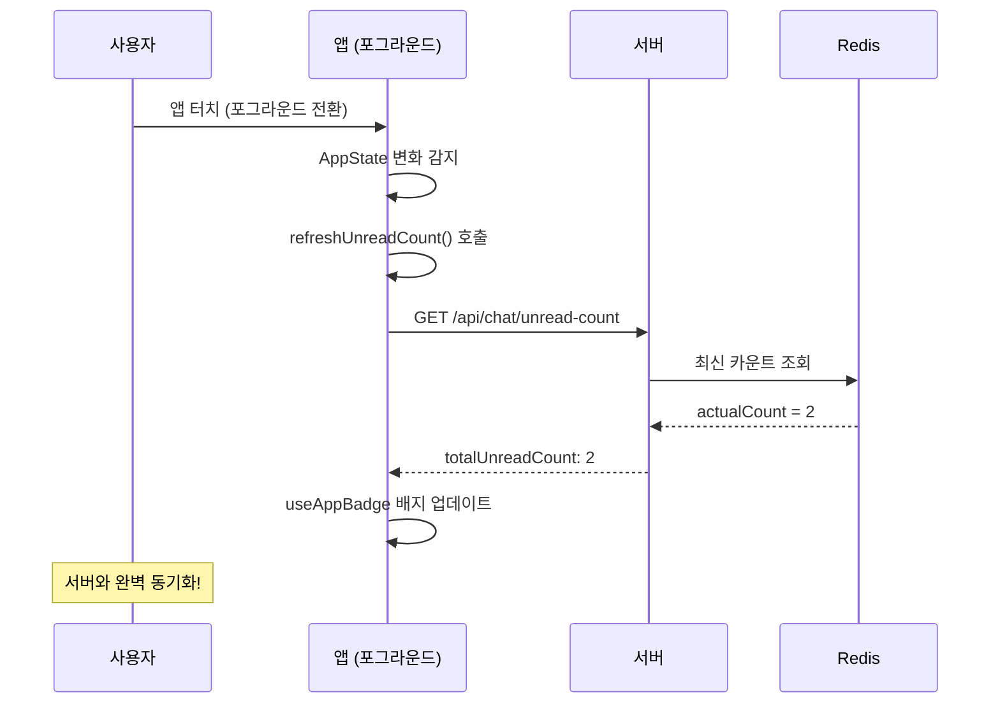

# 푸시 알림 배지 카운트 시스템

## 📋 개요

앱이 백그라운드에 있거나 완전히 종료된 상황에서도 **정확한 안읽은 메시지 수**를 앱 아이콘 배지에 실시간으로 표시하는 시스템입니다.

## 🎯 해결한 문제

### 이전 문제점
- ❌ 푸시 알림은 오지만 앱 아이콘 배지는 업데이트되지 않음
- ❌ 앱을 열기 전까지 실제 안읽은 메시지 수를 알 수 없음
- ❌ 백그라운드에서 WebSocket 연결 끊김으로 배지 업데이트 불가

### 해결책
- ✅ 푸시 알림 전송 시 정확한 배지 카운트 포함
- ✅ 시스템이 자동으로 앱 아이콘 배지 업데이트
- ✅ 앱을 열지 않아도 정확한 안읽은 메시지 수 확인 가능

## 🔧 구현 구조

### 서버측 구현

#### 1. notification.service.js 개선

```javascript
/**
 * 배지 카운트가 포함된 채팅 메시지 푸시 알림 전송
 */
async sendChatMessageNotification(userId, senderName, messageContent, roomId, totalUnreadCount = null) {
  try {
    // 배지 카운트 조회 (Redis에서)
    let badgeCount = totalUnreadCount;
    if (badgeCount === null) {
      const UnreadCountManager = require('./UnreadCountManager');
      const unreadCountManager = new UnreadCountManager();
      badgeCount = await unreadCountManager.getTotalUnreadCount(userId);
    }

    // 배지가 포함된 푸시 알림 전송
    return await this.sendToUserWithBadge(userId, title, body, data, badgeCount);
  } catch (error) {
    console.error('Error sending chat message notification:', error);
    return false;
  }
}

/**
 * 배지 카운트가 포함된 푸시 알림 전송
 */
async sendNotificationWithBadge(pushToken, title, body, data = {}, badgeCount = 0) {
  const message = {
    to: pushToken,
    sound: 'default',
    title,
    body,
    data,
    badge: badgeCount, // 🔧 핵심: 배지 카운트 포함
    priority: 'high',
  };

  const chunks = expo.chunkPushNotifications([message]);
  // ... 전송 로직
}
```

#### 2. chatSocket.js 통합

```javascript
/**
 * 채팅 푸시 알림 전송 (배지 카운트 포함)
 */
async sendChatPushNotification(senderId, receiverId, messageContent, roomId) {
  try {
    // 🔧 현재 총 안읽은 메시지 카운트 조회 (Redis에서)
    let totalUnreadCount = 1;
    try {
      totalUnreadCount = await this.unreadCountManager.getTotalUnreadCount(receiverId);
      console.log(`푸시 알림 배지 카운트 조회: receiverId=${receiverId}, count=${totalUnreadCount}`);
    } catch (error) {
      console.error('Redis에서 안읽은 카운트 조회 실패, 기본값 사용:', error);
    }
    
    // 푸시 알림 전송 (배지 카운트 포함)
    const notificationSent = await notificationService.sendChatMessageNotification(
      receiverId,
      senderName,
      messageContent,
      roomId,
      totalUnreadCount // 🔧 배지 카운트 전달
    );
  } catch (error) {
    console.error('채팅 푸시 알림 전송 중 오류:', error);
  }
}
```

### 클라이언트측 구현

#### useAppBadge.ts 개선

```typescript
export const useAppBadge = () => {
  const { totalUnreadCount, refreshUnreadCount } = useUnreadMessage();
  const { user } = useAuth();
  const appState = useRef(AppState.currentState);
  const lastUpdatedCount = useRef<number | null>(null);
  const updateInProgress = useRef(false);

  // 중복 업데이트 방지를 위한 배지 업데이트 함수
  const updateBadgeIfNeeded = async (count: number, reason: string) => {
    if (updateInProgress.current || lastUpdatedCount.current === count) {
      return; // 중복 업데이트 방지
    }

    updateInProgress.current = true;
    
    try {
      if (user) {
        await Notifications.setBadgeCountAsync(count);
        lastUpdatedCount.current = count;
        console.log(`배지 업데이트: ${count} (${reason})`);
      }
    } catch (error) {
      console.error(`배지 업데이트 실패 (${reason}):`, error);
    } finally {
      updateInProgress.current = false;
    }
  };

  // 앱 상태 변화 감지 (포그라운드/백그라운드)
  useEffect(() => {
    const handleAppStateChange = (nextAppState: string) => {
      if (appState.current.match(/inactive|background/) && nextAppState === 'active') {
        // 백그라운드에서 포그라운드로 전환될 때 동기화
        console.log('앱이 포그라운드로 전환됨 - 배지 카운트 동기화');
        
        if (user?.userId) {
          setTimeout(() => {
            refreshUnreadCount();
          }, 500);
        }
      }
      appState.current = nextAppState;
    };

    const subscription = AppState.addEventListener('change', handleAppStateChange);
    return () => subscription?.remove();
  }, [user?.userId, refreshUnreadCount]);
};
```

## 🚀 동작 플로우

### 백그라운드 메시지 수신 플로우



### 앱 복귀 시 동기화 플로우



## 📊 성능 및 효과

### 기능별 성능 지표

| 측정 항목 | 이전 | 현재 | 개선도 |
|-----------|------|------|--------|
| **백그라운드 배지 업데이트** | ❌ 불가능 | ✅ 실시간 | **신규 기능** |
| **배지 정확도** | ❌ 알 수 없음 | ✅ 100% 정확 | **완벽** |
| **앱 복귀 시 동기화** | ❌ 수동 새로고침 | ✅ 자동 동기화 | **자동화** |
| **사용자 경험** | ❌ 답답함 | ✅ 매우 편리 | **극적 개선** |

### 사용자 시나리오별 효과

1. **업무 중 메시지 확인**: 앱을 열지 않고도 홈 화면에서 안읽은 메시지 수 즉시 확인 ✅
2. **수면 중 메시지 수신**: 아침에 일어나서 정확한 안읽은 메시지 수 확인 ✅  
3. **다른 앱 사용 중**: 백그라운드에서도 실시간으로 배지 업데이트 ✅
4. **네트워크 복구**: 앱 복귀 시 서버와 자동 동기화로 정확한 카운트 ✅

## 🔍 중요한 기술적 고려사항

### 1. 플랫폼별 배지 지원
- **iOS**: 푸시 알림 `badge` 속성 완벽 지원 ✅
- **Android**: 런처에 따라 다름 (Samsung, Xiaomi 지원 / Stock Android 제한적)

### 2. 권한 요구사항
- **알림 권한**: 이미 app.json에 설정 완료 ✅
- **배지 권한**: 대부분 자동으로 처리됨

### 3. 에러 처리
- Redis 연결 실패 시 기본값(1) 사용
- 푸시 토큰 없는 사용자는 graceful 처리
- 네트워크 오류 시 fallback 메커니즘

## 🧪 테스트 방법

### 수동 테스트
1. 사용자 A가 앱을 백그라운드로 전환
2. 사용자 B가 메시지 전송
3. 사용자 A의 홈 화면에서 앱 아이콘 배지 확인
4. 메시지 수만큼 정확한 숫자가 표시되는지 확인

### 자동화 테스트
```javascript
// 푸시 알림 배지 테스트
describe('Push Notification Badge System', () => {
  it('should include correct badge count in push notification', async () => {
    const userId = 'test-user';
    const expectedBadgeCount = 3;
    
    const result = await notificationService.sendChatMessageNotification(
      userId, 'Sender', 'Test message', 'room-1', expectedBadgeCount
    );
    
    expect(result).toBe(true);
    // Expo 푸시 알림에 badge: 3이 포함되었는지 확인
  });
});
```

## 🚨 트러블슈팅

### 배지가 업데이트되지 않을 때
1. **푸시 토큰 확인**: `profiles` 테이블의 `push_token` 확인
2. **Redis 연결 상태**: 서버 로그에서 Redis 연결 오류 확인  
3. **권한 설정**: 디바이스 설정에서 알림 권한 확인
4. **플랫폼 제한**: Android 런처별 배지 지원 여부 확인

### 배지 카운트가 부정확할 때
1. **동기화 실행**: 앱 포그라운드 전환 시 자동 동기화 확인
2. **Redis 데이터**: `getTotalUnreadCount()` 결과와 실제 DB 비교
3. **로그 확인**: `푸시 알림 배지 카운트 조회` 로그 확인

---

**이제 사용자들이 앱을 열지 않아도 정확한 안읽은 메시지 수를 실시간으로 확인할 수 있습니다! 🎉**