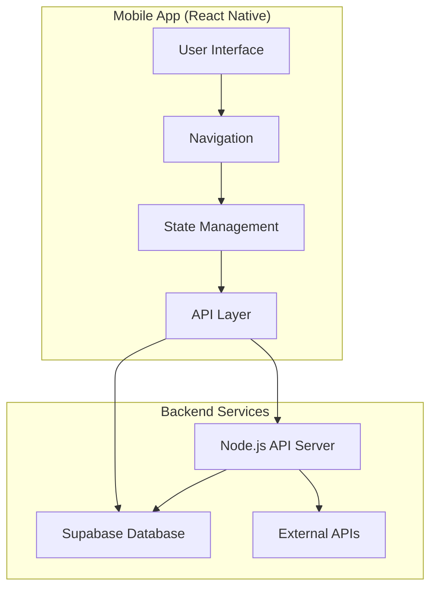
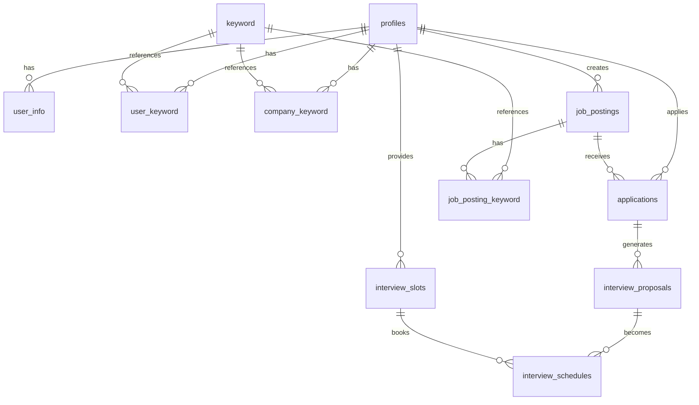
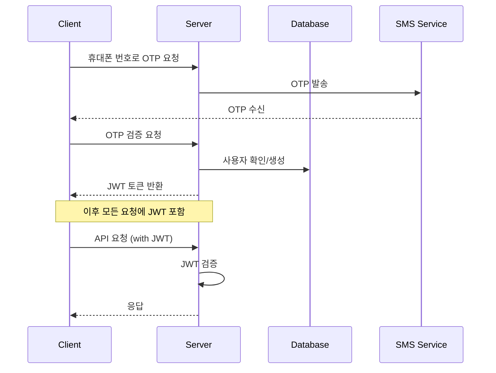
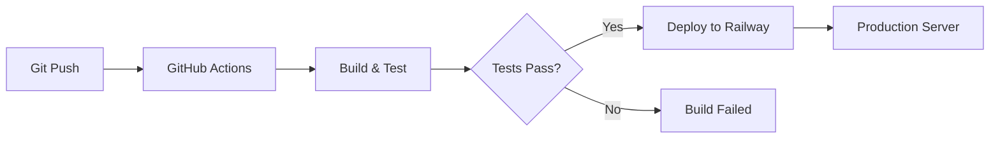

# 시스템 아키텍처

## 🏗 전체 구조



## 📱 모바일 앱 아키텍처

### 계층 구조

```
┌─────────────────────────────────────┐
│           UI Components             │
│      (Expo Router Navigation)       │
├─────────────────────────────────────┤
│       State Management Layer        │
│   Context API + Zustand + Hooks     │
│                                     │
│ ┌─────────────┐ ┌─────────────────┐ │
│ │ AuthContext │ │ JobPostingStore │ │
│ │ Translation │ │ ApplicationForm │ │
│ │  Context    │ │     Store       │ │
│ └─────────────┘ └─────────────────┘ │
├─────────────────────────────────────┤
│          API Layer                  │
│   (Server API + Direct Supabase)    │
├─────────────────────────────────────┤
│         Business Logic              │
│  (5-Level Matching Algorithm)       │
└─────────────────────────────────────┘
```

### 핵심 디렉토리 구조

```
app/
├── (auth)/              # 인증 관련 화면
├── (user)/              # 구직자 인터페이스
├── (company)/           # 기업 인터페이스
├── (pages)/             # 공통 페이지
└── _layout.tsx          # 루트 레이아웃

contexts/
├── AuthContext.tsx      # 인증 상태 관리
└── TranslationContext.tsx # 다국어 지원

lib/
├── api.ts              # API 설정
├── supabase.ts         # Supabase 클라이언트
└── suitability/        # 매칭 알고리즘

hooks/
├── useProfile.ts       # 프로필 데이터 관리
├── useAuth.ts          # 인증 훅
└── useTranslation.ts   # 번역 훅
```

### 데이터 흐름

#### 하이브리드 데이터 아키텍처

**이 프로젝트의 독특한 특징: Server API와 직접 Supabase 접근의 혼합 사용**

**Server API 사용 케이스:**
- 인증 (OTP 발송/검증)
- 일부 프로필 작업  
- 계정 관리
- JWT 토큰 관리
- SMS 서비스 (Solapi)
- 번역 서비스 (Google Translate)

**Direct Supabase 사용 케이스 (광범위하게 사용):**
- 프로필 CRUD (`hooks/useProfile.ts`)
- 키워드 관리 (`hooks/useUserKeywords.ts`)  
- 지원서 관리 (`hooks/useApplications.ts`)
- 메시지 시스템 (실시간 구독)
- 채용공고 관리 (`app/(company)/myJobPostings.tsx`)
- 면접 데이터
- 대부분의 데이터 중심 작업

```typescript
// Server API 패턴
const { authenticatedRequest } = useAuth();
const response = await authenticatedRequest('/api/auth/verify-otp', {
  method: 'POST',
  body: { phone, otp }
});

// Direct Supabase 패턴
const { data } = await supabase
  .from('profiles')
  .select('*, user_info(*)')
  .eq('id', userId)
  .single();
```

### 상태 관리 전략

#### 하이브리드 상태 관리 시스템

**Context API (전역 상태)**
- **AuthContext**: 인증 상태 및 API 클라이언트
- **TranslationContext**: 12개 언어 국제화 지원
- **AsyncStorage**: 토큰, 사용자 데이터, 온보딩 상태 지속화

**Zustand (복잡한 폼 상태)**
- **JobPostingStore**: 채용공고 생성/편집 워크플로우
- **ApplicationFormStore**: 다단계 지원서 폼 상태
- **특징**: 지속적 초안 저장, 복잡한 폼 탐색, 실행취소/재실행 기능

**Custom Hooks (컴포넌트별 상태)**
- **useProfile**: 프로필 CRUD 및 캐싱
- **useApplications**: 지원서 추적 및 상태 관리
- **useUserKeywords**: 키워드 선택 및 관리

```typescript
// Zustand 패턴 예시
import { useJobPostingStore } from '@/stores/jobPostingStore';
const { formData, updateField, resetForm } = useJobPostingStore();

// Context API 패턴 예시  
const { user, authenticatedRequest } = useAuth();
const { t, currentLanguage } = useTranslation();

// Custom Hook 패턴 예시
const { profile, updateProfile, isLoading } = useProfile();
```

## 🖥 서버 아키텍처

### MVC 패턴

```
┌─────────────────┐    ┌─────────────────┐    ┌─────────────────┐
│     Routes      │───▶│   Controllers   │───▶│    Services     │
│  (API 엔드포인트)  │    │   (요청 처리)    │    │  (비즈니스 로직)  │
└─────────────────┘    └─────────────────┘    └─────────────────┘
                                │                       │
                                ▼                       ▼
                       ┌─────────────────┐    ┌─────────────────┐
                       │   Middlewares   │    │    Database     │
                       │ (인증, 검증, 로깅) │    │   (Supabase)    │
                       └─────────────────┘    └─────────────────┘
```

### 서버 디렉토리 구조

```
src/
├── app.js              # Express 앱 설정
├── config/             # 설정 파일들
│   ├── database.js     # Supabase 설정
│   └── cors.js         # CORS 설정
├── controllers/        # 요청 처리 로직
│   ├── auth.controller.js
│   ├── applications.controller.js
│   └── interviews.controller.js
├── services/           # 비즈니스 로직
│   ├── auth.service.js
│   ├── sms.service.js
│   └── translate.service.js
├── middlewares/        # 미들웨어
│   ├── auth.js         # JWT 인증
│   ├── validation.js   # 요청 검증
│   └── rateLimit.js    # 속도 제한
└── routes/            # API 라우트 정의
    ├── auth.routes.js
    ├── applications.routes.js
    └── interviews.routes.js
```

## 🗄 데이터베이스 설계

### ERD 핵심 관계



### 데이터 접근 패턴

#### 1. 프로필 관리
```sql
-- 사용자 프로필 + 상세정보 조회
SELECT p.*, ui.* 
FROM profiles p 
LEFT JOIN user_info ui ON p.id = ui.user_id 
WHERE p.id = $1;
```

#### 2. 매칭 시스템
```sql
-- 사용자의 키워드와 매칭되는 채용공고 찾기
SELECT jp.*, p.name as company_name
FROM job_postings jp
JOIN profiles p ON jp.company_id = p.id
JOIN job_posting_keyword jpk ON jp.id = jpk.job_posting_id
WHERE jpk.keyword_id IN (
  SELECT uk.keyword_id 
  FROM user_keyword uk 
  WHERE uk.user_id = $1
);
```

#### 3. 실시간 데이터
```typescript
// 메시지 실시간 구독
const subscription = supabase
  .channel('messages')
  .on('postgres_changes', 
    { event: 'INSERT', schema: 'public', table: 'messages' },
    (payload) => handleNewMessage(payload.new)
  )
  .subscribe();
```

## 🔐 보안 아키텍처

### 인증 플로우



### JWT 토큰 구조
```json
{
  "user_id": "uuid",
  "phone_number": "string",
  "user_type": "user|company",
  "iat": "timestamp",
  "exp": "timestamp"
}
```

## 🎯 매칭 알고리즘 아키텍처

### 적합도 계산 시스템

```typescript
interface SuitabilityScore {
  totalScore: number;        // 0-100
  level: 'perfect' | 'excellent' | 'good' | 'fair' | 'low';
  categoryScores: {
    [category: string]: {
    score: number;
    maxScore: number;
    keywords: string[];
    }
  };
  bonusPoints: number;
}
```

### 계산 프로세스

1. **카테고리별 점수 계산**
   - 각 카테고리의 가중치 적용
   - 필수 키워드 검증
   - 매칭 키워드 점수 합산

2. **보너스 점수 적용**
   - 키워드 조합 보너스
   - 특별 조건 보너스

3. **최종 적합도 결정**
   - 0-100점 스케일 정규화
   - 5단계 등급 분류

## 📡 외부 서비스 통합

### API 통합 구조

```
┌─────────────────┐    ┌─────────────────┐
│   Mobile App    │    │   Server API    │
└─────────┬───────┘    └─────────┬───────┘
          │                      │
          ▼                      ▼
┌─────────────────┐    ┌─────────────────┐
│    Supabase     │    │ External APIs   │
│   (Database)    │    │ ┌─────────────┐ │
└─────────────────┘    │ │   Solapi    │ │
                       │ │   (SMS)     │ │
                       │ ├─────────────┤ │
                       │ │   Google    │ │
                       │ │ Translate   │ │
                       │ ├─────────────┤ │
                       │ │   OpenAI    │ │
                       │ │    (AI)     │ │
                       │ └─────────────┘ │
                       └─────────────────┘
```

### 서비스별 역할

- **Supabase**: 인증, 데이터베이스, 실시간 기능
- **Solapi**: SMS OTP 발송
- **Google Translate**: 다국어 번역
- **OpenAI**: AI 기반 매칭 개선 (선택사항)

## 🚀 배포 아키텍처

### 환경별 구성

```
Production:
├── Mobile App (App Store/Google Play)
├── Server (Railway)
└── Database (Supabase Cloud)

Development:
├── Mobile App (Expo Go/Dev Build)
├── Server (Local/Railway)
└── Database (Supabase Cloud)
```

### CI/CD 파이프라인



## 📊 성능 최적화

### 모바일 앱 최적화
- **지연 로딩**: 화면별 컴포넌트 분할
- **메모이제이션**: React.memo, useMemo 활용
- **이미지 최적화**: Expo Image 사용
- **번들 크기 최적화**: Metro 설정 튜닝

### 서버 최적화
- **API 응답 캐싱**: Redis (향후 도입 예정)
- **데이터베이스 최적화**: 인덱스, 쿼리 최적화
- **속도 제한**: Rate limiting 적용

### 데이터베이스 최적화
- **인덱스 전략**: 자주 사용되는 쿼리 패턴
- **RLS 정책**: 행 수준 보안 최적화
- **연결 풀링**: Supabase 연결 관리