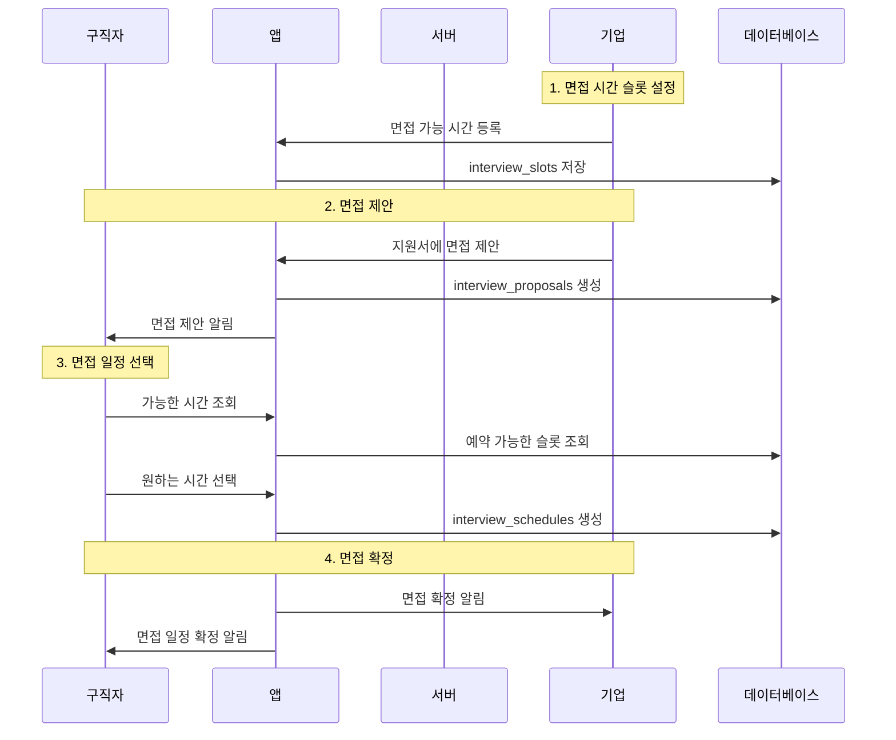
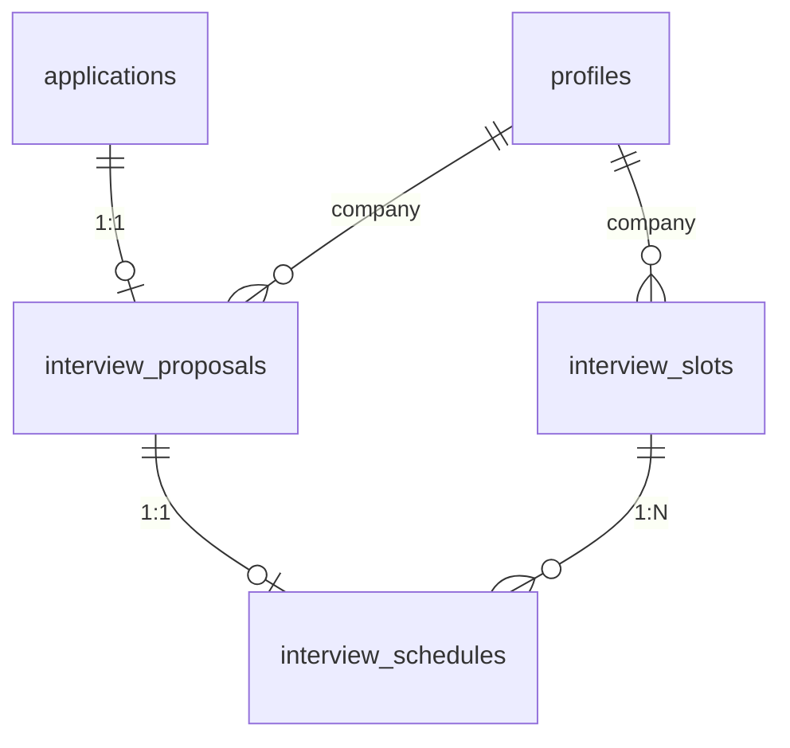

# 면접 시스템

## 🎯 면접 시스템 개요

kgency의 면접 시스템은 기업과 구직자 간의 면접 일정을 효율적으로 관리하는 통합 솔루션입니다. 캘린더 기반의 직관적인 인터페이스와 자동화된 워크플로우를 제공합니다.

### 면접 프로세스 플로우



## 🗄 데이터베이스 구조

### 면접 관련 테이블

#### 1. interview_slots (면접 시간 슬롯)
```sql
CREATE TABLE interview_slots (
    id uuid PRIMARY KEY DEFAULT gen_random_uuid(),
    company_id uuid REFERENCES profiles(id),
    start_time timestamp NOT NULL,
    end_time timestamp NOT NULL,
    interview_type varchar DEFAULT '대면',
    is_available boolean DEFAULT true,
    created_at timestamp DEFAULT now()
);
```

#### 2. interview_proposals (면접 제안)
```sql
CREATE TABLE interview_proposals (
    id integer PRIMARY KEY GENERATED ALWAYS AS IDENTITY,
    application_id uuid UNIQUE REFERENCES applications(id),
    company_id uuid REFERENCES profiles(id),
    location varchar,
    status varchar DEFAULT 'pending' CHECK (status IN (
        'pending', 'accepted', 'rejected', 'expired'
    )),
    created_at timestamp DEFAULT now()
);
```

#### 3. interview_schedules (확정된 면접)
```sql
CREATE TABLE interview_schedules (
    id integer PRIMARY KEY GENERATED ALWAYS AS IDENTITY,
    proposal_id integer UNIQUE REFERENCES interview_proposals(id),
    interview_slot_id uuid REFERENCES interview_slots(id),
    confirmed_at timestamp DEFAULT now(),
    status varchar DEFAULT 'confirmed' CHECK (status IN (
        'confirmed', 'completed', 'cancelled', 'no_show'
    ))
);
```

### 관계 다이어그램



## 📅 기업용 면접 슬롯 관리

### 면접 시간 등록 화면

```typescript
// app/(company)/interviewSlots.tsx
const InterviewSlotsScreen: React.FC = () => {
  const [selectedDate, setSelectedDate] = useState<Date>(new Date());
  const [slots, setSlots] = useState<InterviewSlot[]>([]);
  const [showAddModal, setShowAddModal] = useState(false);

  // 면접 슬롯 조회
  const fetchSlots = async () => {
    const { data } = await supabase
      .from('interview_slots')
      .select('*')
      .eq('company_id', user.id)
      .gte('start_time', startOfDay(selectedDate))
      .lt('start_time', startOfDay(addDays(selectedDate, 1)))
      .order('start_time');
    
    setSlots(data || []);
  };

  // 새 슬롯 추가
  const addSlot = async (slotData: NewSlotData) => {
    const { error } = await supabase
      .from('interview_slots')
      .insert({
        company_id: user.id,
        start_time: slotData.startTime,
        end_time: slotData.endTime,
        interview_type: slotData.type
      });

    if (!error) {
      fetchSlots();
      setShowAddModal(false);
    }
  };

  return (
    <SafeAreaView className="flex-1 bg-gray-50">
      {/* 캘린더 헤더 */}
      <CalendarHeader 
        selectedDate={selectedDate}
        onDateChange={setSelectedDate}
      />
      
      {/* 슬롯 목록 */}
      <ScrollView className="flex-1 p-4">
        {slots.map(slot => (
          <SlotCard 
            key={slot.id}
            slot={slot}
            onEdit={editSlot}
            onDelete={deleteSlot}
          />
        ))}
        
        {/* 빈 상태 */}
        {slots.length === 0 && (
          <EmptySlotState onAddSlot={() => setShowAddModal(true)} />
        )}
      </ScrollView>

      {/* 추가 버튼 */}
      <TouchableOpacity
        className="absolute bottom-6 right-6 bg-blue-500 w-14 h-14 rounded-full items-center justify-center shadow-lg"
        onPress={() => setShowAddModal(true)}
      >
        <Ionicons name="add" size={28} color="white" />
      </TouchableOpacity>

      {/* 슬롯 추가 모달 */}
      <AddSlotModal
        visible={showAddModal}
        selectedDate={selectedDate}
        onAdd={addSlot}
        onClose={() => setShowAddModal(false)}
      />
    </SafeAreaView>
  );
};
```

### 면접 슬롯 카드 컴포넌트

```typescript
const SlotCard: React.FC<{ slot: InterviewSlot }> = ({ slot }) => {
  const [isBooked, setIsBooked] = useState(false);

  // 예약 상태 확인
  useEffect(() => {
    checkBookingStatus();
  }, [slot.id]);

  const checkBookingStatus = async () => {
    const { data } = await supabase
      .from('interview_schedules')
      .select('id')
      .eq('interview_slot_id', slot.id)
      .single();
    
    setIsBooked(!!data);
  };

  return (
    <View className="bg-white p-4 rounded-lg mb-3 shadow-sm">
      <View className="flex-row justify-between items-start">
        <View className="flex-1">
          <Text className="text-lg font-semibold">
            {format(new Date(slot.start_time), 'HH:mm')} - 
            {format(new Date(slot.end_time), 'HH:mm')}
          </Text>
          <Text className="text-gray-600 mt-1">{slot.interview_type}</Text>
          
          {/* 예약 상태 표시 */}
          <View className="flex-row items-center mt-2">
            <View 
              className={`px-2 py-1 rounded-full ${
                isBooked ? 'bg-red-100' : 'bg-green-100'
              }`}
            >
              <Text 
                className={`text-xs font-medium ${
                  isBooked ? 'text-red-600' : 'text-green-600'
                }`}
              >
                {isBooked ? '예약됨' : '예약 가능'}
              </Text>
            </View>
          </View>
        </View>

        {/* 액션 버튼 */}
        <View className="flex-row">
          <TouchableOpacity
            className="p-2 ml-2"
            onPress={() => onEdit(slot)}
          >
            <Ionicons name="pencil" size={20} color="#6B7280" />
          </TouchableOpacity>
          
          <TouchableOpacity
            className="p-2 ml-1"
            onPress={() => onDelete(slot.id)}
            disabled={isBooked}
          >
            <Ionicons 
              name="trash" 
              size={20} 
              color={isBooked ? "#D1D5DB" : "#EF4444"} 
            />
          </TouchableOpacity>
        </View>
      </View>
    </View>
  );
};
```

## 💼 면접 제안 시스템

### 지원서에서 면접 제안하기

```typescript
// components/ApplicationCard.tsx (기업용)
const ApplicationActions: React.FC<{ application: Application }> = ({ 
  application 
}) => {
  const [showInterviewModal, setShowInterviewModal] = useState(false);

  const proposeInterview = async (location: string, message?: string) => {
    try {
      // 1. 면접 제안 생성
      const { data: proposal, error } = await supabase
        .from('interview_proposals')
        .insert({
          application_id: application.id,
          company_id: application.company_id,
          location,
          status: 'pending'
        })
        .select()
        .single();

      if (error) throw error;

      // 2. 지원서 상태 업데이트
      await supabase
        .from('applications')
        .update({ status: 'interview_proposed' })
        .eq('id', application.id);

      // 3. 알림 메시지 전송
      if (message) {
        await supabase
          .from('messages')
          .insert({
            sender_id: application.company_id,
            receiver_id: application.user_id,
            subject: '면접 제안',
            content: message
          });
      }

      setShowInterviewModal(false);
      Alert.alert('성공', '면접 제안이 전송되었습니다.');
      
    } catch (error) {
      console.error('Interview proposal error:', error);
      Alert.alert('오류', '면접 제안 중 오류가 발생했습니다.');
    }
  };

  return (
    <View className="flex-row justify-end space-x-2 mt-3">
      <TouchableOpacity
        className="bg-green-500 px-4 py-2 rounded-lg"
        onPress={() => setShowInterviewModal(true)}
      >
        <Text className="text-white font-medium">면접 제안</Text>
      </TouchableOpacity>

      <InterviewProposalModal
        visible={showInterviewModal}
        application={application}
        onPropose={proposeInterview}
        onClose={() => setShowInterviewModal(false)}
      />
    </View>
  );
};
```

### 면접 제안 모달

```typescript
const InterviewProposalModal: React.FC<{
  visible: boolean;
  application: Application;
  onPropose: (location: string, message: string) => void;
  onClose: () => void;
}> = ({ visible, application, onPropose, onClose }) => {
  const [location, setLocation] = useState('');
  const [message, setMessage] = useState('');

  const defaultMessage = `안녕하세요 ${application.user.name}님,

${application.job_posting.title} 포지션에 지원해주셔서 감사합니다.
서류 검토 결과 면접을 진행하고자 합니다.

아래 면접 가능 시간 중 편한 시간을 선택해주세요.

감사합니다.`;

  const handleSubmit = () => {
    if (!location.trim()) {
      Alert.alert('알림', '면접 장소를 입력해주세요.');
      return;
    }

    onPropose(location, message || defaultMessage);
  };

  return (
    <Modal visible={visible} animationType="slide" presentationStyle="pageSheet">
      <SafeAreaView className="flex-1 bg-white">
        <View className="flex-row justify-between items-center p-4 border-b border-gray-200">
          <Text className="text-lg font-semibold">면접 제안</Text>
          <TouchableOpacity onPress={onClose}>
            <Ionicons name="close" size={24} color="#6B7280" />
          </TouchableOpacity>
        </View>

        <ScrollView className="flex-1 p-4">
          {/* 지원자 정보 */}
          <View className="bg-gray-50 p-4 rounded-lg mb-4">
            <Text className="font-semibold mb-2">지원자 정보</Text>
            <Text>이름: {application.user.name}</Text>
            <Text>포지션: {application.job_posting.title}</Text>
          </View>

          {/* 면접 장소 */}
          <View className="mb-4">
            <Text className="font-medium mb-2">면접 장소</Text>
            <TextInput
              className="border border-gray-300 rounded-lg p-3"
              placeholder="예: 서울시 강남구 회사 사무실 2층 회의실"
              value={location}
              onChangeText={setLocation}
              multiline
            />
          </View>

          {/* 메시지 */}
          <View className="mb-4">
            <Text className="font-medium mb-2">메시지</Text>
            <TextInput
              className="border border-gray-300 rounded-lg p-3 min-h-[120px]"
              placeholder="면접 관련 안내 메시지를 입력하세요"
              value={message}
              onChangeText={setMessage}
              multiline
              textAlignVertical="top"
            />
            <Text className="text-sm text-gray-500 mt-1">
              비워두면 기본 메시지가 전송됩니다.
            </Text>
          </View>
        </ScrollView>

        {/* 제안 버튼 */}
        <View className="p-4 border-t border-gray-200">
          <TouchableOpacity
            className="bg-blue-500 py-3 rounded-lg"
            onPress={handleSubmit}
          >
            <Text className="text-white text-center font-semibold text-lg">
              면접 제안하기
            </Text>
          </TouchableOpacity>
        </View>
      </SafeAreaView>
    </Modal>
  );
};
```

## 👤 구직자용 면접 일정 선택

### 면접 제안 확인 및 일정 선택

```typescript
// app/(pages)/(user)/interview-schedule.tsx
const InterviewScheduleScreen: React.FC = () => {
  const { proposalId } = useLocalSearchParams();
  const [proposal, setProposal] = useState<InterviewProposal | null>(null);
  const [availableSlots, setAvailableSlots] = useState<InterviewSlot[]>([]);
  const [selectedSlot, setSelectedSlot] = useState<string | null>(null);

  useEffect(() => {
    if (proposalId) {
      fetchProposal();
      fetchAvailableSlots();
    }
  }, [proposalId]);

  const fetchProposal = async () => {
    const { data } = await supabase
      .from('interview_proposals')
      .select(`
        *,
        application:applications(
          *,
          job_posting:job_postings(*),
          company:profiles!company_id(*)
        )
      `)
      .eq('id', proposalId)
      .single();

    setProposal(data);
  };

  const fetchAvailableSlots = async () => {
    if (!proposal) return;

    const { data } = await supabase
      .from('interview_slots')
      .select('*')
      .eq('company_id', proposal.company_id)
      .eq('is_available', true)
      .gte('start_time', new Date().toISOString())
      .not('id', 'in', `(
        SELECT interview_slot_id 
        FROM interview_schedules 
        WHERE interview_slot_id IS NOT NULL
      )`)
      .order('start_time');

    setAvailableSlots(data || []);
  };

  const confirmSchedule = async () => {
    if (!selectedSlot || !proposal) return;

    try {
      // 1. 면접 일정 확정
      const { error: scheduleError } = await supabase
        .from('interview_schedules')
        .insert({
          proposal_id: proposal.id,
          interview_slot_id: selectedSlot,
          status: 'confirmed'
        });

      if (scheduleError) throw scheduleError;

      // 2. 제안 상태 업데이트
      await supabase
        .from('interview_proposals')
        .update({ status: 'accepted' })
        .eq('id', proposal.id);

      // 3. 슬롯 예약 상태 업데이트
      await supabase
        .from('interview_slots')
        .update({ is_available: false })
        .eq('id', selectedSlot);

      Alert.alert('완료', '면접 일정이 확정되었습니다.', [
        { text: '확인', onPress: () => router.back() }
      ]);

    } catch (error) {
      console.error('Schedule confirmation error:', error);
      Alert.alert('오류', '일정 확정 중 오류가 발생했습니다.');
    }
  };

  return (
    <SafeAreaView className="flex-1 bg-white">
      <ScrollView className="flex-1 p-4">
        {/* 면접 정보 */}
        {proposal && (
          <View className="bg-blue-50 p-4 rounded-lg mb-6">
            <Text className="text-lg font-semibold mb-2">면접 정보</Text>
            <Text className="mb-1">
              회사: {proposal.application.company.name}
            </Text>
            <Text className="mb-1">
              포지션: {proposal.application.job_posting.title}
            </Text>
            <Text className="mb-1">장소: {proposal.location}</Text>
          </View>
        )}

        {/* 시간 선택 */}
        <Text className="text-lg font-semibold mb-4">면접 시간 선택</Text>
        
        {availableSlots.length === 0 ? (
          <View className="bg-gray-50 p-4 rounded-lg">
            <Text className="text-center text-gray-600">
              현재 예약 가능한 시간이 없습니다.
            </Text>
          </View>
        ) : (
          availableSlots.map(slot => (
            <TouchableOpacity
              key={slot.id}
              className={`border-2 rounded-lg p-4 mb-3 ${
                selectedSlot === slot.id
                  ? 'border-blue-500 bg-blue-50'
                  : 'border-gray-200 bg-white'
              }`}
              onPress={() => setSelectedSlot(slot.id)}
            >
              <View className="flex-row justify-between items-center">
                <View>
                  <Text className="font-semibold">
                    {format(new Date(slot.start_time), 'yyyy년 M월 d일 (E)', {
                      locale: ko
                    })}
                  </Text>
                  <Text className="text-gray-600 mt-1">
                    {format(new Date(slot.start_time), 'HH:mm')} - 
                    {format(new Date(slot.end_time), 'HH:mm')}
                  </Text>
                  <Text className="text-sm text-gray-500 mt-1">
                    {slot.interview_type}
                  </Text>
                </View>
                
                {selectedSlot === slot.id && (
                  <Ionicons name="checkmark-circle" size={24} color="#3B82F6" />
                )}
              </View>
            </TouchableOpacity>
          ))
        )}
      </ScrollView>

      {/* 확정 버튼 */}
      {selectedSlot && (
        <View className="p-4 border-t border-gray-200">
          <TouchableOpacity
            className="bg-blue-500 py-3 rounded-lg"
            onPress={confirmSchedule}
          >
            <Text className="text-white text-center font-semibold text-lg">
              면접 일정 확정하기
            </Text>
          </TouchableOpacity>
        </View>
      )}
    </SafeAreaView>
  );
};
```

## 📱 면접 관리 대시보드

### 기업용 면접 관리

```typescript
// app/(company)/interviews.tsx
const InterviewsManagementScreen: React.FC = () => {
  const [interviews, setInterviews] = useState<ConfirmedInterview[]>([]);
  const [filter, setFilter] = useState<'all' | 'upcoming' | 'completed'>('upcoming');

  const fetchInterviews = async () => {
    let query = supabase
      .from('interview_schedules')
      .select(`
        *,
        proposal:interview_proposals(
          *,
          application:applications(
            *,
            user:profiles!user_id(*),
            job_posting:job_postings(*)
          )
        ),
        slot:interview_slots(*)
      `)
      .eq('proposal.company_id', user.id);

    if (filter === 'upcoming') {
      query = query.gte('slot.start_time', new Date().toISOString());
    } else if (filter === 'completed') {
      query = query.eq('status', 'completed');
    }

    const { data } = await query.order('slot.start_time');
    setInterviews(data || []);
  };

  const markAsCompleted = async (scheduleId: number) => {
    const { error } = await supabase
      .from('interview_schedules')
      .update({ status: 'completed' })
      .eq('id', scheduleId);

    if (!error) {
      fetchInterviews();
    }
  };

  return (
    <SafeAreaView className="flex-1 bg-gray-50">
      {/* 필터 탭 */}
      <View className="bg-white px-4 py-2">
        <View className="flex-row">
          {['upcoming', 'all', 'completed'].map(tab => (
            <TouchableOpacity
              key={tab}
              className={`px-4 py-2 rounded-full mr-2 ${
                filter === tab ? 'bg-blue-500' : 'bg-gray-200'
              }`}
              onPress={() => setFilter(tab as any)}
            >
              <Text className={`${
                filter === tab ? 'text-white' : 'text-gray-700'
              }`}>
                {tab === 'upcoming' ? '예정' : 
                 tab === 'all' ? '전체' : '완료'}
              </Text>
            </TouchableOpacity>
          ))}
        </View>
      </View>

      {/* 면접 목록 */}
      <FlatList
        data={interviews}
        keyExtractor={(item) => item.id.toString()}
        renderItem={({ item }) => (
          <InterviewCard 
            interview={item}
            onMarkCompleted={markAsCompleted}
          />
        )}
        contentContainerStyle={{ padding: 16 }}
        showsVerticalScrollIndicator={false}
      />
    </SafeAreaView>
  );
};
```

### 면접 카드 컴포넌트

```typescript
const InterviewCard: React.FC<{
  interview: ConfirmedInterview;
  onMarkCompleted: (id: number) => void;
}> = ({ interview, onMarkCompleted }) => {
  const isUpcoming = new Date(interview.slot.start_time) > new Date();
  const isToday = isToday(new Date(interview.slot.start_time));

  return (
    <View className="bg-white rounded-lg p-4 mb-3 shadow-sm">
      {/* 날짜 및 시간 */}
      <View className="flex-row justify-between items-start mb-3">
        <View>
          <Text className="text-lg font-semibold">
            {format(new Date(interview.slot.start_time), 'M월 d일 (E)', {
              locale: ko
            })}
          </Text>
          <Text className="text-gray-600">
            {format(new Date(interview.slot.start_time), 'HH:mm')} - 
            {format(new Date(interview.slot.end_time), 'HH:mm')}
          </Text>
        </View>
        
        {/* 상태 배지 */}
        <View className={`px-3 py-1 rounded-full ${
          isToday ? 'bg-red-100' : 
          isUpcoming ? 'bg-green-100' : 
          'bg-gray-100'
        }`}>
          <Text className={`text-xs font-medium ${
            isToday ? 'text-red-600' : 
            isUpcoming ? 'text-green-600' : 
            'text-gray-600'
          }`}>
            {isToday ? '오늘' : 
             isUpcoming ? '예정' : 
             interview.status === 'completed' ? '완료' : '지남'}
          </Text>
        </View>
      </View>

      {/* 지원자 정보 */}
      <View className="border-t border-gray-100 pt-3">
        <View className="flex-row items-center mb-2">
          <View className="w-10 h-10 bg-blue-100 rounded-full items-center justify-center mr-3">
            <Text className="text-blue-600 font-semibold">
              {interview.proposal.application.user.name.charAt(0)}
            </Text>
          </View>
          <View className="flex-1">
            <Text className="font-semibold">
              {interview.proposal.application.user.name}
            </Text>
            <Text className="text-sm text-gray-600">
              {interview.proposal.application.job_posting.title}
            </Text>
          </View>
        </View>

        {/* 면접 정보 */}
        <View className="bg-gray-50 p-3 rounded-lg mb-3">
          <Text className="text-sm text-gray-600 mb-1">면접 장소</Text>
          <Text className="font-medium">{interview.proposal.location}</Text>
        </View>

        {/* 액션 버튼 */}
        <View className="flex-row space-x-2">
          <TouchableOpacity
            className="flex-1 bg-blue-500 py-2 rounded-lg"
            onPress={() => {/* 메시지 보내기 */}}
          >
            <Text className="text-white text-center font-medium">메시지</Text>
          </TouchableOpacity>
          
          {isUpcoming && interview.status !== 'completed' && (
            <TouchableOpacity
              className="flex-1 bg-green-500 py-2 rounded-lg"
              onPress={() => onMarkCompleted(interview.id)}
            >
              <Text className="text-white text-center font-medium">완료</Text>
            </TouchableOpacity>
          )}
        </View>
      </View>
    </View>
  );
};
```

## 🔔 알림 시스템

### 면접 관련 알림

```typescript
// 면접 알림 타입
interface InterviewNotification {
  type: 'interview_proposed' | 'interview_confirmed' | 'interview_reminder';
  data: {
    userId: string;
    interviewId: string;
    scheduledTime: string;
    companyName: string;
    jobTitle: string;
  };
}

// 알림 스케줄링
const scheduleInterviewNotifications = async (
  interview: ConfirmedInterview
) => {
  const interviewTime = new Date(interview.slot.start_time);
  
  // 1일 전 알림
  const oneDayBefore = new Date(interviewTime.getTime() - 24 * 60 * 60 * 1000);
  if (oneDayBefore > new Date()) {
    await Notifications.scheduleNotificationAsync({
      content: {
        title: '면접 알림',
        body: `내일 ${format(interviewTime, 'HH:mm')}에 ${interview.proposal.application.company.name} 면접이 예정되어 있습니다.`,
      },
      trigger: oneDayBefore,
    });
  }

  // 1시간 전 알림
  const oneHourBefore = new Date(interviewTime.getTime() - 60 * 60 * 1000);
  if (oneHourBefore > new Date()) {
    await Notifications.scheduleNotificationAsync({
      content: {
        title: '면접 1시간 전',
        body: `곧 면접이 시작됩니다. 준비해주세요!`,
      },
      trigger: oneHourBefore,
    });
  }
};
```

## 📊 면접 분석 및 리포트

### 면접 성과 분석

```typescript
// 면접 통계 데이터
interface InterviewAnalytics {
  totalInterviews: number;
  completionRate: number;
  averageResponseTime: number; // 제안부터 확정까지 시간
  noShowRate: number;
  conversionRate: number; // 면접에서 채용까지
}

const calculateInterviewAnalytics = async (
  companyId: string,
  timeRange: { start: Date; end: Date }
): Promise<InterviewAnalytics> => {
  // 면접 통계 계산 로직
  const { data: schedules } = await supabase
    .from('interview_schedules')
    .select(`
      *,
      proposal:interview_proposals(
        *,
        application:applications(*)
      )
    `)
    .eq('proposal.company_id', companyId)
    .gte('confirmed_at', timeRange.start.toISOString())
    .lte('confirmed_at', timeRange.end.toISOString());

  return {
    totalInterviews: schedules?.length || 0,
    completionRate: calculateCompletionRate(schedules),
    averageResponseTime: calculateAverageResponseTime(schedules),
    noShowRate: calculateNoShowRate(schedules),
    conversionRate: calculateConversionRate(schedules)
  };
};
```

### 면접 피드백 시스템

```typescript
// 면접 후 피드백
interface InterviewFeedback {
  scheduleId: number;
  rating: number; // 1-5점
  feedback: string;
  hired: boolean;
  notes: string;
}

const submitInterviewFeedback = async (
  feedback: InterviewFeedback
) => {
  // 피드백 저장
  const { error } = await supabase
    .from('interview_feedback')
    .insert(feedback);

  if (!error && feedback.hired) {
    // 채용 확정 시 지원서 상태 업데이트
    await supabase
      .from('applications')
      .update({ status: 'hired' })
      .eq('id', feedback.scheduleId);
  }
};
```

## 🔧 면접 시스템 최적화

### 캐싱 및 성능 최적화

```typescript
// 면접 슬롯 캐싱
const useInterviewSlots = (companyId: string, date: Date) => {
  const [slots, setSlots] = useState<InterviewSlot[]>([]);
  const [loading, setLoading] = useState(true);

  const cacheKey = `interview_slots_${companyId}_${format(date, 'yyyy-MM-dd')}`;

  const fetchSlots = useCallback(async () => {
    // 캐시 확인
    const cached = await AsyncStorage.getItem(cacheKey);
    if (cached) {
      setSlots(JSON.parse(cached));
      setLoading(false);
    }

    // 실제 데이터 조회
    const { data } = await supabase
      .from('interview_slots')
      .select('*')
      .eq('company_id', companyId)
      .gte('start_time', startOfDay(date))
      .lt('start_time', startOfDay(addDays(date, 1)));

    if (data) {
      setSlots(data);
      await AsyncStorage.setItem(cacheKey, JSON.stringify(data));
    }
    setLoading(false);
  }, [companyId, date, cacheKey]);

  useEffect(() => {
    fetchSlots();
  }, [fetchSlots]);

  return { slots, loading, refetch: fetchSlots };
};
```

### 실시간 업데이트

```typescript
// 면접 상태 실시간 구독
const useInterviewUpdates = (userId: string) => {
  useEffect(() => {
    const channel = supabase
      .channel('interview_updates')
      .on('postgres_changes', {
        event: 'INSERT',
        schema: 'public',
        table: 'interview_proposals',
        filter: `application.user_id=eq.${userId}`
      }, (payload) => {
        // 새 면접 제안 알림
        showInterviewProposalNotification(payload.new);
      })
      .on('postgres_changes', {
        event: 'UPDATE',
        schema: 'public',
        table: 'interview_schedules',
        filter: `proposal.application.user_id=eq.${userId}`
      }, (payload) => {
        // 면접 상태 변경 알림
        showInterviewStatusNotification(payload.new);
      })
      .subscribe();

    return () => {
      supabase.removeChannel(channel);
    };
  }, [userId]);
};
```