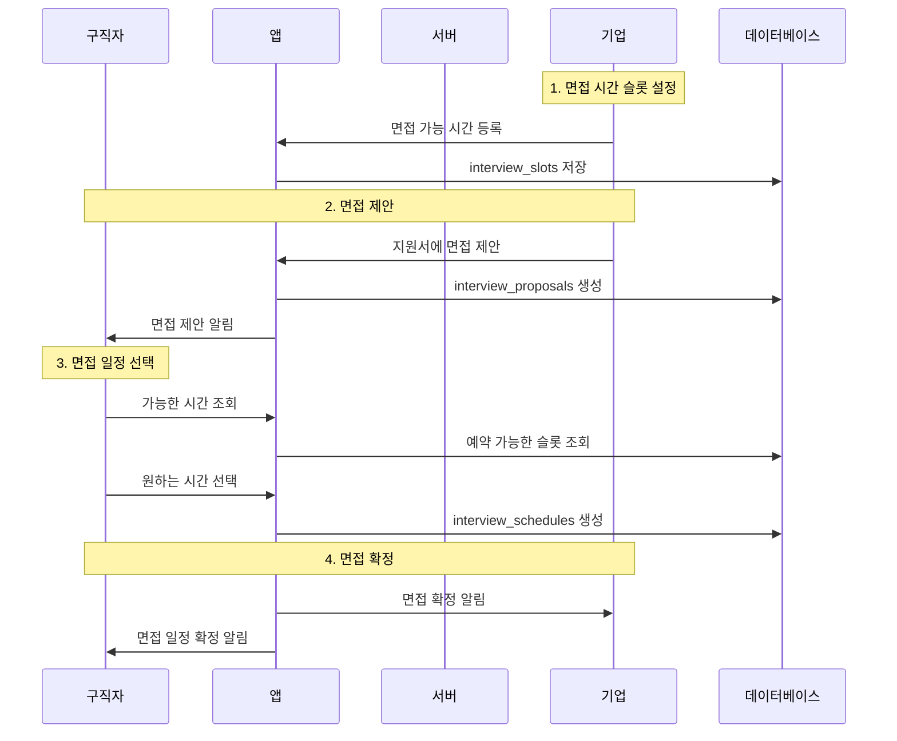
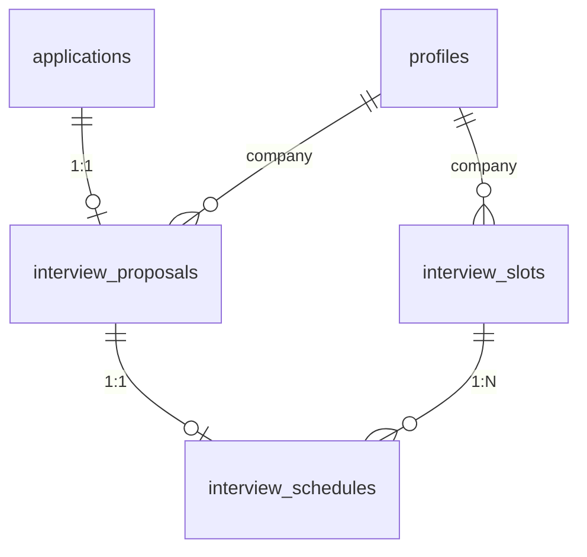

# 면접 시스템

## 🎯 면접 시스템 개요

kgency의 면접 시스템은 기업과 구직자 간의 면접 일정을 효율적으로 관리하는 통합 솔루션입니다. 캘린더 기반의 직관적인 인터페이스와 자동화된 워크플로우를 제공합니다.

### 면접 프로세스 플로우



## 🗄 데이터베이스 구조

### 면접 관련 테이블

#### 1. interview_slots (면접 시간 슬롯)
```sql
CREATE TABLE interview_slots (
    id uuid PRIMARY KEY DEFAULT gen_random_uuid(),
    company_id uuid REFERENCES profiles(id),
    start_time timestamp NOT NULL,
    end_time timestamp NOT NULL,
    interview_type varchar DEFAULT '대면',
    is_available boolean DEFAULT true,
    max_capacity integer DEFAULT 1 CHECK (max_capacity >= 1),
    current_capacity integer DEFAULT 0 CHECK (current_capacity >= 0),
    created_at timestamp DEFAULT now(),
    CONSTRAINT check_capacity CHECK (current_capacity <= max_capacity)
);
```

**새로 추가된 필드:**
- `max_capacity`: 해당 시간대에 면접 가능한 최대 인원수
- `current_capacity`: 현재 예약된 인원수 
- 용량 제약조건으로 오버부킹 방지

#### 2. interview_proposals (면접 제안)
```sql
CREATE TABLE interview_proposals (
    id integer PRIMARY KEY GENERATED ALWAYS AS IDENTITY,
    application_id uuid UNIQUE REFERENCES applications(id),
    company_id uuid REFERENCES profiles(id),
    location varchar,
    status varchar DEFAULT 'pending' CHECK (status IN (
        'pending', 'accepted', 'rejected', 'expired'
    )),
    created_at timestamp DEFAULT now()
);
```

#### 3. interview_schedules (확정된 면접)
```sql
CREATE TABLE interview_schedules (
    id integer PRIMARY KEY GENERATED ALWAYS AS IDENTITY,
    proposal_id integer UNIQUE REFERENCES interview_proposals(id),
    interview_slot_id uuid REFERENCES interview_slots(id),
    confirmed_at timestamp DEFAULT now(),
    status varchar DEFAULT 'confirmed' CHECK (status IN (
        'confirmed', 'completed', 'cancelled', 'no_show'
    ))
);
```

### 관계 다이어그램



## 📅 기업용 면접 슬롯 관리

### TimeSlotManager 컴포넌트 (새로운 아키텍처)

TimeSlotManager는 기존의 고정된 시간대 버튼 시스템을 대체하는 유연한 시간 및 용량 관리 시스템입니다.

#### 주요 기능
- **유연한 시간 설정**: 구인자가 원하는 시간을 자유롭게 설정 가능
- **용량 관리**: 시간대별로 1-10명까지 면접 가능 인원 설정
- **예약 보호**: 이미 예약된 인원보다 적게 용량을 줄이거나 삭제 불가
- **과거 시간 방지**: 오늘 날짜의 지난 시간은 수정/추가 불가
- **실시간 예약 상태**: "X명 예약됨" 형태로 예약 현황 표시

#### TimeSlotManager 인터페이스

```typescript
// TimeSlotManager 컴포넌트 인터페이스
interface TimeSlot {
  id: string;
  time: string; // "HH:MM" 형식
  maxCapacity: number; // 1-10
  currentBookings?: number; // 현재 예약된 인원수
}

interface TimeSlotManagerProps {
  selectedDate: Date;
  dateTimeMap: Record<string, TimeSlot[]>;
  bookedSlots?: Record<string, string[]>;
  onSlotsChange: (date: string, slots: TimeSlot[]) => void;
}

// 사용 예시
const InterviewSlotsTab: React.FC = () => {
  return (
    <TimeSlotManager
      selectedDate={selectedDate}
      dateTimeMap={dateTimeMap}
      onSlotsChange={handleSlotsChange}
    />
  );
};
```

#### 핵심 기능 구현

```typescript
// components/shared/interview-calendar/company/slots/TimeSlotManager.tsx
const TimeSlotManager: React.FC<TimeSlotManagerProps> = ({
  selectedDate,
  dateTimeMap,
  onSlotsChange
}) => {
  // 새 시간대 추가 (현재 시간 기반 기본값)
  const addNewSlot = () => {
    const now = new Date();
    const defaultHour = now.getHours();
    const defaultMinute = Math.ceil(now.getMinutes() / 15) * 15; // 15분 단위
    
    const newSlot: TimeSlot = {
      id: generateUniqueId(),
      time: `${String(defaultHour).padStart(2, '0')}:${String(defaultMinute).padStart(2, '0')}`,
      maxCapacity: 1
    };
    
    updateDateSlots([...currentSlots, newSlot]);
  };

  // 용량 업데이트 (예약 보호 로직)
  const updateSlotCapacity = (slotId: string, newCapacity: number) => {
    const slot = currentSlots.find(s => s.id === slotId);
    const currentBookings = slot?.currentBookings || 0;
    
    // 예약된 인원보다 적게 설정 불가
    if (newCapacity < currentBookings) {
      Alert.alert('알림', `현재 ${currentBookings}명이 예약되어 있어 ${newCapacity}명으로 줄일 수 없습니다.`);
      return;
    }
    
    updateSlot(slotId, { maxCapacity: newCapacity });
  };

  // 시간대 삭제 (예약 보호)
  const deleteSlot = (slotId: string) => {
    const slot = currentSlots.find(s => s.id === slotId);
    const hasBookings = (slot?.currentBookings || 0) > 0;
    
    if (hasBookings) {
      Alert.alert('알림', '예약된 면접이 있어 삭제할 수 없습니다.');
      return;
    }
    
    const updatedSlots = currentSlots.filter(s => s.id !== slotId);
    updateDateSlots(updatedSlots);
  };

  // 과거 시간 검증
  const isPastTime = (timeString: string): boolean => {
    if (!isToday(selectedDate)) return false;
    
    const [hour, minute] = timeString.split(':').map(Number);
    const slotTime = new Date();
    slotTime.setHours(hour, minute, 0, 0);
    
    return slotTime <= new Date();
  };

  return (
    <View>
      {/* 시간대 목록 */}
      {currentSlots.map(slot => (
        <TimeSlotItem
          key={slot.id}
          slot={slot}
          isPast={isPastTime(slot.time)}
          onTimeChange={handleTimeChange}
          onCapacityChange={updateSlotCapacity}
          onDelete={deleteSlot}
        />
      ))}
      
      {/* 추가 버튼 */}
      <TouchableOpacity onPress={addNewSlot}>
        <Text>+ 시간대 추가</Text>
      </TouchableOpacity>
    </View>
  );
};
```

#### 시간 선택 모달

```typescript
// 커스텀 시간 선택 인터페이스 (DateTimePicker 대체)
const CustomTimePickerModal: React.FC<TimePickerProps> = ({
  visible,
  currentTime,
  onConfirm,
  onCancel
}) => {
  const hours = Array.from({ length: 24 }, (_, i) => i);
  const minutes = [0, 15, 30, 45];
  
  return (
    <Modal visible={visible} transparent animationType="slide">
      <View className="flex-1 justify-center bg-black/50">
        <View className="bg-white mx-4 rounded-lg">
          <View className="flex-row">
            {/* 시간 선택 ScrollView */}
            <ScrollView className="flex-1 max-h-40">
              {hours.map(hour => (
                <TouchableOpacity
                  key={hour}
                  onPress={() => setSelectedHour(hour)}
                  className={selectedHour === hour ? 'bg-blue-100' : ''}
                >
                  <Text className="p-3 text-center">
                    {String(hour).padStart(2, '0')}
                  </Text>
                </TouchableOpacity>
              ))}
            </ScrollView>
            
            {/* 분 선택 ScrollView */}
            <ScrollView className="flex-1 max-h-40">
              {minutes.map(minute => (
                <TouchableOpacity
                  key={minute}
                  onPress={() => setSelectedMinute(minute)}
                  className={selectedMinute === minute ? 'bg-blue-100' : ''}
                >
                  <Text className="p-3 text-center">
                    {String(minute).padStart(2, '0')}
                  </Text>
                </TouchableOpacity>
              ))}
            </ScrollView>
          </View>
          
          {/* 확인/취소 버튼 */}
          <View className="flex-row border-t border-gray-200">
            <TouchableOpacity onPress={onCancel} className="flex-1 p-3">
              <Text className="text-center text-gray-600">취소</Text>
            </TouchableOpacity>
            <TouchableOpacity onPress={() => onConfirm(selectedTime)} className="flex-1 p-3">
              <Text className="text-center text-blue-600 font-semibold">확인</Text>
            </TouchableOpacity>
          </View>
        </View>
      </View>
    </Modal>
  );
};
```

### TimeSlotItem 컴포넌트 (새로운 아키텍처)

```typescript
const TimeSlotItem: React.FC<{
  slot: TimeSlot;
  isPast: boolean;
  onTimeChange: (slotId: string, newTime: string) => void;
  onCapacityChange: (slotId: string, newCapacity: number) => void;
  onDelete: (slotId: string) => void;
}> = ({ slot, isPast, onTimeChange, onCapacityChange, onDelete }) => {
  const [showTimePicker, setShowTimePicker] = useState(false);
  const hasBookings = (slot.currentBookings || 0) > 0;
  const availableSpots = slot.maxCapacity - (slot.currentBookings || 0);

  const handleCapacityIncrease = () => {
    if (slot.maxCapacity < 10) {
      onCapacityChange(slot.id, slot.maxCapacity + 1);
    }
  };

  const handleCapacityDecrease = () => {
    const currentBookings = slot.currentBookings || 0;
    if (slot.maxCapacity > Math.max(1, currentBookings)) {
      onCapacityChange(slot.id, slot.maxCapacity - 1);
    }
  };

  return (
    <View className={`bg-white p-4 rounded-lg mb-3 shadow-sm ${
      isPast ? 'opacity-50' : ''
    }`}>
      <View className="flex-row justify-between items-center">
        {/* 시간 표시 및 수정 */}
        <TouchableOpacity
          onPress={() => !isPast && setShowTimePicker(true)}
          disabled={isPast}
          className="flex-row items-center"
        >
          <Text className={`text-lg font-semibold ${
            isPast ? 'text-gray-400' : 'text-blue-600'
          }`}>
            {slot.time}
          </Text>
          {!isPast && (
            <Ionicons name="pencil" size={16} color="#3B82F6" className="ml-2" />
          )}
        </TouchableOpacity>

        {/* 용량 관리 */}
        <View className="flex-row items-center">
          <TouchableOpacity
            onPress={handleCapacityDecrease}
            disabled={isPast || slot.maxCapacity <= Math.max(1, slot.currentBookings || 0)}
            className="w-8 h-8 rounded-full bg-gray-200 items-center justify-center"
          >
            <Ionicons name="remove" size={16} color="#6B7280" />
          </TouchableOpacity>
          
          <Text className="mx-3 text-lg font-semibold min-w-[60px] text-center">
            {slot.maxCapacity}명
          </Text>
          
          <TouchableOpacity
            onPress={handleCapacityIncrease}
            disabled={isPast || slot.maxCapacity >= 10}
            className="w-8 h-8 rounded-full bg-gray-200 items-center justify-center"
          >
            <Ionicons name="add" size={16} color="#6B7280" />
          </TouchableOpacity>
        </View>

        {/* 삭제 버튼 */}
        <TouchableOpacity
          onPress={() => onDelete(slot.id)}
          disabled={isPast || hasBookings}
          className="p-2"
        >
          <Ionicons
            name="trash"
            size={20}
            color={isPast || hasBookings ? "#D1D5DB" : "#EF4444"}
          />
        </TouchableOpacity>
      </View>

      {/* 예약 상태 표시 */}
      {hasBookings && (
        <View className="mt-2 pt-2 border-t border-gray-100">
          <View className="flex-row items-center">
            <View className="px-2 py-1 rounded-full bg-orange-100">
              <Text className="text-xs font-medium text-orange-600">
                {slot.currentBookings}명 예약됨
              </Text>
            </View>
            <Text className="text-sm text-gray-500 ml-2">
              (잔여 {availableSpots}자리)
            </Text>
          </View>
        </View>
      )}

      {/* 시간 선택 모달 */}
      <CustomTimePickerModal
        visible={showTimePicker}
        currentTime={slot.time}
        onConfirm={(newTime) => {
          onTimeChange(slot.id, newTime);
          setShowTimePicker(false);
        }}
        onCancel={() => setShowTimePicker(false)}
      />
    </View>
  );
};
```

### InterviewSlotsSummary 컴포넌트 (용량 정보 표시)

```typescript
const InterviewSlotsSummary: React.FC<{
  dateTimeMap: Record<string, TimeSlot[]>;
}> = ({ dateTimeMap }) => {
  const [isSummaryExpanded, setIsSummaryExpanded] = useState(false);

  // 유효한 슬롯 수집 (현재 시간 이후)
  const allValidSlots = useMemo(() => {
    const slots: Array<{
      date: string;
      time: string;
      isBooked: boolean;
      maxCapacity: number;
      currentCapacity: number;
      availableSpots: number;
    }> = [];

    const now = new Date();
    
    Object.entries(dateTimeMap).forEach(([date, timeSlots]) => {
      const dateObj = new Date(date);
      const isToday = dateObj.toDateString() === now.toDateString();
      
      timeSlots.forEach(slot => {
        const [hour, minute] = slot.time.split(':');
        const slotDateTime = new Date(date);
        slotDateTime.setHours(parseInt(hour), parseInt(minute), 0, 0);
        
        const isValidTime = isToday ? slotDateTime >= now : dateObj > now;
        
        if (isValidTime) {
          const maxCapacity = slot.maxCapacity || 1;
          const currentCapacity = slot.currentBookings || 0;
          const availableSpots = maxCapacity - currentCapacity;
          
          slots.push({
            date,
            time: slot.time,
            isBooked: availableSpots <= 0,
            maxCapacity,
            currentCapacity,
            availableSpots
          });
        }
      });
    });

    return slots.sort((a, b) => {
      if (a.date !== b.date) return a.date.localeCompare(b.date);
      return a.time.localeCompare(b.time);
    });
  }, [dateTimeMap]);

  const totalAvailableSpots = allValidSlots.reduce(
    (sum, slot) => sum + slot.availableSpots, 0
  );

  return (
    <View className="mt-6 bg-green-50 rounded-lg border border-green-200">
      {/* 헤더 */}
      <TouchableOpacity
        onPress={() => setIsSummaryExpanded(!isSummaryExpanded)}
        className="flex-row items-center justify-between p-4"
      >
        <View className="flex-row items-center gap-2">
          <Ionicons name="calendar" size={20} color="#16a34a" />
          <Text className="text-lg font-semibold text-green-900">
            전체 면접 가능 시간대 ({allValidSlots.length}개, 총 {totalAvailableSpots}자리)
          </Text>
        </View>
        <Ionicons
          name={isSummaryExpanded ? "chevron-up" : "chevron-down"}
          size={20}
          color="#16a34a"
        />
      </TouchableOpacity>

      {/* 상세 내용 */}
      {isSummaryExpanded && (
        <View className="px-4 pb-4">
          {Object.entries(
            allValidSlots.reduce((acc, slot) => {
              if (!acc[slot.date]) acc[slot.date] = [];
              acc[slot.date].push(slot);
              return acc;
            }, {} as Record<string, typeof allValidSlots>)
          ).map(([date, slots]) => (
            <View key={date} className="mb-3">
              <Text className="text-sm font-medium text-green-800 mb-2">
                {format(new Date(date), 'M월 d일 (E)', { locale: ko })}
              </Text>
              <View className="flex-row flex-wrap gap-2 pl-2">
                {slots.map((slot) => (
                  <View
                    key={`${slot.date}-${slot.time}`}
                    className={`px-3 py-1.5 rounded-full border ${
                      slot.isBooked
                        ? 'bg-gray-100 border-gray-300'
                        : 'bg-green-100 border-green-300'
                    }`}
                  >
                    <Text className={`text-sm font-medium ${
                      slot.isBooked ? 'text-gray-600' : 'text-green-800'
                    }`}>
                      {slot.time} {slot.currentCapacity > 0 
                        ? `${slot.currentCapacity}/${slot.maxCapacity} 예약됨`
                        : `(${slot.availableSpots}자리)`}
                    </Text>
                  </View>
                ))}
              </View>
            </View>
          ))}
        </View>
      )}
    </View>
  );
};
```

### 서버 측 용량 관리 시스템

```javascript
// kgency_server/src/services/interviewSlot.service.js
class InterviewSlotService {
  // 슬롯 생성 시 용량 필드 처리
  async create(slotData) {
    const { 
      company_id, 
      start_time, 
      end_time, 
      interview_type = '대면',
      max_capacity = 1,
      current_capacity = 0
    } = slotData;

    // 용량 검증
    if (max_capacity < 1 || max_capacity > 10) {
      throw new Error('최대 용량은 1-10명 사이여야 합니다.');
    }
    
    if (current_capacity > max_capacity) {
      throw new Error('현재 용량이 최대 용량을 초과할 수 없습니다.');
    }

    const { data, error } = await supabase
      .from('interview_slots')
      .insert({
        company_id,
        start_time,
        end_time,
        interview_type,
        max_capacity,
        current_capacity
      })
      .select()
      .single();

    if (error) throw error;
    return data;
  }

  // 슬롯 조회 시 실시간 예약 상태 계산
  async getAll(company_id, date) {
    const startOfDay = new Date(date);
    startOfDay.setHours(0, 0, 0, 0);
    
    const endOfDay = new Date(date);
    endOfDay.setHours(23, 59, 59, 999);

    // 슬롯과 예약 수 조인 쿼리
    const { data: slots, error } = await supabase
      .from('interview_slots')
      .select(`
        *,
        schedules:interview_schedules(count)
      `)
      .eq('company_id', company_id)
      .gte('start_time', startOfDay.toISOString())
      .lte('start_time', endOfDay.toISOString())
      .order('start_time');

    if (error) throw error;

    // 실시간 예약 수 계산
    return slots.map(slot => ({
      ...slot,
      current_capacity: slot.schedules?.[0]?.count || 0,
      available_spots: slot.max_capacity - (slot.schedules?.[0]?.count || 0),
      is_fully_booked: (slot.schedules?.[0]?.count || 0) >= slot.max_capacity
    }));
  }

  // 용량 업데이트 (예약 보호 로직)
  async updateCapacity(slot_id, new_max_capacity) {
    // 현재 예약 수 조회
    const { data: currentBookings } = await supabase
      .from('interview_schedules')
      .select('id')
      .eq('interview_slot_id', slot_id)
      .eq('status', 'confirmed');

    const bookingCount = currentBookings?.length || 0;

    // 예약된 인원보다 적게 설정하려는 경우 방지
    if (new_max_capacity < bookingCount) {
      throw new Error(`현재 ${bookingCount}명이 예약되어 있어 ${new_max_capacity}명으로 줄일 수 없습니다.`);
    }

    const { data, error } = await supabase
      .from('interview_slots')
      .update({ 
        max_capacity: new_max_capacity,
        current_capacity: bookingCount // 실제 예약 수로 업데이트
      })
      .eq('id', slot_id)
      .select()
      .single();

    if (error) throw error;
    return data;
  }

  // 슬롯 삭제 (예약 보호 로직)
  async delete(slot_id) {
    // 해당 슬롯에 예약이 있는지 확인
    const { data: existingBookings } = await supabase
      .from('interview_schedules')
      .select('id')
      .eq('interview_slot_id', slot_id)
      .eq('status', 'confirmed');

    if (existingBookings && existingBookings.length > 0) {
      throw new Error('예약된 면접이 있어 삭제할 수 없습니다.');
    }

    const { error } = await supabase
      .from('interview_slots')
      .delete()
      .eq('id', slot_id);

    if (error) throw error;
    return { success: true };
  }
}
```

## 💼 면접 제안 시스템

### 지원서에서 면접 제안하기

```typescript
// components/ApplicationCard.tsx (기업용)
const ApplicationActions: React.FC<{ application: Application }> = ({ 
  application 
}) => {
  const [showInterviewModal, setShowInterviewModal] = useState(false);

  const proposeInterview = async (location: string, message?: string) => {
    try {
      // 1. 면접 제안 생성
      const { data: proposal, error } = await supabase
        .from('interview_proposals')
        .insert({
          application_id: application.id,
          company_id: application.company_id,
          location,
          status: 'pending'
        })
        .select()
        .single();

      if (error) throw error;

      // 2. 지원서 상태 업데이트
      await supabase
        .from('applications')
        .update({ status: 'interview_proposed' })
        .eq('id', application.id);

      // 3. 알림 메시지 전송
      if (message) {
        await supabase
          .from('messages')
          .insert({
            sender_id: application.company_id,
            receiver_id: application.user_id,
            subject: '면접 제안',
            content: message
          });
      }

      setShowInterviewModal(false);
      Alert.alert('성공', '면접 제안이 전송되었습니다.');
      
    } catch (error) {
      console.error('Interview proposal error:', error);
      Alert.alert('오류', '면접 제안 중 오류가 발생했습니다.');
    }
  };

  return (
    <View className="flex-row justify-end space-x-2 mt-3">
      <TouchableOpacity
        className="bg-green-500 px-4 py-2 rounded-lg"
        onPress={() => setShowInterviewModal(true)}
      >
        <Text className="text-white font-medium">면접 제안</Text>
      </TouchableOpacity>

      <InterviewProposalModal
        visible={showInterviewModal}
        application={application}
        onPropose={proposeInterview}
        onClose={() => setShowInterviewModal(false)}
      />
    </View>
  );
};
```

### 면접 제안 모달

```typescript
const InterviewProposalModal: React.FC<{
  visible: boolean;
  application: Application;
  onPropose: (location: string, message: string) => void;
  onClose: () => void;
}> = ({ visible, application, onPropose, onClose }) => {
  const [location, setLocation] = useState('');
  const [message, setMessage] = useState('');

  const defaultMessage = `안녕하세요 ${application.user.name}님,

${application.job_posting.title} 포지션에 지원해주셔서 감사합니다.
서류 검토 결과 면접을 진행하고자 합니다.

아래 면접 가능 시간 중 편한 시간을 선택해주세요.

감사합니다.`;

  const handleSubmit = () => {
    if (!location.trim()) {
      Alert.alert('알림', '면접 장소를 입력해주세요.');
      return;
    }

    onPropose(location, message || defaultMessage);
  };

  return (
    <Modal visible={visible} animationType="slide" presentationStyle="pageSheet">
      <SafeAreaView className="flex-1 bg-white">
        <View className="flex-row justify-between items-center p-4 border-b border-gray-200">
          <Text className="text-lg font-semibold">면접 제안</Text>
          <TouchableOpacity onPress={onClose}>
            <Ionicons name="close" size={24} color="#6B7280" />
          </TouchableOpacity>
        </View>

        <ScrollView className="flex-1 p-4">
          {/* 지원자 정보 */}
          <View className="bg-gray-50 p-4 rounded-lg mb-4">
            <Text className="font-semibold mb-2">지원자 정보</Text>
            <Text>이름: {application.user.name}</Text>
            <Text>포지션: {application.job_posting.title}</Text>
          </View>

          {/* 면접 장소 */}
          <View className="mb-4">
            <Text className="font-medium mb-2">면접 장소</Text>
            <TextInput
              className="border border-gray-300 rounded-lg p-3"
              placeholder="예: 서울시 강남구 회사 사무실 2층 회의실"
              value={location}
              onChangeText={setLocation}
              multiline
            />
          </View>

          {/* 메시지 */}
          <View className="mb-4">
            <Text className="font-medium mb-2">메시지</Text>
            <TextInput
              className="border border-gray-300 rounded-lg p-3 min-h-[120px]"
              placeholder="면접 관련 안내 메시지를 입력하세요"
              value={message}
              onChangeText={setMessage}
              multiline
              textAlignVertical="top"
            />
            <Text className="text-sm text-gray-500 mt-1">
              비워두면 기본 메시지가 전송됩니다.
            </Text>
          </View>
        </ScrollView>

        {/* 제안 버튼 */}
        <View className="p-4 border-t border-gray-200">
          <TouchableOpacity
            className="bg-blue-500 py-3 rounded-lg"
            onPress={handleSubmit}
          >
            <Text className="text-white text-center font-semibold text-lg">
              면접 제안하기
            </Text>
          </TouchableOpacity>
        </View>
      </SafeAreaView>
    </Modal>
  );
};
```

## 👤 구직자용 면접 일정 선택

### 면접 제안 확인 및 일정 선택

```typescript
// app/(pages)/(user)/interview-schedule.tsx
const InterviewScheduleScreen: React.FC = () => {
  const { proposalId } = useLocalSearchParams();
  const [proposal, setProposal] = useState<InterviewProposal | null>(null);
  const [availableSlots, setAvailableSlots] = useState<InterviewSlot[]>([]);
  const [selectedSlot, setSelectedSlot] = useState<string | null>(null);

  useEffect(() => {
    if (proposalId) {
      fetchProposal();
      fetchAvailableSlots();
    }
  }, [proposalId]);

  const fetchProposal = async () => {
    const { data } = await supabase
      .from('interview_proposals')
      .select(`
        *,
        application:applications(
          *,
          job_posting:job_postings(*),
          company:profiles!company_id(*)
        )
      `)
      .eq('id', proposalId)
      .single();

    setProposal(data);
  };

  const fetchAvailableSlots = async () => {
    if (!proposal) return;

    // 용량 기반 슬롯 조회 (여유 공간이 있는 슬롯만)
    const { data } = await supabase
      .from('interview_slots')
      .select(`
        *,
        schedules:interview_schedules!interview_slot_id(count)
      `)
      .eq('company_id', proposal.company_id)
      .gte('start_time', new Date().toISOString())
      .order('start_time');

    // 여유 공간이 있는 슬롯만 필터링
    const availableSlots = data?.filter(slot => {
      const currentBookings = slot.schedules?.[0]?.count || 0;
      const maxCapacity = slot.max_capacity || 1;
      return currentBookings < maxCapacity;
    }) || [];

    // 용량 정보 추가
    const slotsWithCapacity = availableSlots.map(slot => ({
      ...slot,
      current_capacity: slot.schedules?.[0]?.count || 0,
      available_spots: (slot.max_capacity || 1) - (slot.schedules?.[0]?.count || 0)
    }));

    setAvailableSlots(slotsWithCapacity);
  };

  const confirmSchedule = async () => {
    if (!selectedSlot || !proposal) return;

    try {
      // 1. 면접 일정 확정
      const { error: scheduleError } = await supabase
        .from('interview_schedules')
        .insert({
          proposal_id: proposal.id,
          interview_slot_id: selectedSlot,
          status: 'confirmed'
        });

      if (scheduleError) throw scheduleError;

      // 2. 제안 상태 업데이트
      await supabase
        .from('interview_proposals')
        .update({ status: 'accepted' })
        .eq('id', proposal.id);

      // 3. 슬롯 용량 업데이트 (용량 기반 시스템)
      const { data: currentSlot } = await supabase
        .from('interview_slots')
        .select('current_capacity, max_capacity')
        .eq('id', selectedSlot)
        .single();

      const newCurrentCapacity = (currentSlot.current_capacity || 0) + 1;
      const isFullyBooked = newCurrentCapacity >= currentSlot.max_capacity;

      await supabase
        .from('interview_slots')
        .update({ 
          current_capacity: newCurrentCapacity,
          is_available: !isFullyBooked // 용량이 찰 때만 false로 변경
        })
        .eq('id', selectedSlot);

      Alert.alert('완료', '면접 일정이 확정되었습니다.', [
        { text: '확인', onPress: () => router.back() }
      ]);

    } catch (error) {
      console.error('Schedule confirmation error:', error);
      Alert.alert('오류', '일정 확정 중 오류가 발생했습니다.');
    }
  };

  return (
    <SafeAreaView className="flex-1 bg-white">
      <ScrollView className="flex-1 p-4">
        {/* 면접 정보 */}
        {proposal && (
          <View className="bg-blue-50 p-4 rounded-lg mb-6">
            <Text className="text-lg font-semibold mb-2">면접 정보</Text>
            <Text className="mb-1">
              회사: {proposal.application.company.name}
            </Text>
            <Text className="mb-1">
              포지션: {proposal.application.job_posting.title}
            </Text>
            <Text className="mb-1">장소: {proposal.location}</Text>
          </View>
        )}

        {/* 시간 선택 */}
        <Text className="text-lg font-semibold mb-4">면접 시간 선택</Text>
        
        {availableSlots.length === 0 ? (
          <View className="bg-gray-50 p-4 rounded-lg">
            <Text className="text-center text-gray-600">
              현재 예약 가능한 시간이 없습니다.
            </Text>
          </View>
        ) : (
          availableSlots.map(slot => (
            <TouchableOpacity
              key={slot.id}
              className={`border-2 rounded-lg p-4 mb-3 ${
                selectedSlot === slot.id
                  ? 'border-blue-500 bg-blue-50'
                  : 'border-gray-200 bg-white'
              }`}
              onPress={() => setSelectedSlot(slot.id)}
            >
              <View className="flex-row justify-between items-center">
                <View>
                  <Text className="font-semibold">
                    {format(new Date(slot.start_time), 'yyyy년 M월 d일 (E)', {
                      locale: ko
                    })}
                  </Text>
                  <Text className="text-gray-600 mt-1">
                    {format(new Date(slot.start_time), 'HH:mm')} - 
                    {format(new Date(slot.end_time), 'HH:mm')}
                  </Text>
                  <Text className="text-sm text-gray-500 mt-1">
                    {slot.interview_type} • {slot.available_spots}자리 남음
                  </Text>
                </View>
                
                {selectedSlot === slot.id && (
                  <Ionicons name="checkmark-circle" size={24} color="#3B82F6" />
                )}
              </View>
            </TouchableOpacity>
          ))
        )}
      </ScrollView>

      {/* 확정 버튼 */}
      {selectedSlot && (
        <View className="p-4 border-t border-gray-200">
          <TouchableOpacity
            className="bg-blue-500 py-3 rounded-lg"
            onPress={confirmSchedule}
          >
            <Text className="text-white text-center font-semibold text-lg">
              면접 일정 확정하기
            </Text>
          </TouchableOpacity>
        </View>
      )}
    </SafeAreaView>
  );
};
```

## 📱 면접 관리 대시보드

### 기업용 면접 관리

```typescript
// app/(company)/interviews.tsx
const InterviewsManagementScreen: React.FC = () => {
  const [interviews, setInterviews] = useState<ConfirmedInterview[]>([]);
  const [filter, setFilter] = useState<'all' | 'upcoming' | 'completed'>('upcoming');

  const fetchInterviews = async () => {
    let query = supabase
      .from('interview_schedules')
      .select(`
        *,
        proposal:interview_proposals(
          *,
          application:applications(
            *,
            user:profiles!user_id(*),
            job_posting:job_postings(*)
          )
        ),
        slot:interview_slots(*)
      `)
      .eq('proposal.company_id', user.id);

    if (filter === 'upcoming') {
      query = query.gte('slot.start_time', new Date().toISOString());
    } else if (filter === 'completed') {
      query = query.eq('status', 'completed');
    }

    const { data } = await query.order('slot.start_time');
    setInterviews(data || []);
  };

  const markAsCompleted = async (scheduleId: number) => {
    const { error } = await supabase
      .from('interview_schedules')
      .update({ status: 'completed' })
      .eq('id', scheduleId);

    if (!error) {
      fetchInterviews();
    }
  };

  return (
    <SafeAreaView className="flex-1 bg-gray-50">
      {/* 필터 탭 */}
      <View className="bg-white px-4 py-2">
        <View className="flex-row">
          {['upcoming', 'all', 'completed'].map(tab => (
            <TouchableOpacity
              key={tab}
              className={`px-4 py-2 rounded-full mr-2 ${
                filter === tab ? 'bg-blue-500' : 'bg-gray-200'
              }`}
              onPress={() => setFilter(tab as any)}
            >
              <Text className={`${
                filter === tab ? 'text-white' : 'text-gray-700'
              }`}>
                {tab === 'upcoming' ? '예정' : 
                 tab === 'all' ? '전체' : '완료'}
              </Text>
            </TouchableOpacity>
          ))}
        </View>
      </View>

      {/* 면접 목록 */}
      <FlatList
        data={interviews}
        keyExtractor={(item) => item.id.toString()}
        renderItem={({ item }) => (
          <InterviewCard 
            interview={item}
            onMarkCompleted={markAsCompleted}
          />
        )}
        contentContainerStyle={{ padding: 16 }}
        showsVerticalScrollIndicator={false}
      />
    </SafeAreaView>
  );
};
```

### 면접 카드 컴포넌트

```typescript
const InterviewCard: React.FC<{
  interview: ConfirmedInterview;
  onMarkCompleted: (id: number) => void;
}> = ({ interview, onMarkCompleted }) => {
  const isUpcoming = new Date(interview.slot.start_time) > new Date();
  const isToday = isToday(new Date(interview.slot.start_time));

  return (
    <View className="bg-white rounded-lg p-4 mb-3 shadow-sm">
      {/* 날짜 및 시간 */}
      <View className="flex-row justify-between items-start mb-3">
        <View>
          <Text className="text-lg font-semibold">
            {format(new Date(interview.slot.start_time), 'M월 d일 (E)', {
              locale: ko
            })}
          </Text>
          <Text className="text-gray-600">
            {format(new Date(interview.slot.start_time), 'HH:mm')} - 
            {format(new Date(interview.slot.end_time), 'HH:mm')}
          </Text>
        </View>
        
        {/* 상태 배지 */}
        <View className={`px-3 py-1 rounded-full ${
          isToday ? 'bg-red-100' : 
          isUpcoming ? 'bg-green-100' : 
          'bg-gray-100'
        }`}>
          <Text className={`text-xs font-medium ${
            isToday ? 'text-red-600' : 
            isUpcoming ? 'text-green-600' : 
            'text-gray-600'
          }`}>
            {isToday ? '오늘' : 
             isUpcoming ? '예정' : 
             interview.status === 'completed' ? '완료' : '지남'}
          </Text>
        </View>
      </View>

      {/* 지원자 정보 */}
      <View className="border-t border-gray-100 pt-3">
        <View className="flex-row items-center mb-2">
          <View className="w-10 h-10 bg-blue-100 rounded-full items-center justify-center mr-3">
            <Text className="text-blue-600 font-semibold">
              {interview.proposal.application.user.name.charAt(0)}
            </Text>
          </View>
          <View className="flex-1">
            <Text className="font-semibold">
              {interview.proposal.application.user.name}
            </Text>
            <Text className="text-sm text-gray-600">
              {interview.proposal.application.job_posting.title}
            </Text>
          </View>
        </View>

        {/* 면접 정보 */}
        <View className="bg-gray-50 p-3 rounded-lg mb-3">
          <Text className="text-sm text-gray-600 mb-1">면접 장소</Text>
          <Text className="font-medium">{interview.proposal.location}</Text>
        </View>

        {/* 액션 버튼 */}
        <View className="flex-row space-x-2">
          <TouchableOpacity
            className="flex-1 bg-blue-500 py-2 rounded-lg"
            onPress={() => {/* 메시지 보내기 */}}
          >
            <Text className="text-white text-center font-medium">메시지</Text>
          </TouchableOpacity>
          
          {isUpcoming && interview.status !== 'completed' && (
            <TouchableOpacity
              className="flex-1 bg-green-500 py-2 rounded-lg"
              onPress={() => onMarkCompleted(interview.id)}
            >
              <Text className="text-white text-center font-medium">완료</Text>
            </TouchableOpacity>
          )}
        </View>
      </View>
    </View>
  );
};
```

## 🔔 알림 시스템

### 면접 관련 알림

```typescript
// 면접 알림 타입
interface InterviewNotification {
  type: 'interview_proposed' | 'interview_confirmed' | 'interview_reminder';
  data: {
    userId: string;
    interviewId: string;
    scheduledTime: string;
    companyName: string;
    jobTitle: string;
  };
}

// 알림 스케줄링
const scheduleInterviewNotifications = async (
  interview: ConfirmedInterview
) => {
  const interviewTime = new Date(interview.slot.start_time);
  
  // 1일 전 알림
  const oneDayBefore = new Date(interviewTime.getTime() - 24 * 60 * 60 * 1000);
  if (oneDayBefore > new Date()) {
    await Notifications.scheduleNotificationAsync({
      content: {
        title: '면접 알림',
        body: `내일 ${format(interviewTime, 'HH:mm')}에 ${interview.proposal.application.company.name} 면접이 예정되어 있습니다.`,
      },
      trigger: oneDayBefore,
    });
  }

  // 1시간 전 알림
  const oneHourBefore = new Date(interviewTime.getTime() - 60 * 60 * 1000);
  if (oneHourBefore > new Date()) {
    await Notifications.scheduleNotificationAsync({
      content: {
        title: '면접 1시간 전',
        body: `곧 면접이 시작됩니다. 준비해주세요!`,
      },
      trigger: oneHourBefore,
    });
  }
};
```

## 📊 면접 분석 및 리포트

### 면접 성과 분석

```typescript
// 면접 통계 데이터
interface InterviewAnalytics {
  totalInterviews: number;
  completionRate: number;
  averageResponseTime: number; // 제안부터 확정까지 시간
  noShowRate: number;
  conversionRate: number; // 면접에서 채용까지
}

const calculateInterviewAnalytics = async (
  companyId: string,
  timeRange: { start: Date; end: Date }
): Promise<InterviewAnalytics> => {
  // 면접 통계 계산 로직
  const { data: schedules } = await supabase
    .from('interview_schedules')
    .select(`
      *,
      proposal:interview_proposals(
        *,
        application:applications(*)
      )
    `)
    .eq('proposal.company_id', companyId)
    .gte('confirmed_at', timeRange.start.toISOString())
    .lte('confirmed_at', timeRange.end.toISOString());

  return {
    totalInterviews: schedules?.length || 0,
    completionRate: calculateCompletionRate(schedules),
    averageResponseTime: calculateAverageResponseTime(schedules),
    noShowRate: calculateNoShowRate(schedules),
    conversionRate: calculateConversionRate(schedules)
  };
};
```

### 면접 피드백 시스템

```typescript
// 면접 후 피드백
interface InterviewFeedback {
  scheduleId: number;
  rating: number; // 1-5점
  feedback: string;
  hired: boolean;
  notes: string;
}

const submitInterviewFeedback = async (
  feedback: InterviewFeedback
) => {
  // 피드백 저장
  const { error } = await supabase
    .from('interview_feedback')
    .insert(feedback);

  if (!error && feedback.hired) {
    // 채용 확정 시 지원서 상태 업데이트
    await supabase
      .from('applications')
      .update({ status: 'hired' })
      .eq('id', feedback.scheduleId);
  }
};
```

## 🔧 면접 시스템 최적화

### 캐싱 및 성능 최적화

```typescript
// 면접 슬롯 캐싱
const useInterviewSlots = (companyId: string, date: Date) => {
  const [slots, setSlots] = useState<InterviewSlot[]>([]);
  const [loading, setLoading] = useState(true);

  const cacheKey = `interview_slots_${companyId}_${format(date, 'yyyy-MM-dd')}`;

  const fetchSlots = useCallback(async () => {
    // 캐시 확인
    const cached = await AsyncStorage.getItem(cacheKey);
    if (cached) {
      setSlots(JSON.parse(cached));
      setLoading(false);
    }

    // 실제 데이터 조회
    const { data } = await supabase
      .from('interview_slots')
      .select('*')
      .eq('company_id', companyId)
      .gte('start_time', startOfDay(date))
      .lt('start_time', startOfDay(addDays(date, 1)));

    if (data) {
      setSlots(data);
      await AsyncStorage.setItem(cacheKey, JSON.stringify(data));
    }
    setLoading(false);
  }, [companyId, date, cacheKey]);

  useEffect(() => {
    fetchSlots();
  }, [fetchSlots]);

  return { slots, loading, refetch: fetchSlots };
};
```

### 실시간 업데이트

```typescript
// 면접 상태 실시간 구독
const useInterviewUpdates = (userId: string) => {
  useEffect(() => {
    const channel = supabase
      .channel('interview_updates')
      .on('postgres_changes', {
        event: 'INSERT',
        schema: 'public',
        table: 'interview_proposals',
        filter: `application.user_id=eq.${userId}`
      }, (payload) => {
        // 새 면접 제안 알림
        showInterviewProposalNotification(payload.new);
      })
      .on('postgres_changes', {
        event: 'UPDATE',
        schema: 'public',
        table: 'interview_schedules',
        filter: `proposal.application.user_id=eq.${userId}`
      }, (payload) => {
        // 면접 상태 변경 알림
        showInterviewStatusNotification(payload.new);
      })
      .subscribe();

    return () => {
      supabase.removeChannel(channel);
    };
  }, [userId]);
};
```

## 🔄 컴포넌트 통합 및 사용법

### TimeSlotManager 통합 패턴

TimeSlotManager는 다음 두 곳에서 사용됩니다:

#### 1. 기업 시간대 관리 (InterviewSlotsTab)
```typescript
// components/shared/interview-calendar/company/schedule/InterviewSlotsTab.tsx
const InterviewSlotsTab: React.FC = () => {
  const [dateTimeMap, setDateTimeMap] = useState<Record<string, ManagerTimeSlot[]>>({});
  const { user } = useAuth();

  // 서버 데이터 -> TimeSlotManager 형식 변환
  const convertToManagerFormat = (serverSlots: TimeSlot[]): ManagerTimeSlot[] => {
    return serverSlots.map(slot => ({
      id: slot.id,
      time: format(new Date(slot.start_time), 'HH:mm'),
      maxCapacity: slot.max_capacity || 1,
      currentBookings: slot.current_capacity || 0
    }));
  };

  const handleSlotsChange = useCallback(async (dateKey: string, slots: ManagerTimeSlot[]) => {
    try {
      // 1. 기존 슬롯 삭제
      await interviewSlotAPI.deleteByDate(user.id, dateKey);
      
      // 2. 새 슬롯 생성
      const slotPromises = slots.map(slot => 
        interviewSlotAPI.create({
          company_id: user.id,
          start_time: `${dateKey} ${slot.time}:00`,
          end_time: calculateEndTime(dateKey, slot.time),
          max_capacity: slot.maxCapacity,
          interview_type: '대면'
        })
      );
      
      await Promise.all(slotPromises);
      
      // 3. 로컬 상태 업데이트
      setDateTimeMap(prev => ({ ...prev, [dateKey]: slots }));
      
    } catch (error) {
      Alert.alert('오류', '시간대 저장 중 오류가 발생했습니다.');
    }
  }, [user.id]);

  return (
    <TimeSlotManager
      selectedDate={selectedDate}
      dateTimeMap={dateTimeMap}
      onSlotsChange={handleSlotsChange}
    />
  );
};
```

#### 2. 면접 요청 화면 (interview-request.tsx)
```typescript
// app/(pages)/(company)/(interview-management)/(user-list)/interview-request.tsx
type DateTimeMap = { [key: string]: TimeSlot[] };
type BookedSlotsMap = { [key: string]: string[] };
type UserSelectedMap = { [key: string]: string[] };

const InterviewRequestScreen: React.FC = () => {
  const [dateTimeMap, setDateTimeMap] = useState<DateTimeMap>({});
  const [userSelectedSlots, setUserSelectedSlots] = useState<UserSelectedMap>({});
  
  // Record 타입 이슈 해결을 위한 커스텀 타입 사용
  const handleSlotsChange = useCallback((dateKey: string, slots: TimeSlot[]) => {
    setDateTimeMap(prev => ({ ...prev, [dateKey]: slots }));
  }, []);

  // 무한 루프 방지를 위한 초기화 패턴
  const [isInitialized, setIsInitialized] = useState(false);

  useEffect(() => {
    if (selectedDate && !isInitialized) {
      updateSelectedDateData();
      setIsInitialized(true);
    }
  }, [selectedDate]);

  useEffect(() => {
    if (isInitialized && selectedDate) {
      updateSelectedDateData();
    }
  }, [selectedDate, isInitialized]);

  return (
    <TimeSlotManager
      selectedDate={selectedDate}
      dateTimeMap={dateTimeMap}
      onSlotsChange={handleSlotsChange}
    />
  );
};
```

### 데이터 변환 패턴

```typescript
// 서버 TimeSlot -> Manager TimeSlot 변환
interface ServerTimeSlot {
  id: string;
  start_time: string; // ISO timestamp
  end_time: string;
  max_capacity: number;
  current_capacity: number;
  interview_type: string;
}

interface ManagerTimeSlot {
  id: string;
  time: string; // "HH:mm" format
  maxCapacity: number;
  currentBookings?: number;
}

const convertServerToManager = (serverSlots: ServerTimeSlot[]): ManagerTimeSlot[] => {
  return serverSlots.map(slot => ({
    id: slot.id,
    time: format(new Date(slot.start_time), 'HH:mm'),
    maxCapacity: slot.max_capacity,
    currentBookings: slot.current_capacity
  }));
};

// Manager TimeSlot -> 서버 데이터 변환
const convertManagerToServer = (managerSlots: ManagerTimeSlot[], date: string) => {
  return managerSlots.map(slot => ({
    company_id: user.id,
    start_time: `${date} ${slot.time}:00`,
    end_time: calculateEndTime(date, slot.time), // +1시간
    max_capacity: slot.maxCapacity,
    current_capacity: 0,
    interview_type: '대면'
  }));
};
```

### 오류 처리 및 해결방안

#### 1. React Native 타입 오류
```typescript
// 문제: Property 'Record' doesn't exist 오류
// 해결: 커스텀 타입 사용
type DateTimeMap = { [key: string]: TimeSlot[] };
type BookedSlotsMap = { [key: string]: string[] };
```

#### 2. 무한 루프 방지
```typescript
// 문제: useEffect의 의존성 배열에 onSlotsChange 포함 시 무한 루프
// 해결: useCallback 사용 및 초기화 플래그
const handleSlotsChange = useCallback((dateKey: string, slots: TimeSlot[]) => {
  setDateTimeMap(prev => ({ ...prev, [dateKey]: slots }));
}, []); // 빈 의존성 배열

const [isInitialized, setIsInitialized] = useState(false);
```

#### 3. Text 렌더링 오류
```typescript
// 문제: Text strings must be rendered within a <Text> component
// 해결: null 값 처리
<Text>
  {slot.currentBookings || 0}명 예약됨
</Text>

const hasBookings = (slot.currentBookings || 0) > 0;
```

## 📊 면접 시스템 마이그레이션 가이드

### 데이터베이스 마이그레이션

기존 1:1 시스템에서 용량 기반 시스템으로 전환하기 위한 마이그레이션:

```sql
-- 용량 필드 추가
ALTER TABLE interview_slots 
ADD COLUMN max_capacity integer DEFAULT 1 CHECK (max_capacity >= 1),
ADD COLUMN current_capacity integer DEFAULT 0 CHECK (current_capacity >= 0),
ADD CONSTRAINT check_capacity CHECK (current_capacity <= max_capacity);

-- 인덱스 추가 (성능 최적화)
CREATE INDEX idx_interview_slots_capacity ON interview_slots(company_id, start_time, max_capacity, current_capacity);

-- 기존 데이터 마이그레이션
UPDATE interview_slots 
SET max_capacity = 1, current_capacity = (
  CASE 
    WHEN is_available = false THEN 1 -- 예약됨
    ELSE 0 -- 예약 안됨
  END
)
WHERE max_capacity IS NULL;
```

### API 엔드포인트 마이그레이션

기존 API는 하위 호환성을 유지하면서 새로운 용량 기능을 지원:

```javascript
// 기존 API (여전히 작동)
POST /api/interview/slots
{
  "start_time": "2024-01-15 14:00:00",
  "end_time": "2024-01-15 15:00:00"
  // max_capacity 기본값: 1
}

// 새로운 API (용량 지원)
POST /api/interview/slots
{
  "start_time": "2024-01-15 14:00:00",
  "end_time": "2024-01-15 15:00:00",
  "max_capacity": 5 // 새로운 필드
}
```

### 컴포넌튴 마이그레이션 로드맵

1. **Phase 1**: TimeSlotManager 컴포넌트 개발 및 테스트
2. **Phase 2**: 데이터베이스 스키마 업데이트
3. **Phase 3**: 서버 API 로직 업데이트 (예약 보호)
4. **Phase 4**: 기존 TimeSlotGrid 대체
5. **Phase 5**: interview-request.tsx 페이지 업데이트
6. **Phase 6**: 버그 수정 및 성능 최적화
7. **Phase 7**: 문서 업데이트 및 QA

### 성능 모니터링 및 메트릭스

```typescript
// TimeSlotManager 성능 모니터링
const useTimeSlotPerformance = (dateTimeMap: Record<string, TimeSlot[]>) => {
  const [metrics, setMetrics] = useState({
    totalSlots: 0,
    totalCapacity: 0,
    bookedSlots: 0,
    utilizationRate: 0
  });

  useEffect(() => {
    const calculateMetrics = () => {
      let totalSlots = 0;
      let totalCapacity = 0;
      let currentBookings = 0;

      Object.values(dateTimeMap).forEach(slots => {
        slots.forEach(slot => {
          totalSlots++;
          totalCapacity += slot.maxCapacity;
          currentBookings += (slot.currentBookings || 0);
        });
      });

      const utilizationRate = totalCapacity > 0 
        ? (currentBookings / totalCapacity) * 100 
        : 0;

      setMetrics({
        totalSlots,
        totalCapacity,
        bookedSlots: currentBookings,
        utilizationRate: Math.round(utilizationRate)
      });
    };

    calculateMetrics();
  }, [dateTimeMap]);

  return metrics;
};
```

## 📋 컴포넌트 API 참조

### TimeSlotManager Props

| Prop | Type | Required | Description |
|------|------|----------|-------------|
| selectedDate | Date | Yes | 선택된 날짜 |
| dateTimeMap | Record<string, TimeSlot[]> | Yes | 날짜별 시간대 맵 |
| bookedSlots | Record<string, string[]> | No | 예약된 슬롯 ID 목록 |
| onSlotsChange | (date: string, slots: TimeSlot[]) => void | Yes | 슬롯 변경 콜백 |

### TimeSlot Interface

```typescript
interface TimeSlot {
  id: string;              // 고유 ID
  time: string;            // "HH:MM" 형식
  maxCapacity: number;     // 최대 수용 인원 (1-10)
  currentBookings?: number; // 현재 예약 인원
}
```

### InterviewSlotsSummary Props

| Prop | Type | Required | Description |
|------|------|----------|-------------|
| dateTimeMap | Record<string, TimeSlot[]> | Yes | 날짜별 시간대 맵 |
| bookedSlots | Record<string, string[]> | No | 예약 정보 (사용하지 않음) |

### 주요 메서드

- `addNewSlot()`: 새 시간대 추가
- `updateSlotCapacity(slotId, newCapacity)`: 용량 업데이트
- `deleteSlot(slotId)`: 시간대 삭제
- `handleTimeConfirm(slotId, newTime)`: 시간 변경
- `isPastTime(timeString)`: 과거 시간 검증

## 🚀 업그레이드 가이드

기존 TimeSlotGrid에서 TimeSlotManager로 업그레이드하기:

### 1. 컴포넌트 교체
```typescript
// Before (TimeSlotGrid)
import { TimeSlotGrid } from '@/components/shared/interview-calendar/company/slots/TimeSlotGrid';

// After (TimeSlotManager)  
import { TimeSlotManager } from '@/components/shared/interview-calendar/company/slots/TimeSlotManager';
```

### 2. Props 변경
```typescript
// Before
<TimeSlotGrid
  selectedTimeType={selectedTimeType}
  selectedDate={selectedDate}
  onSlotToggle={handleSlotToggle}
/>

// After
<TimeSlotManager
  selectedDate={selectedDate}
  dateTimeMap={dateTimeMap}
  onSlotsChange={handleSlotsChange}
/>
```

### 3. 데이터 구조 변경
```typescript
// Before: 고정된 시간대
const timeSlots = ['breakfast', 'morning', 'afternoon', 'evening'];

// After: 유연한 시간대
const [dateTimeMap, setDateTimeMap] = useState<Record<string, TimeSlot[]>>({});
```

### 4. 사용 예시
```typescript
// 완전한 업그레이드 예시
import React, { useState, useCallback } from 'react';
import { TimeSlotManager } from '@/components/shared/interview-calendar/company/slots/TimeSlotManager';
import { InterviewSlotsSummary } from '@/components/shared/interview-calendar/company/slots/InterviewSlotsSummary';

const MyInterviewSchedule: React.FC = () => {
  const [selectedDate, setSelectedDate] = useState(new Date());
  const [dateTimeMap, setDateTimeMap] = useState<Record<string, TimeSlot[]>>({});
  
  const handleSlotsChange = useCallback(async (dateKey: string, slots: TimeSlot[]) => {
    // API 호출 로직
    await saveSlots(dateKey, slots);
    
    // 로컬 상태 업데이트
    setDateTimeMap(prev => ({ ...prev, [dateKey]: slots }));
  }, []);
  
  return (
    <View>
      <TimeSlotManager
        selectedDate={selectedDate}
        dateTimeMap={dateTimeMap}
        onSlotsChange={handleSlotsChange}
      />
      
      <InterviewSlotsSummary 
        dateTimeMap={dateTimeMap}
      />
    </View>
  );
};
```

이 가이드를 따라하면 기존 고정된 시간대 시스템에서 유연한 용량 기반 시스템으로 원활하게 전환할 수 있습니다.