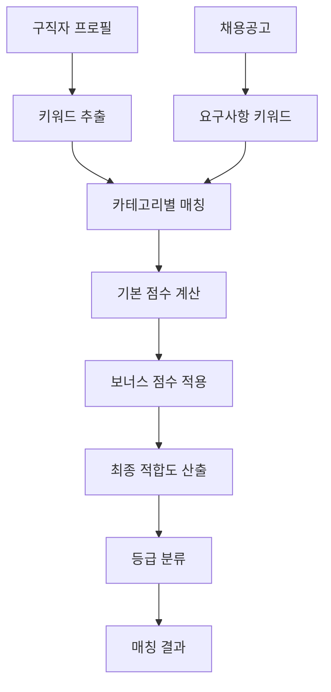

# 매칭 알고리즘

## 🎯 매칭 시스템 개요

kgency의 핵심 기능인 AI 기반 매칭 시스템은 구직자와 채용공고 간의 적합도를 0-100점으로 계산하여 최적의 매치를 제공합니다.

### 매칭 플로우



## 📊 적합도 계산 구조

### SuitabilityScore 인터페이스

```typescript
interface SuitabilityScore {
  totalScore: number;        // 최종 점수 (0-100)
  level: SuitabilityLevel;   // 등급 분류
  categoryScores: {          // 카테고리별 상세 점수
    [category: string]: {
      score: number;         // 해당 카테고리 점수
      maxScore: number;      // 해당 카테고리 최대 점수
      keywords: string[];    // 매칭된 키워드들
    }
  };
  bonusPoints: number;       // 보너스 점수
  details: string[];         // 상세 설명
}

type SuitabilityLevel = 'perfect' | 'excellent' | 'good' | 'fair' | 'low';
```

### 등급 분류 기준

| 등급 | 점수 범위 | 색상 | 설명 |
|------|-----------|------|------|
| **Perfect** | 90-100점 | 🔴 빨간색 | 완벽한 매치 |
| **Excellent** | 80-89점 | 🟠 주황색 | 우수한 매치 |
| **Good** | 60-79점 | 🟡 노란색 | 좋은 매치 |
| **Fair** | 40-59점 | 🔵 파란색 | 보통 매치 |
| **Low** | 0-39점 | ⚫ 회색 | 낮은 매치 |

## 🏗 매칭 알고리즘 구조

### 파일 구조

```
lib/suitability/
├── index.ts              # 메인 매칭 함수
├── types.ts             # 타입 정의
├── categories.ts        # 카테고리 설정
├── bonusCalculator.ts   # 보너스 점수 계산
└── levelCalculator.ts   # 등급 계산
```

### 핵심 함수

```typescript
// lib/suitability/index.ts
export function calculateSuitability(
  userKeywords: UserKeyword[],
  jobKeywords: JobKeyword[]
): SuitabilityScore {
  
  // 1. 카테고리별 매칭 점수 계산
  const categoryScores = calculateCategoryScores(userKeywords, jobKeywords);
  
  // 2. 기본 점수 합산
  const baseScore = sumCategoryScores(categoryScores);
  
  // 3. 보너스 점수 계산
  const bonusPoints = calculateBonusPoints(userKeywords, jobKeywords);
  
  // 4. 최종 점수 산출 (100점 만점)
  const totalScore = Math.min(100, baseScore + bonusPoints);
  
  // 5. 등급 분류
  const level = determineSuitabilityLevel(totalScore);
  
  // 6. 상세 설명 생성
  const details = generateMatchDetails(categoryScores, bonusPoints);
  
  return {
    totalScore,
    level,
    categoryScores,
    bonusPoints,
    details
  };
}
```

## 📝 카테고리 시스템

### 카테고리 설정

```typescript
// lib/suitability/categories.ts
export const CATEGORY_CONFIG = {
  country: {
    weight: 15,           // 가중치
    maxScore: 15,         // 최대 점수
    requiredForUser: true, // 사용자에게 필수
    requiredForJob: false  // 채용공고에 필수 여부
  },
  job: {
    weight: 25,
    maxScore: 25,
    requiredForUser: true,
    requiredForJob: true
  },
  condition: {
    weight: 20,
    maxScore: 20,
    requiredForUser: false,
    requiredForJob: false
  },
  location: {
    weight: 10,
    maxScore: 10,
    requiredForUser: false,
    requiredForJob: false
  },
  visa: {
    weight: 10,
    maxScore: 10,
    requiredForUser: true,
    requiredForJob: false
  },
  workDay: {
    weight: 5,
    maxScore: 5,
    requiredForUser: false,
    requiredForJob: false
  },
  koreanLevel: {
    weight: 10,
    maxScore: 10,
    requiredForUser: true,
    requiredForJob: false
  },
  gender: {
    weight: 3,
    maxScore: 3,
    requiredForUser: false,
    requiredForJob: false
  },
  age: {
    weight: 2,
    maxScore: 2,
    requiredForUser: false,
    requiredForJob: false
  }
};
```

### 카테고리별 매칭 로직

```typescript
function calculateCategoryScores(
  userKeywords: UserKeyword[],
  jobKeywords: JobKeyword[]
): CategoryScores {
  const scores: CategoryScores = {};
  
  for (const [category, config] of Object.entries(CATEGORY_CONFIG)) {
    // 사용자 키워드 필터링
    const userCategoryKeywords = userKeywords.filter(
      k => k.keyword.category === category
    );
    
    // 채용공고 키워드 필터링
    const jobCategoryKeywords = jobKeywords.filter(
      k => k.keyword.category === category
    );
    
    // 매칭된 키워드 찾기
    const matchedKeywords = findMatchedKeywords(
      userCategoryKeywords,
      jobCategoryKeywords
    );
    
    // 점수 계산
    const score = calculateCategoryScore(
      matchedKeywords,
      userCategoryKeywords,
      jobCategoryKeywords,
      config
    );
    
    scores[category] = {
      score,
      maxScore: config.maxScore,
      keywords: matchedKeywords.map(k => k.keyword.keyword)
    };
  }
  
  return scores;
}
```

## ⭐ 보너스 점수 시스템

### 보너스 점수 종류

```typescript
// lib/suitability/bonusCalculator.ts
export function calculateBonusPoints(
  userKeywords: UserKeyword[],
  jobKeywords: JobKeyword[]
): number {
  let bonusPoints = 0;
  
  // 1. 기술 스택 조합 보너스
  bonusPoints += calculateTechStackBonus(userKeywords, jobKeywords);
  
  // 2. 경험 레벨 매치 보너스
  bonusPoints += calculateExperienceBonus(userKeywords, jobKeywords);
  
  // 3. 언어 능력 보너스
  bonusPoints += calculateLanguageBonus(userKeywords, jobKeywords);
  
  // 4. 지역 선호도 보너스
  bonusPoints += calculateLocationBonus(userKeywords, jobKeywords);
  
  // 5. 완벽한 매치 보너스
  bonusPoints += calculatePerfectMatchBonus(userKeywords, jobKeywords);
  
  return Math.min(20, bonusPoints); // 최대 20점
}
```

### 구체적인 보너스 로직

#### 1. 기술 스택 조합 보너스
```typescript
function calculateTechStackBonus(
  userKeywords: UserKeyword[],
  jobKeywords: JobKeyword[]
): number {
  const techCombinations = [
    ['React', 'TypeScript'],        // +3점
    ['Node.js', 'Express'],         // +3점
    ['React Native', 'Expo'],       // +3점
    ['Vue', 'Nuxt'],               // +3점
    ['Python', 'Django'],          // +3점
  ];
  
  let bonus = 0;
  
  for (const combination of techCombinations) {
    const userHasAll = combination.every(tech =>
      userKeywords.some(uk => uk.keyword.keyword === tech)
    );
    
    const jobRequiresAll = combination.every(tech =>
      jobKeywords.some(jk => jk.keyword.keyword === tech)
    );
    
    if (userHasAll && jobRequiresAll) {
      bonus += 3;
    }
  }
  
  return bonus;
}
```

#### 2. 경험 레벨 매치 보너스
```typescript
function calculateExperienceBonus(
  userKeywords: UserKeyword[],
  jobKeywords: JobKeyword[]
): number {
  const experienceMapping = {
    '신입': 1,
    '1-3년': 2,
    '3-5년': 3,
    '5년이상': 4
  };
  
  const userExperience = userKeywords.find(k => 
    k.keyword.category === 'experience'
  );
  
  const jobExperience = jobKeywords.find(k => 
    k.keyword.category === 'experience'
  );
  
  if (!userExperience || !jobExperience) return 0;
  
  const userLevel = experienceMapping[userExperience.keyword.keyword];
  const jobLevel = experienceMapping[jobExperience.keyword.keyword];
  
  // 정확한 매치: +5점
  if (userLevel === jobLevel) return 5;
  
  // 1단계 차이: +3점
  if (Math.abs(userLevel - jobLevel) === 1) return 3;
  
  // 사용자가 요구사항보다 높은 경험: +2점
  if (userLevel > jobLevel) return 2;
  
  return 0;
}
```

## 🔍 매칭 상세 분석

### 매칭 결과 예시

```typescript
const matchingResult: SuitabilityScore = {
  totalScore: 87,
  level: 'excellent',
  categoryScores: {
    country: { score: 15, maxScore: 15, keywords: ['한국'] },
    job: { score: 22, maxScore: 25, keywords: ['프론트엔드', 'React'] },
    condition: { score: 15, maxScore: 20, keywords: ['주5일', '야근없음'] },
    location: { score: 8, maxScore: 10, keywords: ['서울'] },
    visa: { score: 10, maxScore: 10, keywords: ['F-4'] },
    koreanLevel: { score: 8, maxScore: 10, keywords: ['고급'] },
    // ...
  },
  bonusPoints: 12,
  details: [
    '기술 스택이 완벽하게 매치됩니다 (+3점)',
    '경험 레벨이 정확히 일치합니다 (+5점)',
    '지역 선호도가 일치합니다 (+2점)',
    '언어 능력이 우수합니다 (+2점)'
  ]
};
```

### UI에서의 표시

```typescript
// 적합도 표시 컴포넌트
const SuitabilityDisplay: React.FC<{ score: SuitabilityScore }> = ({ score }) => {
  const getLevelColor = (level: SuitabilityLevel) => {
    switch (level) {
      case 'perfect': return '#FF3B30';
      case 'excellent': return '#FF9500';
      case 'good': return '#FFCC00';
      case 'fair': return '#007AFF';
      case 'low': return '#8E8E93';
    }
  };

  const getLevelText = (level: SuitabilityLevel) => {
    switch (level) {
      case 'perfect': return '완벽한 매치';
      case 'excellent': return '우수한 매치';
      case 'good': return '좋은 매치';
      case 'fair': return '보통 매치';
      case 'low': return '낮은 매치';
    }
  };

  return (
    <View className="bg-white p-4 rounded-lg shadow">
      <View className="flex-row items-center justify-between mb-2">
        <Text className="text-lg font-bold">적합도</Text>
        <Text 
          className="text-2xl font-bold"
          style={{ color: getLevelColor(score.level) }}
        >
          {score.totalScore}점
        </Text>
      </View>
      
      <View className="flex-row items-center mb-3">
        <View 
          className="px-3 py-1 rounded-full"
          style={{ backgroundColor: getLevelColor(score.level) }}
        >
          <Text className="text-white font-medium">
            {getLevelText(score.level)}
          </Text>
        </View>
      </View>

      {/* 카테고리별 점수 표시 */}
      {Object.entries(score.categoryScores).map(([category, data]) => (
        <View key={category} className="mb-2">
          <View className="flex-row justify-between">
            <Text className="text-sm">{getCategoryName(category)}</Text>
            <Text className="text-sm font-medium">
              {data.score}/{data.maxScore}점
            </Text>
          </View>
          <View className="w-full bg-gray-200 rounded-full h-2 mt-1">
            <View 
              className="bg-blue-500 h-2 rounded-full"
              style={{ width: `${(data.score / data.maxScore) * 100}%` }}
            />
          </View>
          {data.keywords.length > 0 && (
            <Text className="text-xs text-gray-500 mt-1">
              매칭: {data.keywords.join(', ')}
            </Text>
          )}
        </View>
      ))}

      {/* 보너스 점수 표시 */}
      {score.bonusPoints > 0 && (
        <View className="mt-3 p-2 bg-green-50 rounded">
          <Text className="text-sm font-medium text-green-700">
            보너스 점수: +{score.bonusPoints}점
          </Text>
          {score.details.map((detail, index) => (
            <Text key={index} className="text-xs text-green-600 mt-1">
              • {detail}
            </Text>
          ))}
        </View>
      )}
    </View>
  );
};
```

## 🔧 매칭 성능 최적화

### 캐싱 전략

```typescript
// 매칭 결과 캐싱
const matchingCache = new Map<string, SuitabilityScore>();

function getCachedSuitability(
  userId: string,
  jobPostingId: string
): SuitabilityScore | null {
  const cacheKey = `${userId}_${jobPostingId}`;
  return matchingCache.get(cacheKey) || null;
}

function setCachedSuitability(
  userId: string,
  jobPostingId: string,
  score: SuitabilityScore
): void {
  const cacheKey = `${userId}_${jobPostingId}`;
  matchingCache.set(cacheKey, score);
  
  // 1시간 후 캐시 삭제
  setTimeout(() => {
    matchingCache.delete(cacheKey);
  }, 60 * 60 * 1000);
}
```

### 배치 매칭

```typescript
// 여러 채용공고에 대한 일괄 매칭
export function calculateBatchSuitability(
  userKeywords: UserKeyword[],
  jobPostings: JobPosting[]
): Array<{ jobPosting: JobPosting; score: SuitabilityScore }> {
  
  return jobPostings
    .map(jobPosting => ({
      jobPosting,
      score: calculateSuitability(userKeywords, jobPosting.keywords)
    }))
    .sort((a, b) => b.score.totalScore - a.score.totalScore); // 점수순 정렬
}
```

## 📈 매칭 분석 및 개선

### 매칭 성공률 추적

```typescript
// 매칭 결과 분석
interface MatchingAnalytics {
  averageScore: number;
  scoreDistribution: { [level: string]: number };
  categoryPerformance: { [category: string]: number };
  conversionRate: number; // 매칭 -> 지원 전환율
}

function analyzeMatchingPerformance(
  matchingResults: SuitabilityScore[],
  applications: Application[]
): MatchingAnalytics {
  // 분석 로직 구현
  return {
    averageScore: calculateAverageScore(matchingResults),
    scoreDistribution: calculateScoreDistribution(matchingResults),
    categoryPerformance: calculateCategoryPerformance(matchingResults),
    conversionRate: calculateConversionRate(matchingResults, applications)
  };
}
```

### A/B 테스트

```typescript
// 매칭 알고리즘 A/B 테스트
export function calculateSuitabilityWithVariant(
  userKeywords: UserKeyword[],
  jobKeywords: JobKeyword[],
  variant: 'control' | 'experiment'
): SuitabilityScore {
  
  if (variant === 'experiment') {
    // 실험군: 새로운 가중치 적용
    return calculateSuitabilityWithNewWeights(userKeywords, jobKeywords);
  }
  
  // 대조군: 기존 알고리즘
  return calculateSuitability(userKeywords, jobKeywords);
}
```

## 🎯 매칭 품질 향상 방안

### 1. 머신러닝 통합

```typescript
// 향후 ML 모델 통합 예정
interface MLMatchingService {
  predictSuitability(
    userProfile: UserProfile,
    jobPosting: JobPosting
  ): Promise<number>;
  
  updateModel(
    trainingData: MatchingTrainingData[]
  ): Promise<void>;
}
```

### 2. 사용자 피드백 반영

```typescript
// 사용자 피드백 기반 개선
interface MatchingFeedback {
  userId: string;
  jobPostingId: string;
  predictedScore: number;
  userRating: number; // 1-5점
  applied: boolean;
  hired: boolean;
}

function adjustMatchingWeights(
  feedback: MatchingFeedback[]
): CategoryWeights {
  // 피드백 기반 가중치 조정 로직
  return adjustedWeights;
}
```

### 3. 실시간 매칭 개선

```typescript
// 실시간 매칭 품질 모니터링
const matchingQualityTracker = {
  trackMatchingResult(result: SuitabilityScore): void {
    // 매칭 결과 품질 추적
  },
  
  getQualityMetrics(): MatchingQualityMetrics {
    // 품질 지표 반환
    return {
      averageAccuracy: 0.87,
      falsePositiveRate: 0.12,
      userSatisfactionScore: 4.2
    };
  }
};
```