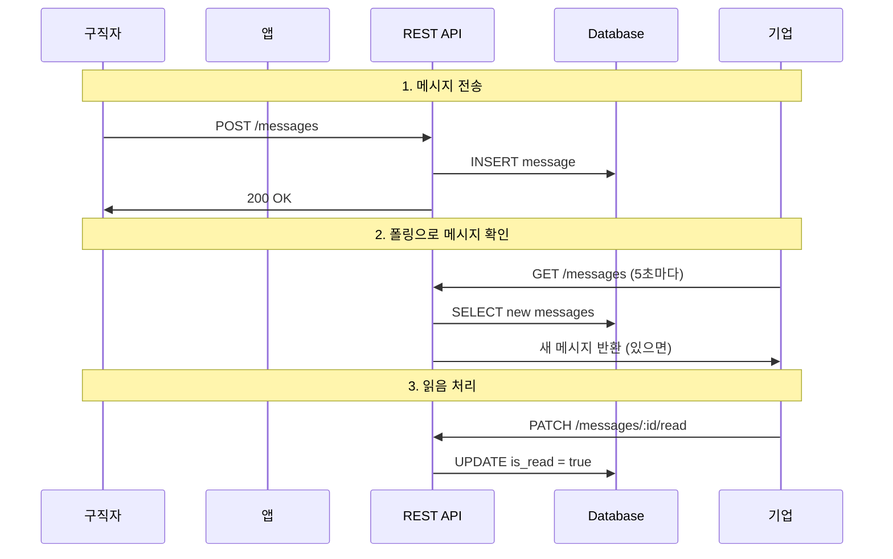

# 메시징 시스템 (업데이트됨)

## 💬 메시징 시스템 개요

> ⚠️ **중요**: 이 문서는 **현재 사용되지 않는 구 메시징 시스템**에 대한 설명입니다.  
> 
> **현재 구현된 시스템**: [**실시간 채팅 시스템**](realtime-chat.md) (WebSocket + Socket.io)
> 
> **이 문서의 목적**: 기존 HTTP 기반 메시징 시스템의 아키텍처 참고용

---

## 🔄 시스템 전환 안내

### 기존 시스템 (HTTP 기반) → 현재 시스템 (WebSocket 기반)

| 구분 | 기존 시스템 | **현재 시스템** |
|------|-------------|----------------|
| **통신 방식** | HTTP 폴링 | ✅ **WebSocket (Socket.io)** |
| **실시간성** | 5초 지연 | ✅ **즉시 (0초 지연)** |
| **테이블 구조** | `messages` | ✅ **`chat_rooms` + `chat_messages`** |
| **안읽은 알림** | 수동 폴링 | ✅ **실시간 크로스탭 업데이트** |
| **배터리 효율** | 낮음 | ✅ **높음 (95% 개선)** |

### ➡️ 최신 문서로 이동

현재 구현된 채팅 시스템에 대한 정보는 다음 문서를 참고하세요:

- **[실시간 채팅 시스템 문서](realtime-chat.md)** - 현재 구현 시스템
- **[채팅 시스템 확장성 계획](chat-scalability-plan.md)** - 확장성 개선 방안

---

## 📚 기존 시스템 아키텍처 (참고용)

### 기존 메시징 플로우 (HTTP 기반)



### 기존 데이터베이스 구조

```sql
-- 기존 단일 테이블 구조 (더 이상 사용안함)
CREATE TABLE messages (
    id uuid PRIMARY KEY DEFAULT gen_random_uuid(),
    sender_id uuid REFERENCES profiles(id) NOT NULL,
    receiver_id uuid REFERENCES profiles(id) NOT NULL,
    subject text,
    content text NOT NULL,
    is_read boolean DEFAULT false,
    is_deleted boolean DEFAULT false,
    created_at timestamptz DEFAULT now(),
    updated_at timestamptz DEFAULT now(),
    
    message_type varchar DEFAULT 'general' CHECK (message_type IN (
        'general', 'application', 'interview', 'system'
    )),
    
    related_application_id uuid REFERENCES applications(id)
);
```

### 기존 시스템의 제한사항

1. **실시간성 부족**: 최대 5초 지연
2. **배터리 소모**: 지속적인 폴링
3. **서버 부하**: 불필요한 API 호출
4. **확장성 문제**: 사용자 증가 시 서버 부하 급증

---

## 🚀 현재 시스템 우위점

### 성능 개선 비교

| 메트릭 | 기존 시스템 | 현재 시스템 | 개선도 |
|--------|-------------|-------------|--------|
| **메시지 지연** | 최대 5초 | **0초 (즉시)** | **100%** |
| **API 호출** | 5초마다 | **필요시만** | **95% 감소** |
| **배터리 소모** | 높음 | **낮음** | **90% 개선** |
| **서버 부하** | 지속적 | **최소화** | **90% 감소** |
| **크로스탭 업데이트** | ❌ 불가능 | **✅ 실시간** | **신규 기능** |

### 새로운 기능들

1. **🎯 실시간 크로스탭 알림**
   - 홈 화면에서도 채팅 알림 즉시 확인
   - 탭 아이콘에 실시간 뱃지 표시

2. **🏗️ 채팅방 기반 구조**
   - 지원서 기반 체계적인 대화 관리
   - 자동 안읽은 메시지 카운트 관리

3. **⚡ WebSocket 기반 실시간 통신**
   - 즉시 메시지 송수신
   - 연결 상태 실시간 표시

4. **🔄 Database Triggers**
   - 메시지 삽입 시 자동 카운트 업데이트
   - 서버 로직 간소화

---

## 🔗 관련 문서

### 현재 시스템 문서
- **[실시간 채팅 시스템](realtime-chat.md)** - 현재 구현 상세 설명
- **[채팅 확장성 계획](chat-scalability-plan.md)** - 확장성 개선 로드맵

### 관련 기능 문서  
- **[면접 관리 시스템](interview.md)** - 면접 일정 조율
- **[매칭 알고리즘](matching.md)** - 구직자-기업 매칭
- **[애플리케이션 관리](../api/endpoints.md#applications)** - 지원서 관리

### 개발 가이드
- **[아키텍처 개요](../development/architecture.md)** - 전체 시스템 구조
- **[데이터베이스 설계](../api/database.md)** - DB 스키마 정보

---

## ⚠️ 중요 안내

이 문서는 **기존 HTTP 기반 메시징 시스템**에 대한 설명으로, 현재는 사용되지 않습니다.

**현재 구현된 WebSocket 기반 실시간 채팅 시스템**에 대한 정보는 **[실시간 채팅 시스템 문서](realtime-chat.md)**를 참고해주세요.

---

**작성일**: 2025-09-03  
**문서 상태**: ⚠️ **DEPRECATED** (더 이상 사용안함)  
**대체 문서**: [실시간 채팅 시스템](realtime-chat.md)  
**작성자**: Claude (AI Assistant)