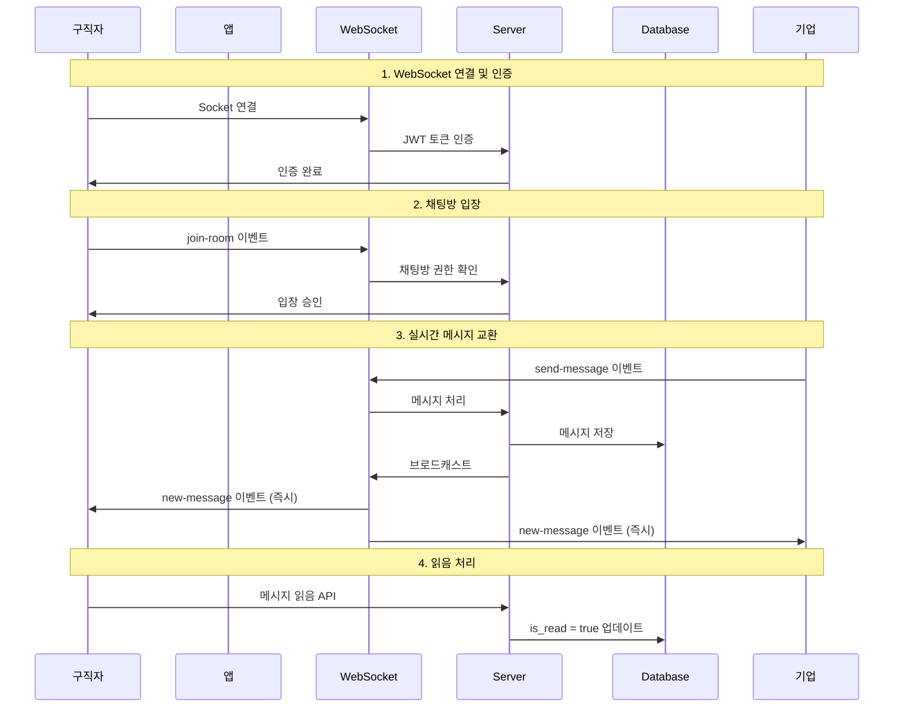

# 메시징 시스템

## 💬 메시징 시스템 개요

kgency의 메시징 시스템은 구직자와 기업 간의 원활한 소통을 위한 **WebSocket 기반 실시간 채팅** 기능을 제공합니다. 지원서 기반 대화, 면접 조율, 채용 과정 전반의 커뮤니케이션을 지원합니다.

> **업데이트**: 2025년 9월 2일 - HTTP 폴링에서 WebSocket(Socket.io)으로 전환

### 메시징 플로우 (WebSocket 기반)



## 🗄 데이터베이스 구조

### messages 테이블

```sql
CREATE TABLE messages (
    id uuid PRIMARY KEY DEFAULT gen_random_uuid(),
    sender_id uuid REFERENCES profiles(id) NOT NULL,
    receiver_id uuid REFERENCES profiles(id) NOT NULL,
    subject text,
    content text NOT NULL,
    is_read boolean DEFAULT false,
    is_deleted boolean DEFAULT false,
    created_at timestamptz DEFAULT now(),
    updated_at timestamptz DEFAULT now(),
    
    -- 메시지 타입 (선택사항)
    message_type varchar DEFAULT 'general' CHECK (message_type IN (
        'general', 'application', 'interview', 'system'
    )),
    
    -- 관련 지원서 ID (선택사항)
    related_application_id uuid REFERENCES applications(id)
);

-- 인덱스 생성
CREATE INDEX idx_messages_participants ON messages(sender_id, receiver_id);
CREATE INDEX idx_messages_receiver_unread ON messages(receiver_id, is_read) 
    WHERE is_read = false AND is_deleted = false;
CREATE INDEX idx_messages_created_at ON messages(created_at DESC);

-- RLS 정책
CREATE POLICY "Users can view own messages" ON messages
    FOR SELECT USING (
        auth.uid() = sender_id OR auth.uid() = receiver_id
    );

CREATE POLICY "Users can send messages" ON messages
    FOR INSERT WITH CHECK (auth.uid() = sender_id);

CREATE POLICY "Users can update own sent messages" ON messages
    FOR UPDATE USING (auth.uid() = sender_id);
```

### 대화방 개념

메시징 시스템은 별도의 대화방 테이블 없이 `sender_id`와 `receiver_id` 조합으로 대화를 그룹화합니다.

```typescript
// 대화 참가자 식별
type ConversationParticipants = {
  user1: string;  // UUID
  user2: string;  // UUID
};

// 대화 ID 생성 (정렬하여 일관성 보장)
const getConversationId = (userId1: string, userId2: string): string => {
  return [userId1, userId2].sort().join('_');
};
```

## 📱 메시지 화면 구현

### 메시지 목록 화면

```typescript
// app/(user)/message.tsx & app/(company)/message.tsx
const MessageListScreen: React.FC = () => {
  const { user } = useAuth();
  const [conversations, setConversations] = useState<Conversation[]>([]);
  const [loading, setLoading] = useState(true);

  const fetchConversations = async () => {
    // 최근 메시지를 기준으로 대화 목록 조회
    const { data } = await supabase
      .from('messages')
      .select(`
        *,
        sender:profiles!sender_id(id, name, user_type),
        receiver:profiles!receiver_id(id, name, user_type)
      `)
      .or(`sender_id.eq.${user.id},receiver_id.eq.${user.id}`)
      .eq('is_deleted', false)
      .order('created_at', { ascending: false });

    if (data) {
      // 대화별로 그룹화
      const groupedConversations = groupMessagesByConversation(data, user.id);
      setConversations(groupedConversations);
    }
    setLoading(false);
  };

  // 실시간 새 메시지 구독
  useEffect(() => {
    const channel = supabase
      .channel('new_messages')
      .on('postgres_changes', {
        event: 'INSERT',
        schema: 'public',
        table: 'messages',
        filter: `receiver_id=eq.${user.id}`,
      }, (payload) => {
        handleNewMessage(payload.new as Message);
      })
      .subscribe();

    return () => {
      supabase.removeChannel(channel);
    };
  }, [user.id]);

  const groupMessagesByConversation = (
    messages: Message[],
    currentUserId: string
  ): Conversation[] => {
    const conversationMap = new Map<string, Conversation>();

    messages.forEach(message => {
      const otherUserId = message.sender_id === currentUserId 
        ? message.receiver_id 
        : message.sender_id;
      
      const conversationId = getConversationId(currentUserId, otherUserId);
      
      if (!conversationMap.has(conversationId)) {
        conversationMap.set(conversationId, {
          id: conversationId,
          otherUser: message.sender_id === currentUserId 
            ? message.receiver 
            : message.sender,
          lastMessage: message,
          unreadCount: 0,
          messages: []
        });
      }

      const conversation = conversationMap.get(conversationId)!;
      
      // 최신 메시지 업데이트
      if (new Date(message.created_at) > new Date(conversation.lastMessage.created_at)) {
        conversation.lastMessage = message;
      }

      // 읽지 않은 메시지 카운트
      if (!message.is_read && message.receiver_id === currentUserId) {
        conversation.unreadCount++;
      }
    });

    return Array.from(conversationMap.values())
      .sort((a, b) => 
        new Date(b.lastMessage.created_at).getTime() - 
        new Date(a.lastMessage.created_at).getTime()
      );
  };

  return (
    <SafeAreaView className="flex-1 bg-gray-50">
      <View className="bg-white px-4 py-3 border-b border-gray-200">
        <Text className="text-xl font-bold">메시지</Text>
      </View>

      {loading ? (
        <LoadingSpinner />
      ) : conversations.length === 0 ? (
        <EmptyMessageState />
      ) : (
        <FlatList
          data={conversations}
          keyExtractor={(item) => item.id}
          renderItem={({ item }) => (
            <ConversationCard 
              conversation={item}
              onPress={() => navigateToChat(item.otherUser.id)}
            />
          )}
          showsVerticalScrollIndicator={false}
        />
      )}
    </SafeAreaView>
  );
};
```

### 대화 카드 컴포넌트

```typescript
const ConversationCard: React.FC<{
  conversation: Conversation;
  onPress: () => void;
}> = ({ conversation, onPress }) => {
  const { lastMessage, otherUser, unreadCount } = conversation;
  
  const formatMessageTime = (timestamp: string) => {
    const messageDate = new Date(timestamp);
    const now = new Date();
    
    if (isToday(messageDate)) {
      return format(messageDate, 'HH:mm');
    } else if (isYesterday(messageDate)) {
      return '어제';
    } else {
      return format(messageDate, 'M/d');
    }
  };

  const truncateMessage = (content: string, maxLength: number = 40) => {
    return content.length > maxLength 
      ? content.substring(0, maxLength) + '...' 
      : content;
  };

  return (
    <TouchableOpacity
      className="bg-white border-b border-gray-100 px-4 py-3"
      onPress={onPress}
    >
      <View className="flex-row items-center">
        {/* 프로필 아바타 */}
        <View className="w-12 h-12 bg-blue-100 rounded-full items-center justify-center mr-3">
          <Text className="text-blue-600 font-semibold text-lg">
            {otherUser.name.charAt(0)}
          </Text>
        </View>

        {/* 메시지 내용 */}
        <View className="flex-1">
          <View className="flex-row items-center justify-between mb-1">
            <Text className="font-semibold text-gray-900">
              {otherUser.name}
            </Text>
            <Text className="text-xs text-gray-500">
              {formatMessageTime(lastMessage.created_at)}
            </Text>
          </View>
          
          <View className="flex-row items-center justify-between">
            <Text 
              className={`flex-1 ${
                unreadCount > 0 ? 'font-medium text-gray-900' : 'text-gray-600'
              }`}
            >
              {truncateMessage(lastMessage.content)}
            </Text>
            
            {/* 읽지 않은 메시지 배지 */}
            {unreadCount > 0 && (
              <View className="bg-red-500 rounded-full min-w-[20px] h-5 items-center justify-center ml-2">
                <Text className="text-white text-xs font-medium">
                  {unreadCount > 99 ? '99+' : unreadCount}
                </Text>
              </View>
            )}
          </View>
        </View>
      </View>
    </TouchableOpacity>
  );
};
```

## 💬 채팅 화면 구현

### 1:1 채팅 화면

```typescript
// app/(pages)/chat/[userId].tsx
const ChatScreen: React.FC = () => {
  const { userId } = useLocalSearchParams();
  const { user } = useAuth();
  const [messages, setMessages] = useState<Message[]>([]);
  const [newMessage, setNewMessage] = useState('');
  const [otherUser, setOtherUser] = useState<Profile | null>(null);
  const [loading, setLoading] = useState(true);
  const flatListRef = useRef<FlatList>(null);

  useEffect(() => {
    if (userId && user?.id) {
      fetchOtherUser();
      fetchMessages();
      markMessagesAsRead();
      subscribeToMessages();
    }
  }, [userId, user?.id]);

  const fetchOtherUser = async () => {
    const { data } = await supabase
      .from('profiles')
      .select('*')
      .eq('id', userId)
      .single();
    
    setOtherUser(data);
  };

  const fetchMessages = async () => {
    const { data } = await supabase
      .from('messages')
      .select('*')
      .or(`and(sender_id.eq.${user.id},receiver_id.eq.${userId}),and(sender_id.eq.${userId},receiver_id.eq.${user.id})`)
      .eq('is_deleted', false)
      .order('created_at', { ascending: true });

    if (data) {
      setMessages(data);
      // 새 메시지가 있으면 스크롤을 맨 아래로
      setTimeout(() => {
        flatListRef.current?.scrollToEnd({ animated: true });
      }, 100);
    }
    setLoading(false);
  };

  const markMessagesAsRead = async () => {
    await supabase
      .from('messages')
      .update({ is_read: true })
      .eq('sender_id', userId)
      .eq('receiver_id', user.id)
      .eq('is_read', false);
  };

  const subscribeToMessages = () => {
    const channel = supabase
      .channel(`chat_${getConversationId(user.id, userId as string)}`)
      .on('postgres_changes', {
        event: 'INSERT',
        schema: 'public',
        table: 'messages',
        filter: `or(and(sender_id.eq.${user.id},receiver_id.eq.${userId}),and(sender_id.eq.${userId},receiver_id.eq.${user.id}))`,
      }, (payload) => {
        const newMessage = payload.new as Message;
        setMessages(prev => [...prev, newMessage]);
        
        // 받은 메시지인 경우 자동으로 읽음 처리
        if (newMessage.receiver_id === user.id) {
          markMessageAsRead(newMessage.id);
        }
        
        // 스크롤을 맨 아래로
        setTimeout(() => {
          flatListRef.current?.scrollToEnd({ animated: true });
        }, 100);
      })
      .subscribe();

    return () => {
      supabase.removeChannel(channel);
    };
  };

  const sendMessage = async () => {
    if (!newMessage.trim()) return;

    const messageData = {
      sender_id: user.id,
      receiver_id: userId,
      content: newMessage.trim(),
      message_type: 'general',
    };

    const { data, error } = await supabase
      .from('messages')
      .insert(messageData)
      .select()
      .single();

    if (!error && data) {
      setNewMessage('');
      // 메시지는 실시간 구독으로 자동 추가됨
    }
  };

  const markMessageAsRead = async (messageId: string) => {
    await supabase
      .from('messages')
      .update({ is_read: true })
      .eq('id', messageId);
  };

  return (
    <SafeAreaView className="flex-1 bg-white">
      {/* 헤더 */}
      <View className="bg-white px-4 py-3 border-b border-gray-200 flex-row items-center">
        <TouchableOpacity
          onPress={() => router.back()}
          className="mr-3"
        >
          <Ionicons name="arrow-back" size={24} color="#000" />
        </TouchableOpacity>
        
        <View className="w-8 h-8 bg-blue-100 rounded-full items-center justify-center mr-3">
          <Text className="text-blue-600 font-semibold">
            {otherUser?.name?.charAt(0)}
          </Text>
        </View>
        
        <Text className="text-lg font-semibold">{otherUser?.name}</Text>
      </View>

      {/* 메시지 목록 */}
      <FlatList
        ref={flatListRef}
        data={messages}
        keyExtractor={(item) => item.id}
        renderItem={({ item }) => (
          <MessageBubble 
            message={item}
            isOwn={item.sender_id === user.id}
          />
        )}
        contentContainerStyle={{ padding: 16 }}
        showsVerticalScrollIndicator={false}
        onContentSizeChange={() => 
          flatListRef.current?.scrollToEnd({ animated: false })
        }
      />

      {/* 메시지 입력 */}
      <View className="bg-white border-t border-gray-200 px-4 py-3">
        <View className="flex-row items-end">
          <TextInput
            className="flex-1 border border-gray-300 rounded-full px-4 py-2 mr-3 max-h-24"
            placeholder="메시지를 입력하세요..."
            value={newMessage}
            onChangeText={setNewMessage}
            multiline
            textAlignVertical="center"
          />
          <TouchableOpacity
            className={`w-10 h-10 rounded-full items-center justify-center ${
              newMessage.trim() ? 'bg-blue-500' : 'bg-gray-300'
            }`}
            onPress={sendMessage}
            disabled={!newMessage.trim()}
          >
            <Ionicons 
              name="send" 
              size={20} 
              color="white" 
            />
          </TouchableOpacity>
        </View>
      </View>
    </SafeAreaView>
  );
};
```

### 메시지 버블 컴포넌트

```typescript
const MessageBubble: React.FC<{
  message: Message;
  isOwn: boolean;
}> = ({ message, isOwn }) => {
  const formatTime = (timestamp: string) => {
    return format(new Date(timestamp), 'HH:mm');
  };

  return (
    <View className={`flex-row mb-3 ${isOwn ? 'justify-end' : 'justify-start'}`}>
      <View className={`max-w-[80%] ${isOwn ? 'items-end' : 'items-start'}`}>
        {/* 메시지 버블 */}
        <View
          className={`px-4 py-2 rounded-2xl ${
            isOwn 
              ? 'bg-blue-500 rounded-br-md' 
              : 'bg-gray-200 rounded-bl-md'
          }`}
        >
          <Text 
            className={`${isOwn ? 'text-white' : 'text-gray-900'}`}
            style={{ fontSize: 16, lineHeight: 20 }}
          >
            {message.content}
          </Text>
        </View>

        {/* 시간 및 읽음 표시 */}
        <View className={`flex-row items-center mt-1 ${isOwn ? 'flex-row-reverse' : ''}`}>
          <Text className="text-xs text-gray-500">
            {formatTime(message.created_at)}
          </Text>
          
          {isOwn && (
            <View className="ml-1">
              {message.is_read ? (
                <Text className="text-xs text-blue-500">읽음</Text>
              ) : (
                <Text className="text-xs text-gray-400">전송됨</Text>
              )}
            </View>
          )}
        </View>
      </div>
    </View>
  );
};
```

## 🔔 메시지 알림 시스템

### 푸시 알림 설정

```typescript
// hooks/useMessageNotifications.ts
const useMessageNotifications = () => {
  const { user } = useAuth();

  useEffect(() => {
    if (!user) return;

    // 알림 권한 요청
    const requestPermissions = async () => {
      const { status } = await Notifications.requestPermissionsAsync();
      if (status !== 'granted') {
        Alert.alert('알림', '메시지 알림을 받으려면 알림 권한이 필요합니다.');
        return;
      }
    };

    requestPermissions();

    // 새 메시지 실시간 구독
    const channel = supabase
      .channel('message_notifications')
      .on('postgres_changes', {
        event: 'INSERT',
        schema: 'public',
        table: 'messages',
        filter: `receiver_id=eq.${user.id}`,
      }, async (payload) => {
        const message = payload.new as Message;
        
        // 앱이 백그라운드에 있을 때만 알림 표시
        const appState = AppState.currentState;
        if (appState !== 'active') {
          await showMessageNotification(message);
        }
      })
      .subscribe();

    return () => {
      supabase.removeChannel(channel);
    };
  }, [user?.id]);

  const showMessageNotification = async (message: Message) => {
    // 발신자 정보 조회
    const { data: sender } = await supabase
      .from('profiles')
      .select('name')
      .eq('id', message.sender_id)
      .single();

    await Notifications.scheduleNotificationAsync({
      content: {
        title: sender?.name || '새 메시지',
        body: message.content,
        data: {
          type: 'message',
          senderId: message.sender_id,
          messageId: message.id,
        },
      },
      trigger: null, // 즉시 표시
    });
  };

  // 알림 탭 처리
  useEffect(() => {
    const subscription = Notifications.addNotificationResponseReceivedListener(
      (response) => {
        const data = response.notification.request.content.data;
        if (data.type === 'message') {
          // 해당 채팅방으로 이동
          router.push(`/chat/${data.senderId}`);
        }
      }
    );

    return () => subscription.remove();
  }, []);
};
```

### 메시지 배지 시스템

```typescript
// hooks/useUnreadCount.ts
const useUnreadCount = () => {
  const { user } = useAuth();
  const [unreadCount, setUnreadCount] = useState(0);

  const fetchUnreadCount = async () => {
    if (!user) return;

    const { count } = await supabase
      .from('messages')
      .select('*', { count: 'exact', head: true })
      .eq('receiver_id', user.id)
      .eq('is_read', false)
      .eq('is_deleted', false);

    setUnreadCount(count || 0);
    
    // 앱 아이콘 배지 업데이트
    Notifications.setBadgeCountAsync(count || 0);
  };

  useEffect(() => {
    fetchUnreadCount();

    // 실시간 업데이트
    const channel = supabase
      .channel('unread_count')
      .on('postgres_changes', {
        event: '*',
        schema: 'public',
        table: 'messages',
        filter: `receiver_id=eq.${user?.id}`,
      }, () => {
        fetchUnreadCount();
      })
      .subscribe();

    return () => {
      supabase.removeChannel(channel);
    };
  }, [user?.id]);

  return unreadCount;
};

// 탭 바에 배지 표시
const MessageTabIcon: React.FC<{ focused: boolean }> = ({ focused }) => {
  const unreadCount = useUnreadCount();

  return (
    <View>
      <Ionicons 
        name={focused ? "chatbubbles" : "chatbubbles-outline"} 
        size={24} 
        color={focused ? "#007AFF" : "#8E8E93"} 
      />
      {unreadCount > 0 && (
        <View className="absolute -top-1 -right-1 bg-red-500 rounded-full min-w-[16px] h-4 items-center justify-center">
          <Text className="text-white text-xs font-medium">
            {unreadCount > 9 ? '9+' : unreadCount}
          </Text>
        </View>
      )}
    </View>
  );
};
```

## 🤖 자동 메시지 시스템

### 지원서 관련 자동 메시지

```typescript
// services/messageService.ts
class MessageService {
  // 지원서 제출 시 자동 메시지
  static async sendApplicationMessage(
    application: Application
  ): Promise<void> {
    const message = `안녕하세요! ${application.job_posting.title} 포지션에 지원해주셔서 감사합니다.

지원서를 검토한 후 연락드리겠습니다.

궁금한 점이 있으시면 언제든 메시지 주세요.

감사합니다.`;

    await supabase
      .from('messages')
      .insert({
        sender_id: application.company_id,
        receiver_id: application.user_id,
        subject: '지원서 접수 확인',
        content: message,
        message_type: 'application',
        related_application_id: application.id,
      });
  }

  // 면접 제안 메시지
  static async sendInterviewProposalMessage(
    proposal: InterviewProposal,
    customMessage?: string
  ): Promise<void> {
    const defaultMessage = `면접 제안을 드립니다.

면접 장소: ${proposal.location}

가능한 시간을 선택해주세요.`;

    await supabase
      .from('messages')
      .insert({
        sender_id: proposal.company_id,
        receiver_id: proposal.application.user_id,
        subject: '면접 제안',
        content: customMessage || defaultMessage,
        message_type: 'interview',
        related_application_id: proposal.application_id,
      });
  }

  // 면접 확정 메시지
  static async sendInterviewConfirmationMessage(
    schedule: InterviewSchedule
  ): Promise<void> {
    const interviewTime = format(
      new Date(schedule.slot.start_time), 
      'yyyy년 M월 d일 (E) HH:mm',
      { locale: ko }
    );

    const message = `면접 일정이 확정되었습니다.

📅 일시: ${interviewTime}
📍 장소: ${schedule.proposal.location}

시간에 맞춰 방문해주세요.
감사합니다.`;

    await supabase
      .from('messages')
      .insert({
        sender_id: schedule.proposal.company_id,
        receiver_id: schedule.proposal.application.user_id,
        subject: '면접 일정 확정',
        content: message,
        message_type: 'interview',
      });
  }
}
```

### 템플릿 메시지 시스템

```typescript
// components/MessageTemplates.tsx
const MessageTemplates: React.FC<{
  onSelectTemplate: (message: string) => void;
}> = ({ onSelectTemplate }) => {
  const templates = [
    {
      title: '면접 일정 문의',
      content: '안녕하세요. 면접 일정 관련해서 문의드립니다. 언제 편하신지 알려주세요.'
    },
    {
      title: '추가 서류 요청',
      content: '안녕하세요. 전형 진행을 위해 추가 서류가 필요합니다. 포트폴리오를 보내주시면 감사하겠습니다.'
    },
    {
      title: '면접 결과 안내',
      content: '면접에 참여해주셔서 감사합니다. 결과는 일주일 내에 안내드리겠습니다.'
    },
    {
      title: '채용 확정',
      content: '축하합니다! 최종 합격하셨습니다. 입사 관련 안내는 별도로 연락드리겠습니다.'
    },
  ];

  return (
    <Modal visible={true} animationType="slide">
      <SafeAreaView className="flex-1 bg-white">
        <View className="p-4 border-b border-gray-200">
          <Text className="text-lg font-semibold">메시지 템플릿</Text>
        </View>
        
        <FlatList
          data={templates}
          keyExtractor={(item) => item.title}
          renderItem={({ item }) => (
            <TouchableOpacity
              className="p-4 border-b border-gray-100"
              onPress={() => onSelectTemplate(item.content)}
            >
              <Text className="font-medium mb-2">{item.title}</Text>
              <Text className="text-gray-600 text-sm">{item.content}</Text>
            </TouchableOpacity>
          )}
        />
      </SafeAreaView>
    </Modal>
  );
};
```

## 📊 메시지 분석 및 관리

### 메시지 통계

```typescript
// 메시지 활동 분석
interface MessageAnalytics {
  totalMessages: number;
  responseRate: number;
  averageResponseTime: number; // 분 단위
  activeConversations: number;
}

const getMessageAnalytics = async (
  userId: string,
  timeRange: { start: Date; end: Date }
): Promise<MessageAnalytics> => {
  // 전체 메시지 수
  const { count: totalMessages } = await supabase
    .from('messages')
    .select('*', { count: 'exact', head: true })
    .eq('sender_id', userId)
    .gte('created_at', timeRange.start.toISOString())
    .lte('created_at', timeRange.end.toISOString());

  // 응답률 계산
  const responseRate = await calculateResponseRate(userId, timeRange);
  
  // 평균 응답 시간 계산
  const averageResponseTime = await calculateAverageResponseTime(userId, timeRange);
  
  // 활성 대화 수
  const activeConversations = await getActiveConversationsCount(userId);

  return {
    totalMessages: totalMessages || 0,
    responseRate,
    averageResponseTime,
    activeConversations,
  };
};
```

### 메시지 검색 기능

```typescript
// 메시지 검색
const searchMessages = async (
  userId: string,
  query: string,
  otherUserId?: string
): Promise<Message[]> => {
  let queryBuilder = supabase
    .from('messages')
    .select(`
      *,
      sender:profiles!sender_id(name),
      receiver:profiles!receiver_id(name)
    `)
    .or(`sender_id.eq.${userId},receiver_id.eq.${userId}`)
    .ilike('content', `%${query}%`)
    .eq('is_deleted', false)
    .order('created_at', { ascending: false })
    .limit(50);

  // 특정 대화에서만 검색
  if (otherUserId) {
    queryBuilder = queryBuilder.or(
      `and(sender_id.eq.${userId},receiver_id.eq.${otherUserId}),and(sender_id.eq.${otherUserId},receiver_id.eq.${userId})`
    );
  }

  const { data } = await queryBuilder;
  return data || [];
};

// 검색 UI 컴포넌트
const MessageSearch: React.FC = () => {
  const [query, setQuery] = useState('');
  const [results, setResults] = useState<Message[]>([]);
  const [loading, setLoading] = useState(false);
  const { user } = useAuth();

  const handleSearch = async () => {
    if (!query.trim()) return;

    setLoading(true);
    const searchResults = await searchMessages(user.id, query);
    setResults(searchResults);
    setLoading(false);
  };

  return (
    <View className="flex-1">
      <View className="p-4 border-b border-gray-200">
        <TextInput
          className="border border-gray-300 rounded-lg px-3 py-2"
          placeholder="메시지 검색..."
          value={query}
          onChangeText={setQuery}
          onSubmitEditing={handleSearch}
          returnKeyType="search"
        />
      </View>

      {loading ? (
        <LoadingSpinner />
      ) : (
        <FlatList
          data={results}
          keyExtractor={(item) => item.id}
          renderItem={({ item }) => (
            <SearchResultItem message={item} />
          )}
        />
      )}
    </View>
  );
};
```

## 🔧 메시징 시스템 최적화

### 메시지 캐싱

```typescript
// 메시지 로컬 캐싱
class MessageCache {
  private static cache = new Map<string, Message[]>();
  private static readonly CACHE_EXPIRY = 5 * 60 * 1000; // 5분

  static getCachedMessages(conversationId: string): Message[] | null {
    const cached = this.cache.get(conversationId);
    if (cached) {
      return cached;
    }
    return null;
  }

  static setCachedMessages(conversationId: string, messages: Message[]): void {
    this.cache.set(conversationId, messages);
    
    // 캐시 만료 처리
    setTimeout(() => {
      this.cache.delete(conversationId);
    }, this.CACHE_EXPIRY);
  }

  static invalidateCache(conversationId: string): void {
    this.cache.delete(conversationId);
  }
}
```

### 메시지 압축 및 페이지네이션

```typescript
// 대용량 대화를 위한 페이지네이션
const usePaginatedMessages = (otherUserId: string) => {
  const [messages, setMessages] = useState<Message[]>([]);
  const [loading, setLoading] = useState(false);
  const [hasMore, setHasMore] = useState(true);
  const { user } = useAuth();

  const MESSAGES_PER_PAGE = 20;

  const loadMessages = async (before?: string) => {
    if (loading) return;
    
    setLoading(true);
    
    let query = supabase
      .from('messages')
      .select('*')
      .or(`and(sender_id.eq.${user.id},receiver_id.eq.${otherUserId}),and(sender_id.eq.${otherUserId},receiver_id.eq.${user.id})`)
      .eq('is_deleted', false)
      .order('created_at', { ascending: false })
      .limit(MESSAGES_PER_PAGE);

    if (before) {
      query = query.lt('created_at', before);
    }

    const { data } = await query;
    
    if (data) {
      if (before) {
        // 이전 메시지 추가 (페이지네이션)
        setMessages(prev => [...data.reverse(), ...prev]);
      } else {
        // 초기 로드
        setMessages(data.reverse());
      }
      
      setHasMore(data.length === MESSAGES_PER_PAGE);
    }
    
    setLoading(false);
  };

  const loadMoreMessages = () => {
    if (messages.length > 0 && hasMore) {
      loadMessages(messages[0].created_at);
    }
  };

  return {
    messages,
    loading,
    hasMore,
    loadMessages,
    loadMoreMessages,
  };
};
```

### 실시간 연결 최적화

```typescript
// 연결 상태 관리
const useRealtimeConnection = () => {
  const [isConnected, setIsConnected] = useState(false);
  const { user } = useAuth();

  useEffect(() => {
    if (!user) return;

    const channel = supabase.channel('presence');
    
    channel
      .on('presence', { event: 'sync' }, () => {
        setIsConnected(true);
      })
      .on('presence', { event: 'join' }, ({ key, newPresences }) => {
        console.log('User joined:', newPresences);
      })
      .on('presence', { event: 'leave' }, ({ key, leftPresences }) => {
        console.log('User left:', leftPresences);
      })
      .subscribe(async (status) => {
        if (status === 'SUBSCRIBED') {
          await channel.track({
            user_id: user.id,
            online_at: new Date().toISOString(),
          });
        }
      });

    return () => {
      supabase.removeChannel(channel);
    };
  }, [user?.id]);

  return isConnected;
};
```